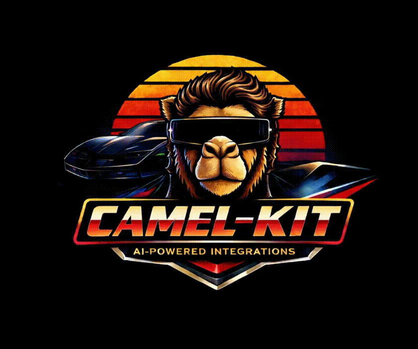

# Camel-Kit

<p align="center">
  
</p>

[](https://opensource.org/licenses/Apache-2.0)
[](https://luigidemasi.github.io/camel-kit-web/)

> Design, implement, and verify Apache Camel integrations with AI coding assistants.

Camel-Kit adds structured slash commands to your AI assistant that guide you through the full integration lifecycle — from designing the integration, through implementation and testing, to runtime verification. It works across multiple AI agents and produces production-ready Apache Camel routes.

**Inspired by [GitHub Spec-Kit](https://github.com/github/spec-kit)**, adapted for the Apache Camel ecosystem.

---

## The Workflow

```
Entry:        /camel-start         (routes to the right skill based on context)

Greenfield:   /camel-brainstorm → /camel-plan → /camel-execute → /camel-validate
                                                      ├── implements (camel-implement)
                                                      ├── verifies (camel-verify, internal)
                                                      └── tests (camel-test)

Migration:    /camel-migrate    → /camel-plan → /camel-execute → /camel-validate

Utilities:    /camel-validate      (endpoint validation only)
              /camel-ship          (autonomous full pipeline with oversight levels)
              /camel-knowledge     (documentation Q&A)
              /camel-debug         (standalone troubleshooting)
```

| Command | Purpose |
|---------|---------|
| `/camel-start` | Entry point — routes to brainstorm (greenfield) or migrate based on context |
| `/camel-brainstorm` | Interactive design session — produces a Blueprint Reference Document (BRD) with Technical Design Documents (TDDs) |
| `/camel-migrate` | Migration from MuleSoft, Microsoft BizTalk, legacy Camel, or JBoss Fuse to modern Camel |
| `/camel-plan` | Reviews approved design, creates a detailed implementation plan with wave analysis for parallel execution |
| `/camel-execute` | Orchestrated execution — environment probe, then implements, validates, tests, and verifies all flows |
| `/camel-validate` | Standalone endpoint validation — checks component configuration without full implementation |
| `/camel-debug` | Standalone troubleshooting for broken routes, build failures, startup errors, and runtime exceptions |
| `/camel-ship` | Autonomous pipeline — runs brainstorm, plan, execute, and validate end-to-end with configurable oversight (`always`, `smart`, `never`) |
| `/camel-knowledge` | Documentation Q&A — semantic search over Apache Camel docs, CVEs, errata, and component catalog |

[Command Reference →](docs/commands.md)

---

## Installation

### Prerequisites

| Requirement | Purpose | Install |
|-------------|---------|---------|
| Java 17+ | Runtime | [SDKMAN](https://sdkman.io/), [Adoptium](https://adoptium.net/), or your package manager |
| [JBang](https://www.jbang.dev/) | CLI launcher for camel-kit | See below |
| [Camel JBang](https://camel.apache.org/manual/camel-jbang.html) | `camel run`, `camel run --check` for route execution and validation | `jbang app install camel@apache/camel` |
| [Camel JBang test plugin](https://camel.apache.org/manual/camel-jbang.html) | `camel test run` for Citrus integration tests in the verify loop | `camel plugin add test` |

Camel JBang and its test plugin are needed for the full pipeline (environment probe, endpoint validation, runtime verification). The design and planning phases work without them.

`camel-kit init` automatically checks for these prerequisites and reports their status. Missing tools produce warnings but don't block initialization.

### Standalone (JBang)

```bash
# Install JBang (if not already installed)
curl -Ls https://sh.jbang.dev | bash -s - app setup        # Linux/macOS
iex "& { $(iwr -useb https://ps.jbang.dev) } app setup"    # Windows PowerShell

# Install camel-kit globally
jbang app install camel-kit@luigidemasi/camel-kit

# Verify
camel-kit --help
```

### Run without installing

```bash
jbang run camel-kit@luigidemasi/camel-kit init my-integration --ai claude
```

### Camel JBang Plugin

If you already use [Camel JBang](https://camel.apache.org/manual/camel-jbang.html), install camel-kit as a plugin:

```bash
camel plugin add kit \
  --gav io.github.luigidemasi:camel-kit-jbang-plugin:LATEST \
  --description "Design Apache Camel Integrations with AI"

# Then use via the camel CLI
camel kit init my-integration --ai bob
```

### Build from Source (development version)

Some features (including `--ai qwen` and `--ai opencode`) are only available in the development version. To build from source:

```bash
git clone https://github.com/luigidemasi/camel-kit.git
cd camel-kit
./mvnw clean install -DskipTests

# Install the development version globally via JBang
jbang app install --name camel-kit --force \
  camel-kit-main/src/main/jbang/main/CamelKit.java

# Verify
camel-kit --help
```

To also build the [Knowledge MCP server](https://github.com/luigidemasi/camel-kit-knowledge) (documentation search, CVE tracking, component catalog):

```bash
git clone https://github.com/luigidemasi/camel-kit-knowledge.git
cd camel-kit-knowledge
./mvnw clean install -DskipTests
```

---

## Quick Start

```bash
# 1. Create a new project (choose your AI assistant)
camel-kit init my-integration --ai claude   # Anthropic Claude Code
camel-kit init my-integration --ai bob      # IBM Project Bob
camel-kit init my-integration --ai gemini   # Google Gemini CLI
camel-kit init my-integration --ai qwen     # Qwen (requires dev build)
camel-kit init my-integration --ai opencode # OpenCode (requires dev build)

# 2. Override configuration if needed
camel-kit init my-integration --ai claude -p "camel.main.version=4.18.2"

# 3. Open in your AI assistant
cd my-integration

# 4. Start designing
/camel-start
```

---

## Supported AI Agents

| Agent | Init Flag | Instruction File | MCP Config |
|-------|-----------|-----------------|------------|
| Anthropic Claude Code | `--ai claude` | `CLAUDE.md` | `.mcp.json` |
| IBM Project Bob | `--ai bob` | `custom_modes.yaml` + rules | `.bob/mcp.json` |
| Google Gemini CLI | `--ai gemini` | `GEMINI.md` | `.gemini/mcp.json` |
| Qwen | `--ai qwen` | `QWEN.md` | `.qwen/mcp.json` |
| OpenCode | `--ai opencode` | `AGENTS.md` | `.opencode/mcp.json` |

All agents use the same skills — camel-kit generates agent-specific instruction files with per-agent traits that load the shared skill guides. The skills are the equalization layer. [Architecture Guide →](docs/architecture.md)

---

## Key Features

### Pipeline

- **3-phase orchestrated pipeline** — brainstorm the design, plan the implementation, execute with environment probe and automated review. [Learn more →](docs/user-guide.md)
- **Autonomous mode** — `/camel-ship` runs the full pipeline end-to-end with three oversight levels: `always` (pause at every gate), `smart` (pause on uncertainty), `never` (fully autonomous with re-planning). [Learn more →](docs/commands.md)
- **Environment probe** — validates the target environment (dependency resolution, Docker services, runtime startup) before implementation begins. Mechanical failures are auto-fixed; architectural failures trigger re-planning. [Learn more →](docs/architecture.md)
- **Wave analysis** — the plan analyzer identifies independent tasks and groups them into parallel execution waves for faster implementation.
- **Deterministic staleness detection** — `doc check`, `doc stale`, and `doc unstale` CLI commands manage pipeline artifact validity via structured YAML frontmatter, with `--cascade` for automatic downstream propagation. [Learn more →](docs/commands.md)

### Runtime Verification

- **3-phase verification loop** — build, run Citrus integration tests with Testcontainers, report results. Error taxonomy classifies failures and routes fixes to the right skill (implementation, test re-generation, or re-planning). [Learn more →](docs/user-guide.md)

### Migration

- **Multi-platform migration** — migrate from MuleSoft 3.x/4.x, Microsoft BizTalk, legacy Apache Camel 2.x/3.x, or JBoss Fuse to modern Camel 4.x with YAML DSL. [Learn more →](docs/user-guide.md)

### Graph Intelligence

- **9 parsers + 2 post-processors** — build a queryable property graph of your codebase covering Java classes, Camel routes (XML, YAML, Java DSL, Groovy), Maven dependencies, configuration properties, MuleSoft flows, DataWeave scripts, and BizTalk orchestrations. [Learn more →](docs/architecture.md)
- **DI-aware analysis** — detects `@Inject`, `@Autowired`, `@Value`, `@ConfigProperty`, `@Component`, `@Service` annotations and traces dependencies across interface boundaries. Inspired by [Chinthareddy, "Reliable Graph-RAG for Codebases"](https://arxiv.org/abs/2601.08773) (2026). [Learn more →](docs/architecture.md)
- **Migration context** — `graph migration-context <routeId>` produces structured JSON with a route's full dependency chain (components, services, artifacts, properties, warnings), bridging the project graph with the Knowledge MCP for targeted documentation lookup. [Learn more →](docs/commands.md)
- **PropertyBindingSupport analysis** — understands Camel's `#class:`, `#bean:`, `#autowired` property syntax that instantiates and wires beans from `application.properties`. [Learn more →](docs/architecture.md)

### Knowledge & MCP

- **MCP integration** — real-time catalog queries, route validation, and security analysis via the Apache Camel MCP server. [Learn more →](docs/architecture.md)
- **Knowledge layer** — hybrid BM25 + vector search over Apache Camel documentation, component catalogs, release notes, and CVE/errata advisories. The generated MCP allowlist is defined in the workflow manifest. [Learn more →](docs/architecture.md)
- **DataMapper** — automatic data transformation with two engines: XSLT for complex schema-driven mappings, Groovy for simple field-level transformations. [Learn more →](docs/architecture.md)

### Multi-Agent

- **5 AI agents** — same skills work across Claude Code, IBM Bob, Gemini CLI, Qwen, and OpenCode. Agent-specific traits customize behavior (pacing, approval modes, tool usage) without changing the shared skills. [Learn more →](docs/architecture.md)

---

## Documentation

- **[User Guide](docs/user-guide.md)** — workflows, migration, verification, DataMapper
- **[Command Reference](docs/commands.md)** — all slash commands, CLI options, graph subcommands
- **[Architecture Guide](docs/architecture.md)** — skills, MCP, graph intelligence, pipeline internals
- **[Contributing](CONTRIBUTING.md)** — development setup, how to add skills

Workflow contributors should treat `camel-kit-core/src/main/resources/workflow/camel-kit-workflow.yaml` as the source of truth for command, skill, stage, artifact, and MCP tool metadata before updating generated templates or reference docs.

---

## License

Apache License 2.0 — see [LICENSE](LICENSE).

## Contributing

See [CONTRIBUTING.md](CONTRIBUTING.md).

## Acknowledgments

Camel-Kit is built on ideas pioneered by the **[GitHub Spec-Kit](https://github.com/github/spec-kit)** team. We are grateful for their open approach to spec-driven development with AI assistants.
