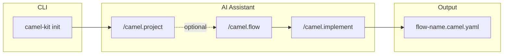
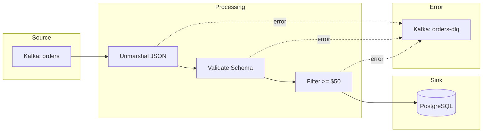

# Camel-Kit

<p align="center">
  
</p>

[](https://opensource.org/licenses/Apache-2.0)

> Design Apache Camel integrations with AI coding assistants using Flow-Driven Development.

**Camel-Kit is heavily inspired by [GitHub Spec-Kit](https://github.com/github/spec-kit)** — a brilliant project by the GitHub team that pioneered the concept of spec-driven development with AI coding assistants. We're grateful to the spec-kit authors for their innovative approach and for making their work available to the community. Their elegant design patterns and philosophy have directly shaped how Camel-Kit guides developers through integration design.

Camel-Kit adapts these ideas for the Apache Camel ecosystem, providing structured slash commands for AI coding assistants (IBM Project Bob, Gemini CLI, Claude Code, and more) to help you design, validate, and generate Camel routes following best practices.

**Workflow: 1 Flow = 1 Route** — Each integration flow maps to a single Camel route, making it easy to design, implement, and maintain your integrations.



## Features

- **Guided Design** - Interactive commands walk you through integration design step-by-step
- **Best Practices** - Constitution enforces Apache Camel best practices automatically
- **Catalog Integration** - Live component and Kamelet catalog lookup with suggestions
- **Schema Validation** - Automated validation using official Camel YAML DSL Validator Maven plugin
- **Kaoto-Ready Output** - Generate YAML DSL compatible with [Kaoto](https://kaoto.io/) visual designer
- **Citrus Testing** - Generate integration tests using [Citrus Framework](https://citrusframework.org/) with JSON schema validation
- **Portable Maven** - Generated projects include Maven Wrapper for cross-platform builds

## Quick Start

### Installation

**Using JBang (Recommended):**

[JBang](https://www.jbang.dev/) makes running Java applications easy. Install it first:

```bash
# Linux/macOS
curl -Ls https://sh.jbang.dev | bash -s - app setup

# Windows (PowerShell)
iex "& { $(iwr -useb https://ps.jbang.dev) } app setup"
```

Then install camel-kit:

```bash
# Install from Maven (after publishing)
jbang app install camel-kit@io.github.luigidemasi:camel-kit

# Or install from local build
cd camel-kit
mvn install
jbang app install --force camel-kit@io.github.luigidemasi:camel-kit

# Verify installation
camel-kit --help
```

**Run without installing:**

```bash
jbang io.github.luigidemasi:camel-kit init my-integration --ai bob
```

### Initialize a Project

```bash
# Create new integration project with IBM Project Bob
camel-kit init my-integration --ai bob

# Create new integration project with Gemini CLI
camel-kit init my-integration --ai gemini

# Create new integration project with Claude Code
camel-kit init my-integration --ai claude

# With specific Camel version
camel-kit init my-integration --ai bob --camel-version 4.14.5

# With specific Citrus version
camel-kit init my-integration --ai bob --citrus-version 4.9.2

# Initialize in current directory
camel-kit init --here --ai bob
```

### Use with AI Assistant

Open your project in IBM Project Bob (or other supported AI assistant) and use the slash commands:

```
/camel.project     (Optional) Define integration landscape and identify flows
/camel.flow        Define and design the integration flow
/camel.implement   Generate Kaoto-ready YAML code with validation loop
/camel.validate    Check specifications and compliance
/camel.test        Generate Citrus integration tests with validation loop
```

## Documentation

- [User Guide](docs/user-guide.md) - Complete guide to using camel-kit
- [Command Reference](docs/commands.md) - Detailed command documentation
- [Constitution](docs/constitution.md) - Best practices enforced by camel-kit
- [Contributing](CONTRIBUTING.md) - How to contribute to camel-kit

## Supported AI Agents

| Agent | Status | Commands Folder | Format |
|-------|--------|-----------------|--------|
| [IBM Project Bob](https://www.ibm.com/products/bob) | Available | `.bob/commands/` | Markdown |
| [Gemini CLI](https://github.com/google-gemini/gemini-cli) | Available | `.gemini/commands/` | TOML |
| [Claude Code](https://docs.anthropic.com/en/docs/claude-code) | Available | `.claude/commands/` | Markdown |
| GitHub Copilot | Planned | `.github/agents/` | Markdown |
| Cursor | Planned | `.cursor/commands/` | Markdown |

## Commands Overview

| Command | Purpose |
|---------|---------|
| `/camel.project` | (Optional) Define integration landscape and identify all flows |
| `/camel.flow` | Define and design the integration flow (business + technical) |
| `/camel.implement` | Generate Camel YAML DSL with automated validation loop |
| `/camel.validate` | Check completeness and constitution compliance |
| `/camel.test` | Generate Citrus integration tests with automated validation loop |

**Note:** Project initialization is done via CLI (`camel-kit init`), not a slash command.

## Validation

Camel-Kit uses official validation tools via Maven Wrapper for cross-platform compatibility:

### Camel YAML Validation

```bash
./mvnw org.apache.camel:camel-yaml-dsl-validator:4.14.5:validate \
  -Dcamel.validator.files=my-route.camel.yaml
```

### Citrus Test Validation

```bash
./mvnw com.dataliquid.maven:json-yaml-validator-maven-plugin:2.0.0:validate \
  -Dschema.validator.schemaFile=.camel-kit/.cache/citrus/4.9.2/citrus-testcase.json \
  -Dschema.validator.sourceDirectory=test \
  -Dschema.validator.includes=**/*.camel.it.yaml
```

## Example Workflow

```bash
# 1. Initialize project
camel-kit init order-processing --ai bob

# 2. Open in IBM Project Bob
cd order-processing

# 3. (Optional) Define integration landscape:
#    /camel.project
#    - Identify systems, data formats, and flows

# 4. Define and design the flow:
#    /camel.flow order-ingestion
#    - Source: Kafka topic "orders"
#    - EIPs: Unmarshal JSON, validate, filter
#    - Sink: PostgreSQL database
#    - Error handling: Dead Letter Channel

# 5. Generate the Camel YAML (with validation loop):
#    /camel.implement order-ingestion
#    - Creates: order-ingestion.camel.yaml
#    - Validates with: ./mvnw camel-yaml-dsl-validator:validate

# 6. Validate & Test:
#    /camel.validate
#    /camel.test order-ingestion

# 7. Open in Kaoto or run (with application.properties for config):
camel run order-ingestion.camel.yaml application.properties
```

## Output Example

A flow defines the data journey from source to sink:



Generated Kaoto-compatible YAML (`order-ingestion.camel.yaml`):

```yaml
- route:
    id: order-ingestion
    description: Consume orders from Kafka and persist to database

    errorHandler:
      deadLetterChannel:
        deadLetterUri: kafka:orders-dlq
        redeliveryPolicy:
          maximumRedeliveries: 3

    from:
      uri: kafka:orders
      parameters:
        brokers: "{{KAFKA_BROKERS}}"
        groupId: order-processor
      steps:
        - unmarshal:
            json:
              unmarshalType: com.example.Order

        - filter:
            simple: "${body.totalAmount} >= 50"
            steps:
              - to:
                  uri: jpa:com.example.Order
```

## CLI Commands

```bash
# Project initialization
camel-kit init <project-name> [options]
  --ai, -a           AI agent: bob, gemini, claude (default: bob)
  --camel-version    Camel version (default: 4.14.5)
  --citrus-version   Citrus version (default: 4.9.2)
  --here             Initialize in current directory
  --no-fetch         Skip external catalog fetching
```

## Requirements

- Java 17+
- [JBang](https://www.jbang.dev/) (for installation and running)
- [Camel JBang](https://camel.apache.org/manual/camel-jbang.html) (for running routes)
- Supported AI coding assistant (IBM Project Bob, Gemini CLI, Claude Code)
- Docker/Podman (for Citrus tests with Testcontainers)

## Related Projects

- [Apache Camel](https://camel.apache.org/) - Integration framework
- [Kaoto](https://kaoto.io/) - Visual integration designer
- [Citrus Framework](https://citrusframework.org/) - Integration testing
- [GitHub Spec-Kit](https://github.com/github/spec-kit) - Inspiration for spec-driven development

## License

Apache License 2.0 - See [LICENSE](LICENSE) for details.

## Contributing

Contributions are welcome! See [CONTRIBUTING.md](CONTRIBUTING.md) for guidelines.

## Acknowledgments

This project owes its existence to the brilliant work of the **[GitHub Spec-Kit](https://github.com/github/spec-kit)** team. Their pioneering vision of spec-driven development with AI assistants has transformed how developers can approach software design. The spec-kit authors demonstrated that AI coding assistants become dramatically more effective when guided by structured specifications and clear workflows. We deeply appreciate their open approach to sharing these ideas.

Camel-Kit is our humble attempt to bring these powerful concepts to the Apache Camel integration community.
