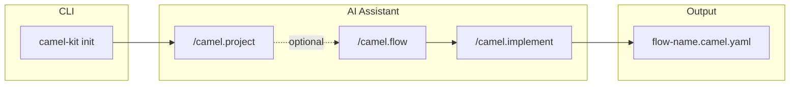
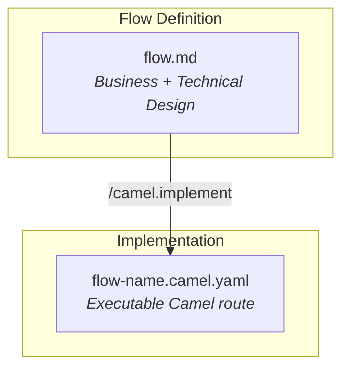
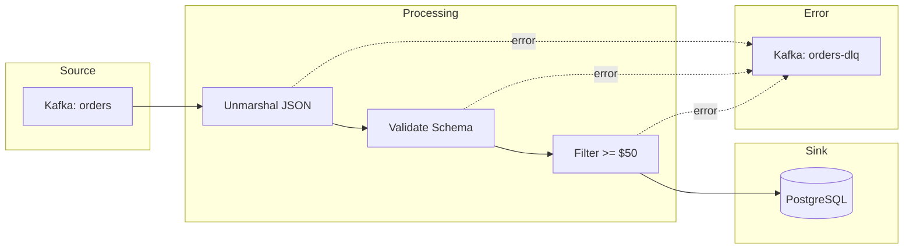

# Camel-Kit

[](https://opensource.org/licenses/Apache-2.0)

> Design Apache Camel integrations with AI coding assistants using Flow-Driven Development.

**Camel-Kit is heavily inspired by [GitHub Spec-Kit](https://github.com/github/spec-kit)** — a brilliant project by the GitHub team that pioneered the concept of spec-driven development with AI coding assistants. We're grateful to the spec-kit authors for their innovative approach and for making their work available to the community. Their elegant design patterns and philosophy have directly shaped how Camel-Kit guides developers through integration design.

Camel-Kit adapts these ideas for the Apache Camel ecosystem, providing structured slash commands for AI coding assistants (IBM Project Bob, Gemini CLI, Claude Code, and more) to help you design, validate, and generate Camel routes following best practices.

**Workflow: 1 Flow = 1 Route** — Each integration flow maps to a single Camel route, making it easy to design, implement, and maintain your integrations.



## Features

- **Guided Design** - Interactive commands walk you through integration design step-by-step
- **Best Practices** - Constitution enforces Apache Camel best practices automatically
- **Catalog Integration** - Live component and Kamelet catalog lookup with suggestions
- **Validation** - Comprehensive checks before generating code
- **Kaoto-Ready Output** - Generate YAML DSL compatible with [Kaoto](https://kaoto.io/) visual designer
- **Citrus Testing** - Generate integration tests using [Citrus Framework](https://citrusframework.org/)

## Quick Start

### Installation

**Using uv (Recommended):**

[uv](https://github.com/astral-sh/uv) is a fast Python package manager. Install it first:

```bash
curl -LsSf https://astral.sh/uv/install.sh | sh
```

Then install camel-kit:

```bash
# Persistent installation (adds to PATH)
uv tool install camel-kit-cli --from git+https://github.com/luigidemasi/camel-kit.git

# Verify installation
camel-kit version
```

**Using uvx (Run without installing):**

```bash
# Run any camel-kit command directly without installation
uvx --from git+https://github.com/luigidemasi/camel-kit.git camel-kit init my-integration

# Examples
uvx --from git+https://github.com/luigidemasi/camel-kit.git camel-kit version
uvx --from git+https://github.com/luigidemasi/camel-kit.git camel-kit catalog search kafka
```

**Using pip:**

```bash
pip install git+https://github.com/luigidemasi/camel-kit.git
```

### Initialize a Project

```bash
# Create new integration project with IBM Project Bob
camel-kit init my-integration --ai bob

# Create new integration project with Gemini CLI
camel-kit init my-integration --ai gemini

# Create new integration project with Claude Code
camel-kit init my-integration --ai claude

# With specific Camel version
camel-kit init my-integration --ai bob --camel-version 4.10.0

# Initialize in current directory
camel-kit init --here --ai bob
```

### Use with AI Assistant

Open your project in IBM Project Bob (or other supported AI assistant) and use the slash commands:

```
/camel.project     (Optional) Define integration landscape and identify flows
/camel.flow        Define and design the integration flow
/camel.implement   Generate Kaoto-ready YAML code
/camel.validate    Check specifications and compliance
/camel.test        Generate Citrus integration tests
```

## Documentation

- [User Guide](docs/user-guide.md) - Complete guide to using camel-kit
- [Command Reference](docs/commands.md) - Detailed command documentation
- [Constitution](docs/constitution.md) - Best practices enforced by camel-kit
- [Contributing](CONTRIBUTING.md) - How to contribute to camel-kit

## Supported AI Agents

| Agent | Status | Commands Folder | Format |
|-------|--------|-----------------|--------|
| [IBM Project Bob](https://www.ibm.com/products/bob) | ✅ Available | `.bob/commands/` | Markdown |
| [Gemini CLI](https://github.com/google-gemini/gemini-cli) | ✅ Available | `.gemini/commands/` | TOML |
| [Claude Code](https://docs.anthropic.com/en/docs/claude-code) | ✅ Available | `.claude/commands/` | Markdown |
| GitHub Copilot | 🔜 Planned | `.github/agents/` | Markdown |
| Cursor | 🔜 Planned | `.cursor/commands/` | Markdown |

## Commands Overview

| Command | Purpose |
|---------|---------|
| `/camel.project` | (Optional) Define integration landscape and identify all flows |
| `/camel.flow` | Define and design the integration flow (business + technical) |
| `/camel.implement` | Generate Camel YAML DSL from the flow definition |
| `/camel.validate` | Check completeness and constitution compliance |
| `/camel.test` | Generate Citrus integration tests |

**Note:** Project initialization is done via CLI (`camel-kit init`), not a slash command.

## Project Structure

Each flow progresses through two artifacts:



After initialization:

```
my-integration/
├── <flow-name>.camel.yaml      # Generated Camel route (after /camel.implement)
├── application.properties      # Component config & dependencies (camel.jbang.dependencies)
├── test/                       # Generated Citrus tests (Camel JBang convention)
│   ├── *.camel.it.yaml         # Test files
│   ├── data/                   # Test data files
│   └── jbang.properties        # Test dependencies (Citrus)
├── .bob/commands/              # AI agent slash commands
│   ├── camel.project.md
│   ├── camel.flow.md
│   ├── camel.implement.md
│   ├── camel.validate.md
│   └── camel.test.md
└── .camel-kit/                 # Specifications and configuration
    ├── config.yaml             # Project configuration
    ├── constitution.md         # Best practices
    ├── project.md              # Integration landscape (optional)
    ├── flows/                  # Flow definitions (1 flow = 1 route)
    │   └── <flow-name>/
    │       └── flow.md         # Complete flow definition
    └── templates/              # Reference templates
        ├── flow.md
        ├── design-patterns.md
        ├── validation-guide.md
        └── yaml-generation-guide.md
```

## Example Workflow

```bash
# 1. Initialize project
camel-kit init order-processing --ai bob

# 2. Open in IBM Project Bob
cd order-processing

# 3. (Optional) Define integration landscape:
#    /camel.project
#    - Identify systems, data formats, and flows

# 4. Define and design the flow:
#    /camel.flow order-ingestion
#    - Source: Kafka topic "orders"
#    - EIPs: Unmarshal JSON, validate, filter
#    - Sink: PostgreSQL database
#    - Error handling: Dead Letter Channel

# 5. Generate the Camel YAML:
#    /camel.implement order-ingestion
#    - Creates: order-ingestion.camel.yaml

# 6. Validate & Test:
#    /camel.validate
#    /camel.test order-ingestion

# 7. Open in Kaoto or run (with application.properties for config):
camel run order-ingestion.camel.yaml application.properties
```

## Output Example

A flow defines the data journey from source to sink:



Generated Kaoto-compatible YAML (`order-ingestion.camel.yaml`):

```yaml
- route:
    id: order-ingestion
    description: Consume orders from Kafka and persist to database

    errorHandler:
      deadLetterChannel:
        deadLetterUri: kafka:orders-dlq
        redeliveryPolicy:
          maximumRedeliveries: 3

    from:
      uri: kafka:orders
      parameters:
        brokers: "{{KAFKA_BROKERS}}"
        groupId: order-processor
      steps:
        - unmarshal:
            json:
              unmarshalType: com.example.Order

        - filter:
            simple: "${body.totalAmount} >= 50"
            steps:
              - to:
                  uri: jpa:com.example.Order
```

## CLI Commands

```bash
# Project initialization
camel-kit init <project-name> [options]
  --ai, -a        AI agent (default: bob)
  --camel-version Version (default: latest)
  --here          Initialize in current directory
  --no-fetch-catalog  Skip catalog download

# List available agents
camel-kit agents

# Manage component/Kamelet catalog
camel-kit catalog info
camel-kit catalog fetch [--force]
camel-kit catalog search <query> [--type source|sink|action]

# Show version
camel-kit version
```

## Requirements

- Python 3.11+
- [uv](https://github.com/astral-sh/uv) (recommended) or pip
- [Camel JBang](https://camel.apache.org/manual/camel-jbang.html) (for running routes)
- Supported AI coding assistant (IBM Project Bob, etc.)

## Related Projects

- [Apache Camel](https://camel.apache.org/) - Integration framework
- [Kaoto](https://kaoto.io/) - Visual integration designer
- [Citrus Framework](https://citrusframework.org/) - Integration testing
- [GitHub Spec-Kit](https://github.com/github/spec-kit) - Inspiration for spec-driven development

## License

Apache License 2.0 - See [LICENSE](LICENSE) for details.

## Contributing

Contributions are welcome! See [CONTRIBUTING.md](CONTRIBUTING.md) for guidelines.

## Acknowledgments

This project owes its existence to the brilliant work of the **[GitHub Spec-Kit](https://github.com/github/spec-kit)** team. Their pioneering vision of spec-driven development with AI assistants has transformed how developers can approach software design. The spec-kit authors demonstrated that AI coding assistants become dramatically more effective when guided by structured specifications and clear workflows. We deeply appreciate their open approach to sharing these ideas.

Camel-Kit is our humble attempt to bring these powerful concepts to the Apache Camel integration community.
