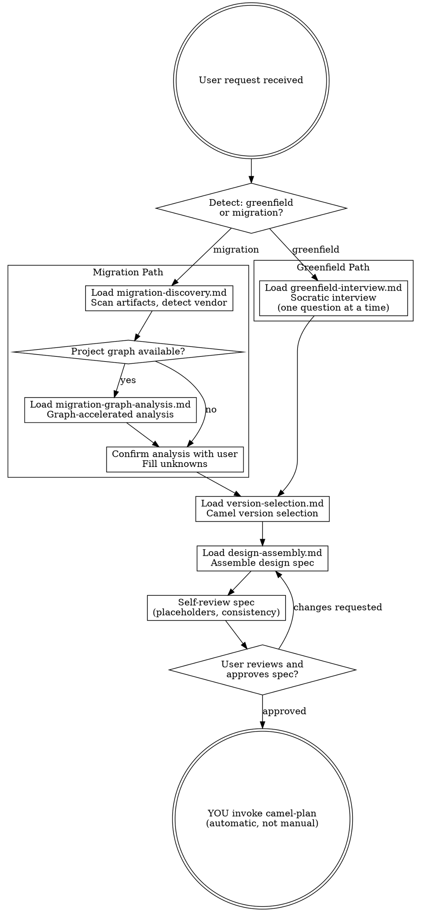

# Camel Brainstorm — Phase 1 Orchestrator

Turn integration ideas into fully formed design specs through collaborative dialogue.

**Announce at start:** "I'm using the camel-brainstorm skill to design your integration."

**Core principle:** Understand before designing. Design before planning. Plan before coding.

**Violating the letter of these rules is violating the spirit of these rules.**

<HARD-GATE>
Do NOT invoke camel-plan, generate any implementation artifacts, write any YAML routes, or take any implementation action until you have presented a design spec and the user has explicitly approved it. This applies to EVERY project regardless of perceived simplicity.
</HARD-GATE>

## Anti-Pattern: "This Is Too Simple To Need A Design"

Every integration goes through this process. A single-route REST-to-database flow, a file watcher, a simple bridge — all of them. "Simple" integrations are where unexamined assumptions cause the most wasted work. The design spec can be short for truly simple projects, but you MUST present it and get approval.

---

## Process Flow



**The terminal state is YOU invoking camel-plan.** Do NOT invoke camel-execute, generate YAML, or take any implementation action.

<HARD-RULE>
When the user approves the design spec, YOU must invoke/activate the `camel-plan` skill immediately and automatically. Do NOT tell the user to run it manually. Do NOT print "please run camel-plan" or "run /camel-plan". YOU do it — the transition is automatic.
</HARD-RULE>

---

## Iron Laws (enforced in this phase)

Read `shared/iron-laws.md` for the full Iron Laws. This phase enforces:

- **Iron Law 1: MCP Catalog Verification** — Every component, EIP, dataformat, and language in the design spec MUST be MCP-verified before inclusion. You do NOT guess component names.
- **Iron Law 4: No Code Without Spec Approval** — NEVER invoke camel-plan or generate any implementation artifacts before the user has explicitly approved the design spec.

### Rationalization Table

| Excuse | Reality |
|--------|---------|
| "The user clearly wants X, I'll just start designing" | Understand FIRST. Ask questions. Don't assume. |
| "This is just a simple REST-to-DB flow" | Simple flows have the most hidden assumptions. Interview anyway. |
| "I know which components to use" | You know training data. MCP catalog is truth. Verify. |
| "The user is in a hurry, I'll skip the interview" | Rushed design = rework. The interview saves time. |
| "I can design and plan in parallel to be efficient" | Iron Law 4: design spec approved BEFORE planning begins. |
| "The migration source tells me everything I need" | Source artifacts show WHAT exists, not what the user WANTS. Confirm. |
| "I'll verify components later during implementation" | Wrong design spec → wrong plan → wrong code. Verify NOW. |
| "I'll ask all clarification questions at once to save time" | Batching questions overwhelms the user and hides dependencies between answers. ONE question at a time. |
| "I'll tell the user to run camel-plan next" | NO. YOU invoke camel-plan automatically after approval. The pipeline is seamless. |

### Red Flags — STOP If You Think:

- "I already know what they need..."
- "Let me just start writing the design spec..."
- "This component probably exists..."
- "I can skip a few interview questions..."
- "The migration is straightforward, I don't need to confirm..."
- "I'll present the spec and move on quickly..."
- "I'll ask all the clarification questions at once to save time..."
- "Before I proceed, I need to clarify a few things: 1. ... 2. ... 3. ..."
- "To proceed, please run /camel-plan..." or "Next step: run camel-plan..."

---

## Detection Logic

Determine the project type from the user's request:

**Greenfield indicators:**
- "Create", "build", "connect", "integrate", "new project"
- No existing source artifacts mentioned
- Describes desired end state, not existing state

**Migration indicators:**
- "Migrate", "convert", "move from", "replace"
- Mentions source platform: MuleSoft, Mule, Fuse, Camel 2.x, Camel 3.x
- References existing integration files or projects
- "Upgrade" from older Camel version

**If ambiguous:** Ask the user:
```
Are you building a new integration from scratch, or migrating an existing one from another platform?

1. New integration (greenfield)
2. Migration from existing platform
```

---

## Checklist

You MUST complete these items in order:

1. **Detect project type** — greenfield or migration
2. **Resolve pipeline** — read `shared/pipeline-infrastructure.md` for pipeline resolution logic. If no active pipeline exists, prompt the user to run `{COMMAND_PREFIX} nextId <slug>` to create one. The pipeline ID determines where artifacts are saved.
3. **Load context** — read `docs/constitution.md` (if it exists), `.camel-kit/config.properties` (if it exists)
4. **Run interview/discovery** — load the appropriate guide:
   - Greenfield: `guides/greenfield-interview.md`
   - Migration: `guides/migration-discovery.md`
5. **Select Camel version** — load `guides/version-selection.md`
6. **Design flows** — for each flow, load relevant `camel-design/` guides (component selection, EIPs, data formats, error handling, security, resilience)
7. **Assemble design spec** — load `guides/design-assembly.md`
8. **Self-review spec** — scan for placeholders, contradictions, unverified components
9. **User reviews spec** — present spec, wait for explicit approval (Iron Law 4)
10. **Transition** — YOU invoke the `camel-plan` skill automatically (do NOT tell the user to run it)

---

## MCP Tools Used in This Phase

- `camel_catalog_component` — verify component exists, get options
- `camel_catalog_eip` — verify EIP exists, get configuration
- `camel_catalog_dataformat` — verify dataformat exists
- `camel_catalog_language` — verify expression language exists
→ For MCP setup, version mapping, and fallback policy: see `shared/mcp-setup.md`
→ For graph analysis: use `{COMMAND_PREFIX} graph` CLI commands (see `shared/graph-availability.md`)

---

## Context Loading (do this first)

**Read at start (if they exist):**
1. `docs/constitution.md` — constitution rules. If missing, copy from `templates/constitution.md`.
2. `.camel-kit/config.properties` — project config (Camel version, runtime). May not exist yet.
3. `docs/business-requirements.md` — existing BRD (if resuming a project).

---

## Error Handling

- **Missing constitution:** Copy from `templates/constitution.md` and continue.
- **No config.properties:** Will be created during version selection.
- **MCP tool failure:** Warn the user, continue with a note that verification is pending.
- **Ambiguous project type:** Ask explicitly — don't guess.
