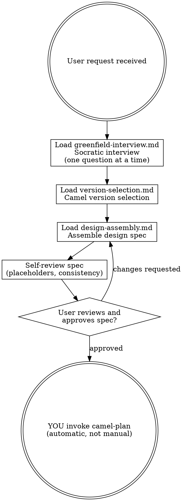

# Camel Brainstorm — Phase 1 Orchestrator

Turn integration ideas into fully formed design specs through collaborative dialogue.

**Announce at start:** "I'm using the camel-brainstorm skill to design your integration."

**Core principle:** Understand before designing. Design before planning. Plan before coding.

## When NOT to use this skill

- Quick property changes or version bumps — edit the file directly
- Adding a single well-known component — no design spec needed for a one-line route change
- Questions about Apache Camel — use `/camel-knowledge` instead
- You already have a design spec — use `/camel-plan` to decompose it into tasks
- Migrating from another platform (MuleSoft, BizTalk, Fuse, Camel 2.x/3.x) — use `/camel-migrate` instead

**Violating the letter of these rules is violating the spirit of these rules.**

<HARD-GATE>
Do NOT invoke camel-plan, generate any implementation artifacts, write any YAML routes, or take any implementation action until you have presented a design spec and the user has explicitly approved it. This applies to EVERY project regardless of perceived simplicity.
</HARD-GATE>

## Invocation Modes

This skill supports two invocation modes (see `shared/pipeline-infrastructure.md` for details):

### Chained Mode (default)

Auto-invoked by `camel-start` or invoked directly without a `<PIPELINE_ID>` argument when no existing design spec is found. Runs the full interview → design → approval → auto-invoke plan flow.

### Standalone Mode

Invoked with a `<PIPELINE_ID>` argument (e.g., `/camel-brainstorm 001-order-processing`). Two sub-cases:

1. **New pipeline** — `design-spec.md` does NOT exist in `docs/camel-kit/<PIPELINE_ID>/`. Runs the full interview flow, writes output to the pipeline directory, then STOPS (does NOT auto-invoke plan).
2. **Amend mode** — `design-spec.md` already exists. Enters re-iteration: loads the existing spec, presents it for amendment, writes the updated spec, marks downstream artifacts stale, then STOPS.

**Detection at start:**

```text
if <PIPELINE_ID> argument provided:
    resolve pipeline directory
    if design-spec.md exists → AMEND MODE
    else → STANDALONE NEW
else:
    → CHAINED MODE (normal flow)
```

In standalone mode, the `<HARD-RULE>` auto-transition to `camel-plan` is suppressed. The skill writes its output and stops.

---

## Amend Mode (Re-iteration)

When amending an existing design spec:

1. Read `docs/camel-kit/<PIPELINE_ID>/design-spec.md`
2. Present the existing spec to the user with: "This pipeline already has a design spec. What would you like to change?"
3. Apply the user's requested changes — this may involve:
   - Re-running parts of the interview for affected flows
   - Adding, removing, or modifying flows
   - Re-verifying components via MCP for changed flows
4. Self-review the amended spec (same review criteria as the original)
5. Present the amended spec for user approval
6. On approval, overwrite `design-spec.md` with the amended version
7. **Mark downstream artifacts stale** — per `shared/pipeline-infrastructure.md`, run `{COMMAND_PREFIX} doc stale --reason "design spec amended" --cascade <first-downstream-artifact>` (usually `implementation-plan.md`) so CLI-managed YAML frontmatter propagates staleness. Do not prepend manual marker text.
8. STOP — do NOT auto-invoke plan (standalone mode)

---

## Anti-Pattern: "This Is Too Simple To Need A Design"

Every integration goes through this process. A single-route REST-to-database flow, a file watcher, a simple bridge — all of them. "Simple" integrations are where unexamined assumptions cause the most wasted work. The design spec can be short for truly simple projects, but you MUST present it and get approval.

---

## Process Flow



**The terminal state depends on invocation mode.** In chained mode: YOU invoke camel-plan. In standalone mode: write output and STOP. In both modes: do NOT invoke camel-execute, generate YAML, or take any implementation action.

<HARD-RULE>
When the user approves the design spec in **chained mode**, YOU must invoke/activate the `camel-plan` skill immediately and automatically. Do NOT tell the user to run it manually. Do NOT print "please run camel-plan" or "run /camel-plan". YOU do it — the transition is automatic.

In **standalone mode** (including amend mode), write the output artifact and STOP. Do NOT auto-invoke camel-plan.
</HARD-RULE>

---

## Iron Laws (enforced in this phase)

Read `shared/iron-laws.md` for the full Iron Laws. This phase enforces:

- **Iron Law 1: MCP Catalog Verification** — Every component, EIP, dataformat, and language in the design spec MUST be MCP-verified before inclusion. You do NOT guess component names.
- **Iron Law 3: No Code Without Design Approval and an Existing Plan** — NEVER generate implementation artifacts
  (YAML, Java) during this phase. Brainstorming produces one greenfield design spec, not code or migration business
  requirements.
- **Iron Law 5: Adversarial Code Review** — while no code is generated here, the adversarial mindset applies to the design: assume the design will fail and look for gaps.

### Rationalization Table

| Excuse | Reality |
|--------|---------|
| "The user clearly wants X, I'll just start designing" | Understand FIRST. Ask questions. Don't assume. |
| "This is just a simple REST-to-DB flow" | Simple flows have the most hidden assumptions. Interview anyway. |
| "I know which components to use" | You know training data. MCP catalog is truth. Verify. |
| "The user is in a hurry, I'll skip the interview" | Rushed design = rework. The interview saves time. |
| "I can design and plan in parallel to be efficient" | Iron Law 3: design spec approved BEFORE planning begins. |
| "I'll verify components later during implementation" | Wrong design spec → wrong plan → wrong code. Verify NOW. |
| "I'll ask all clarification questions at once to save time" | Batching questions overwhelms the user and hides dependencies between answers. ONE question at a time. |
| "I'll tell the user to run camel-plan next" | NO. In chained mode, YOU invoke camel-plan automatically. In standalone mode, STOP after writing output. |
| "The existing spec is fine, I'll skip the amend review" | Amend mode still requires self-review and user approval. Same standards apply. |
| "I'll auto-invoke plan after amending the spec" | NO. Amend mode is standalone — write output and STOP. The caller manages transitions. |
| "I don't need to mark downstream artifacts stale" | If you amend the design spec and downstream artifacts exist, they MUST be marked stale. |

### Red Flags — STOP If You Think:

- "I already know what they need..."
- "Let me just start writing the design spec..."
- "This component probably exists..."
- "I can skip a few interview questions..."
- "I'll present the spec and move on quickly..."
- "I'll ask all the clarification questions at once to save time..."
- "Before I proceed, I need to clarify a few things: 1. ... 2. ... 3. ..."
- "To proceed, please run /camel-plan..." or "Next step: run camel-plan..."

---

## Scope

This skill is greenfield-only. `camel-start` routes migration and upgrade requests to `camel-migrate`; do not detect,
scan, or execute a migration branch here.

---

## Checklist

You MUST complete these items in order:

1. **Detect invocation mode** — check for `<PIPELINE_ID>` argument and existing `design-spec.md` (see Invocation Modes above). If amend mode, skip to the Amend Mode section.
2. **Resolve pipeline** — read `shared/pipeline-infrastructure.md` for pipeline resolution logic. If no active pipeline exists, prompt the user to run `{COMMAND_PREFIX} nextId <slug>` to create one. The pipeline ID determines where artifacts are saved.
3. **Load context** — read `docs/constitution.md` (if it exists), `.camel-kit/config.properties` (if it exists)
4. **Run greenfield interview** — first read `shared/discovery-completeness.md`, then load
   `guides/greenfield-interview.md`; capture explicit scope boundaries and the reason for every exclusion
5. **Select Camel version** — load `guides/version-selection.md`
6. **Design flows** — for each flow, load relevant `camel-design/` guides (component selection, EIPs, data formats, error handling, security, resilience)
7. **Assemble design spec** — load `guides/design-assembly.md`
8. **Self-review spec** — scan for placeholders, contradictions, unverified components, and any flow that crosses an
   explicit `Not Doing (and Why)` boundary
9. **User reviews spec** — present spec, wait for explicit approval (Iron Law 3)
10. **Transition** — depends on invocation mode:
    - **Chained mode:** YOU invoke the `camel-plan` skill automatically (do NOT tell the user to run it)
    - **Standalone mode:** write output artifact, print confirmation, STOP

---

## MCP Tools Used in This Phase

- `camel_catalog_component_doc` — verify component exists, get options
- `camel_catalog_eip_doc` — verify EIP exists, get configuration
- `camel_catalog_dataformat_doc` — verify dataformat exists
- `camel_catalog_language_doc` — verify expression language exists

Pass `runtime` and the full `platformBom` GAV (derived from `.camel-kit/config.properties` per `shared/mcp-setup.md` — the file stores bare versions, not the GAV) on every call, and check the echoed `camelVersion` matches the project version (Iron Law 1).

→ For MCP setup, version mapping, and fallback policy: see `shared/mcp-setup.md`
→ For graph analysis: use `{COMMAND_PREFIX} graph` CLI commands (see `shared/graph-availability.md`)

---

## Context Loading (do this first)

**Read at start (if they exist):**
1. `docs/constitution.md` — constitution rules. If missing, copy from `templates/constitution.md`.
2. `.camel-kit/config.properties` — project config (Camel version, runtime). May not exist yet.

---

## Error Handling

- **Missing constitution:** Copy from `templates/constitution.md` and continue.
- **No config.properties:** Will be created during version selection.
- **MCP tool failure:** Warn the user, continue with a note that verification is pending.
- **Ambiguous project type:** Ask explicitly — don't guess.
