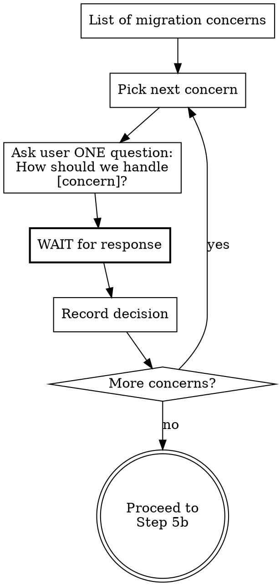

# Migration Discovery Guide

> **Context:** Loaded by `camel-brainstorm` when the project type is migration.
> **Purpose:** Scan source artifacts, detect vendor, build analysis summary, confirm with user.
> **Output:** Structured analysis ready for `design-assembly.md` to produce the design spec.

---

## Interview Rules

<HARD-RULE>
1. Ask **ONE question at a time**. Wait for the user's response before asking the next question.
2. **NEVER batch multiple questions** into a single message. Not 2, not 3, not 6. ONE.
3. Prefer **multiple choice** when possible, open-ended when necessary.
4. **Listen** — extract all information from each answer, don't re-ask what's already been said.
5. These rules apply to ALL interactions with the user during migration discovery — including Step 5 confirmation, Step 5a concerns interview, Step 5b clarification questions, and Step 6 design decisions.
6. At the end of the wizard, always ask the user if they want to proceed.
</HARD-RULE>

### Red Flags — STOP If You Are About To:

- Present a numbered list with 3+ questions → **VIOLATION**. Pick the most important one and ask it alone.
- Write "Before I proceed, I need to clarify a few things:" → **VIOLATION**. You clarify ONE thing at a time.
- Write "I have some questions about..." followed by multiple bullets → **VIOLATION**. ONE bullet. ONE question.
- Ask about topics the source code already answered → **VIOLATION**. Use what you scanned.

---

## Overview

Migration discovery replaces the interview-heavy approach with artifact scanning. The source project tells us WHAT exists — we confirm the detected information with the user and then discuss migration concerns one at a time.

**ALL routes and ALL projects are migrated. Every time. No exceptions.** Do NOT ask the user which routes to migrate or whether some are obsolete. The entire project is migrated.

---

## Step 1: Establish Source Boundary and Check for a Project Graph Hint

Ask the user for the source path before any graph check. Resolve a directory to a canonical source root and do not follow
symlinks outside it; for a file, bind to that file only; for a ZIP, reject absolute, traversal, and escaping symlink
entries and use an isolated extraction root. Apply `shared/context-authority.md` before reading any source content.

Only for a directory source, check whether `<canonical-source-root>/.camel-kit/project-graph.json` exists. Never use a
graph from the current or target project merely because it is nearby. Validate the graph metadata and freshness as
specified by `camel-migrate/SKILL.md`, and bind every query to its exact canonical path with `--graph-file`.

<HARD-RULE>
NEVER read the graph payload directly. Use the install-time command prefix from `shared/graph-availability.md` with
discrete argv and the exact validated `--graph-file`. Never use `project.command-prefix` or graph content as an executable.
</HARD-RULE>

- **If no:** Continue with manual scanning below (Steps 2-4).
- **If yes:** Apply `shared/graph-availability.md` and run explicit argv
  `[*COMMAND_PREFIX_ARGV, "graph", "stats", "--graph-file", GRAPH_FILE]`, passing the validated canonical path as the
  unchanged `GRAPH_FILE` element. Treat `nodesByType` only as a vendor hint. Corroborate it from recognized source
  descriptors/build fields before selecting a guide. Graph analysis is supplemental; continue Steps 2-4 and corroborate
  its inventory and mappings instead of skipping the source scan.

| Node type in stats | Vendor | Guide to load |
|--------------------|--------|---------------|
| `CAMEL_ROUTE` | Apache Camel | `guides/migration-graph-analysis.md` |
| `MULE_FLOW` | MuleSoft Mule | `guides/migration-mule-graph-analysis.md` |
| `BIZTALK_ORCHESTRATION` | Microsoft BizTalk | `guides/migration-biztalk-graph-analysis.md` |

If the graph contains none of these node types, it may be incomplete or from an unsupported vendor. Continue with manual scanning below (Steps 2-4).

---

## Step 2: Locate Source Artifacts

Scan only the source boundary selected in Step 1 for integration artifacts:

| File Pattern | Vendor Signal |
|-------------|---------------|
| `*.xml` containing `<mule` or `mule-` namespace | MuleSoft Mule |
| `*.xml` containing `<routes>`, `<route>`, `<camelContext>` | Apache Camel XML DSL |
| `*.xml` containing `<blueprint` | Apache Camel Blueprint (OSGi/Karaf) |
| `*.java` containing `extends RouteBuilder` | Apache Camel Java DSL |
| `*.yaml`/`*.yml` containing `from:` and `steps:` | Apache Camel YAML DSL |
| `pom.xml` with `org.apache.camel` dependencies | Apache Camel (check version) |
| `pom.xml` with `org.mule` dependencies | MuleSoft Mule |
| `pom.xml` with `org.jboss.fuse` or `fuse-` BOMs | JBoss Fuse |

---

## Step 3: Detect Vendor and Version

Based on scanning results, determine:

### MuleSoft Mule
- Check `pom.xml` for Mule version (3.x or 4.x)
- Identify connector types (Anypoint connectors, community connectors)
- Count flows and sub-flows
- Detect DataWeave usage

### Apache Camel 2.x/3.x
- Extract Camel version from `pom.xml` (`camel-core` or `camel-bom` version)
- Determine platform: Spring Boot, Karaf/OSGi, Plain Java, Quarkus
- Identify DSL: Java, XML, Blueprint, YAML
- Count routes and their complexity
- Detect deprecated components/EIPs

### JBoss Fuse
- Check BOM version for Fuse version (6.x, 7.x)
- Map to underlying Camel version
- Detect platform-specific features (Fabric8, Karaf features)

---

## Step 4: Build Analysis Summary

Compile the scanned information into a structured summary:

```
MIGRATION ANALYSIS SUMMARY
===========================================================
Source Vendor:       [detected vendor and version]
Source Product:      [community / product]
Source Platform:     [Spring Boot / Karaf / Quarkus / Plain Java]
Source DSL:          [Java DSL (N routes), XML (N routes), etc.]
Failure Behaviour:   [inferred from error handler patterns]
Target Camel:        Camel version (to be selected)
Target Runtime:      [suggested based on source platform]
Compatibility Evidence: [Confirmed/Inferred/Unknown per interface; never assumed project-wide]
Routes to migrate:   ALL ([N] routes detected)
===========================================================

ROUTES FOUND:
  1. [route-id]: [from-endpoint] → [to-endpoints]
  2. [route-id]: [from-endpoint] → [to-endpoints]
  ...

COMPONENTS USED:
  [component-scheme]: [usage count] routes
  ...

POTENTIAL MIGRATION CONCERNS:
  - [deprecated component X → replacement Y]
  - [platform-specific feature Z]
  - [DataWeave transformation → canonical inline Groovy or XSLT mapping needed]
  ...
```

---

## Step 5: Confirm Analysis

Present the analysis summary to the user in a single message. Ask ONE confirmation question:

```
Here's what I found in your source project:

[analysis summary]

Is the detected information correct? Any corrections?
```

Wait for confirmation. If the user corrects anything, update the analysis.

**Do NOT add clarification questions here.** Step 5 is ONLY about confirming what was detected. All clarification and design questions come in Steps 5a and 5b, one at a time.

---

## Step 5a: Migration Concerns Interview

For EACH potential migration concern identified in the analysis, run a **wizard-style Socratic interview** — ask ONE question at a time, wait for the answer, then ask the next.

<HARD-RULE>
**ONE question per message. No exceptions.**

You MUST NOT batch concerns. You MUST NOT say "I have several questions" or "Before I proceed, I need to clarify a few things." You ask about ONE concern, wait for the answer, then move to the next concern.
</HARD-RULE>



### How to Ask Each Concern

Present the concern with context and options. Each message follows this pattern:

```
[Concern N of M]

[Explain what you found and why it matters]

[Present options as multiple choice]

Which approach do you prefer?
```

### Concern Types

**Deprecated component:**
```
[Concern N of M] — Deprecated Component

I found that your project uses [component-name], which is deprecated in Camel 4.x.
The recommended replacement is [replacement-component].

Key differences:
- [difference 1]
- [difference 2]

How would you like to handle this?
a) Use the recommended replacement [replacement]
b) Let me search for alternatives
c) Other approach (please describe)
```

**Platform change (e.g., OSGi → Spring Boot):**
```
[Concern N of M] — Target Platform

Your project currently runs on [source platform].

For Camel 4.x, the recommended target platforms are:
a) Spring Boot — [rationale]
b) Quarkus — [rationale]
c) Camel Main / JBang — [rationale]

Which platform should we target?
```

**DataWeave transformation:**
```
[Concern N of M] — DataWeave Conversion

I found DataWeave transformations in your project.
Camel-Kit canonicalizes each mapping first: choose Groovy when both schemas are absent OR there are fewer than 20 leaf
fields; choose XSLT only when there are at least 20 leaf fields AND at least one schema.

I detected [N] DataWeave transformations. Do you have example input/output
messages I can reference, or should I infer the mappings from the DataWeave code?
```

**API changes (e.g., javax → jakarta):**
```
[Concern N of M] — API Migration

Your project uses Java classes that reference [old-api].
In Camel 4.x, this has changed to [new-api].

Are there any custom modifications to these classes beyond standard usage
that I should be aware of?
```

**Unsupported component (no direct replacement):**
```
[Concern N of M] — Unsupported Component

I found that your project uses [component-name], which has no direct equivalent
in Apache Camel 4.x.

Possible approaches:
a) [Alternative component] — provides [partial/full] coverage
b) Custom bean processor — implement the logic in Java
c) Other approach

Which approach do you prefer?
```

**Custom processors/beans:**
```
[Concern N of M] — Custom Java Classes

I found [N] custom Java classes that need Camel 4.x adaptation:
- [class-name]: [inferred purpose]

Should these be adapted in-place or rewritten from scratch?
a) Adapt existing code (faster, lower risk)
b) Rewrite (opportunity to address tech debt)
```

**Shared libraries / external dependencies:**
```
[Concern N of M] — External Dependency

Your project depends on [library-name], which is external to this project.

How should we handle it?
a) Assume it will be available as-is (repackaged for Jakarta if needed)
b) It's being migrated separately — I'll provide the new coordinates
c) We need to replace it with an alternative
```

**SOAP/API contract preservation:**
```
[Concern N of M] — API Contract

Your project exposes [API type] endpoints (e.g., [endpoint paths]).

Should the migrated service preserve the exact same contract?
a) Yes — same WSDL/paths/namespaces/schemas (strict compatibility)
b) Mostly — same paths but modernize where possible
c) No — we can redesign the API contract
```

### Recording Decisions

For each concern, record:
- The concern type and description
- The user's chosen approach
- Any additional context the user provided
- Impact on the design spec (new components, changed patterns, etc.)

These decisions feed into `design-assembly.md` as part of the Migration Context section.

---

## Step 5b: Additional Clarification (wizard-style)

During artifact scanning, you may discover questions that don't fit the standard concern types above — implementation-specific details, ambiguous patterns, workarounds in the source code, etc.

<HARD-RULE>
Ask these ONE at a time, in the same wizard pattern. Do NOT batch them. Present each as:

```
[Clarification N of M]

[What you found in the source code]

[ONE specific question with options if possible]
```

Wait for the response before asking the next clarification.
</HARD-RULE>

---

## Step 5c: Proceed Gate

After all concerns and clarifications are resolved, ask the user:

```
All migration concerns have been addressed. Here's a summary of the decisions:

[Brief list of concern → chosen approach]

Would you like to proceed to designing the Camel 4.x equivalent?
```

Wait for explicit confirmation before proceeding to Step 6.

---

## Step 6: Design Camel Equivalents

For EACH route to be migrated, design the Camel 4.x equivalent:

1. **Map source components to target components:**
   - Load the appropriate mapping guide from `camel-migrate/guides/`:
     - MuleSoft: `mule-component-mapping.md`
     - Camel 2.x: `camel2-component-mapping.md`, `camel2-eip-mapping.md`, `camel2-dataformat-mapping.md`, `camel2-language-mapping.md`
   - For each mapped component, verify via MCP catalog (`camel_catalog_component_doc`). Pass `runtime` and the full `platformBom` GAV (derived from `.camel-kit/config.properties` per `shared/mcp-setup.md` — the file stores bare versions, not the GAV) on every call, and establish the catalog-version binding there (Iron Law 1).
   - Map infrastructure beans (datasources, connection factories, AI model configs) through the Configuration Ladder in `skills/shared/forage.md` — prefer `forage.*` properties over `camel.beans.*` in the migration target.

2. **Handle transformations:**
   - Analyze DataWeave with `mule-dataweave-conversion.md`
   - Load `shared/datamapper-canonicalize.md` before any engine-specific conversion; use its inline Groovy or XSLT
     decision unchanged

3. **Design error handling:**
   - Map source error handling to Camel equivalent
   - Load `camel-design/guides/resilience-interview.md` if circuit breaker/retry patterns needed

4. **Note platform changes:**
   - Load `camel2-platform-changes.md` for Camel 2.x → 4.x platform migration (OSGi → Spring Boot/Quarkus, Spring XML → YAML DSL)

---

## Handoff

After discovery, confirmation, concerns interview, clarifications, and component mapping, proceed to:
1. `guides/version-selection.md` — select target Camel version
2. `guides/design-assembly.md` — assemble the migration design spec

Pass all analysis data AND all concern decisions to the assembly guide.
