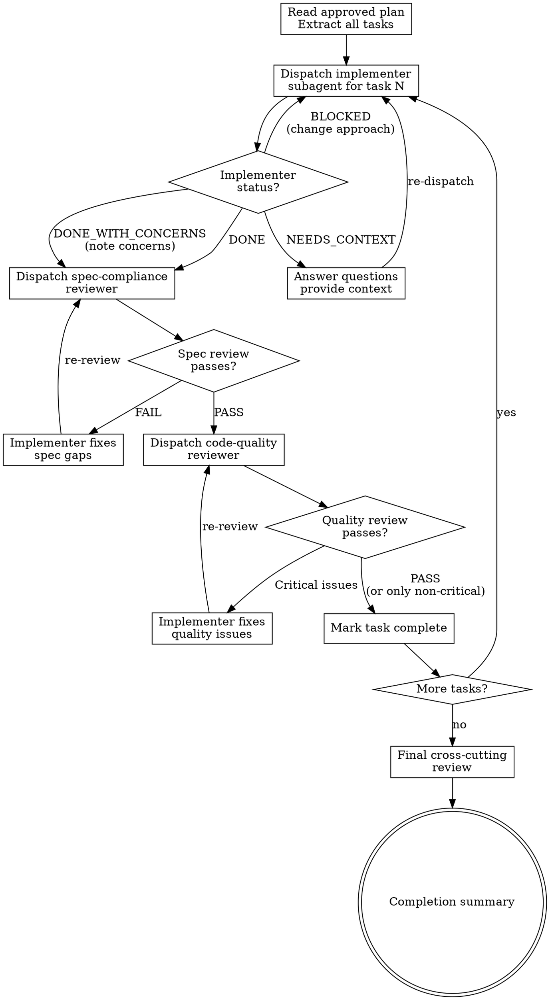

# Camel Execute — Phase 3 Orchestrator

Execute the approved implementation plan by dispatching fresh subagents per task, with two-stage review after each.

**Announce at start:** "I'm using the camel-execute skill to implement the plan."

**Core principle:** Fresh subagent per task + two-stage review (spec then quality) = high quality, fast iteration.

<HARD-RULE>
AUTONOMOUS EXECUTION: Execute ALL tasks from the plan sequentially WITHOUT stopping, pausing, or asking the user between tasks. The user approved the entire plan — that is your authorization to execute every task. After each task's review passes, IMMEDIATELY start the next task. Do NOT print "Next Steps", "Ready to proceed", or any summary between tasks. The ONLY summary is the final completion report after ALL tasks are done (Step 4).
</HARD-RULE>

**Violating the letter of these rules is violating the spirit of these rules.**

---

## Process Flow



---

## Iron Laws (enforced in this phase)

Read `shared/iron-laws.md` for the full Iron Laws. This phase enforces ALL five:

- **Iron Law 1: MCP Catalog Verification** — implementer subagents MUST verify every component via MCP before generating YAML.
- **Iron Law 2: Red Hat Build Only** — quality reviewer checks Red Hat support status.
- **Iron Law 3: Constitution Compliance** — quality reviewer checks all 7 constitution rules.
- **Iron Law 4: No Code Without Spec Approval** — this phase runs ONLY after the plan is approved.
- **Iron Law 5: Spec Compliance Before Quality** — ALWAYS spec review FIRST, then quality review. Never in parallel. Never reversed.

### Rationalization Table

| Excuse | Reality |
|--------|---------|
| "I can run both reviews in parallel to save time" | Iron Law 5: spec first, quality second. Sequential. Always. |
| "The implementation clearly matches the spec" | Clearly ≠ verified. Run the spec review. |
| "I'll fix issues after all tasks are done" | Fix per task. Don't accumulate tech debt across tasks. |
| "The implementer's self-review is sufficient" | Self-review catches obvious issues. Reviewer catches what self-review misses. Both needed. |
| "This task is too simple for two-stage review" | Simple tasks get simple reviews. But they still get reviews. |
| "I'll dispatch multiple implementers in parallel" | Never. Implementers can conflict. One at a time. |
| "The subagent can read the plan file itself" | Provide full task text. Don't make subagents read plan files. |
| "I should ask before proceeding to the next task" | The user approved the ENTIRE plan. Execute ALL tasks without asking. |
| "Let me check if the user wants to continue" | They already said yes — to the whole plan. Keep going. |
| "Let me summarize what was completed so far" | No mid-plan summaries. Print ONE LINE per task. Summary only at the END (Step 4). |
| "The scaffolding phase is complete, ready for implementation" | Scaffolding is ONE task. The plan has N tasks. Execute all N. Don't stop at 1. |
| "Next Steps: Ready to proceed with Task N" | There are no "Next Steps" — you ARE executing the next step RIGHT NOW. |

### Red Flags — STOP If You Think:

- "Let me skip the spec review for this simple task..."
- "I can run spec and quality reviews at the same time..."
- "The implementer said it's done, I trust them..."
- "I'll batch the reviews at the end..."
- "I don't need to dispatch a subagent for this..."
- "Would you like me to continue with Task N?"
- "Shall I proceed with the next task?"
- "Next Steps: Ready to proceed with..."
- "The [phase/command] has successfully completed..."
- "The project is now ready for implementation of the remaining tasks"
- "Ready to continue..." (any sentence starting with "Ready to continue")

---

## Execution Process

### Step 1: Read Plan and Extract Tasks

Read `docs/implementation-plan.md` (or the plan path specified).

Extract ALL tasks with:
- Full task text (don't summarize)
- Agent persona to dispatch
- Files to create/modify
- Guides to load
- MCP tools to call
- Design spec section reference
- Review specification

### Step 2: Per-Task Loop

For each task in order:

#### 2a: Dispatch Implementer Subagent

Build the implementer prompt using `guides/implementer-context.md`.

Dispatch a fresh subagent with:
- Agent persona (from `agents/[persona].md`)
- Full task text from the plan
- Relevant design spec section (read and include — don't make the subagent find it)
- Guide file paths to load
- MCP tool parameters (runtime, platformBom)
- Project context (Camel version, runtime, module path)

**Model selection:**
- Mechanical tasks (single-route YAML, properties, Docker Compose): standard model
- Complex tasks (DataMapper XSLT, multi-route coordination, migration): most capable model
- Review tasks: standard model (spec reviewer), most capable (quality reviewer)

#### 2b: Handle Implementer Status

| Status | Action |
|--------|--------|
| **DONE** | Proceed to spec compliance review |
| **DONE_WITH_CONCERNS** | Read concerns. If correctness/scope issues: address before review. If observations: note and proceed. |
| **NEEDS_CONTEXT** | Provide missing context, re-dispatch same subagent |
| **BLOCKED** | Assess blocker: context problem → provide more context. Task too large → break it up. Plan wrong → note for user. |

#### 2c: Spec Compliance Review (Stage 1)

Dispatch spec-compliance-reviewer subagent using `guides/spec-reviewer-criteria.md`.

Provide:
- The generated files (or paths to them)
- The design spec section this task implements
- The task's review specification

If review FAILS: return feedback to implementer, re-dispatch implementer to fix, re-review. Loop until pass.

**DO NOT proceed to quality review until spec review passes.**

#### 2d: Code Quality Review (Stage 2)

Dispatch code-quality-reviewer subagent using `guides/quality-reviewer-criteria.md`.

Provide:
- The generated files (or paths to them)
- Constitution rules to check
- Security and anti-pattern checks

If review finds **Critical** issues: return to implementer, fix, re-review.
If review finds only **Important/Suggestion** issues: note them, proceed.

#### 2e: Mark Task Complete and Continue

Record completion with a ONE-LINE status: `✅ Task N complete. Starting Task N+1...`

Then IMMEDIATELY start Step 2a for the next task. No summary, no "Next Steps", no pause.

<HARD-RULE>
The per-task loop is AUTOMATIC and UNINTERRUPTED.

After completing a task (implement → spec review → quality review):
1. Print ONE LINE: `✅ Task N complete. Starting Task N+1...`
2. IMMEDIATELY begin dispatching the next task's implementer subagent

Do NOT:
- Ask "Would you like me to continue?" or "Shall I proceed with Task N?"
- Print "Next Steps" or "Ready to proceed" blocks
- Print a completion summary (that's Step 4, ONLY after ALL tasks)
- Pause for confirmation between tasks
- Say "The camel-execute/camel-migrate command has completed" (it hasn't — there are more tasks)

The user approved the entire plan — that approval covers ALL tasks. Execute them ALL sequentially without interruption. The ONLY time you stop is after the LAST task, when you print the Step 4 completion summary.
</HARD-RULE>

### Step 3: Final Cross-Cutting Review

After all tasks complete:

1. Dispatch code-quality-reviewer for a cross-cutting review of ALL generated routes
2. Check constitution compliance across all routes (not just individually)
3. Check for cross-route consistency (naming conventions, property patterns, error handling consistency)
4. Run smoke test if plan includes one

### Step 4: Completion Summary

```
===============================================================
IMPLEMENTATION COMPLETE
===============================================================

Plan: docs/implementation-plan.md
Design Spec: docs/design-spec.md

Tasks Completed: [N/N]

Generated Files:
  [list all generated files with paths]

Review Results:
  Spec Compliance: [N/N] tasks passed
  Code Quality: [N/N] tasks passed ([M] non-critical issues noted)

Cross-Cutting Review: PASS/FAIL
Smoke Test: PASS/FAIL/NOT_RUN

===============================================================
```

---

## Never

- Start implementation without an approved plan
- Skip reviews (spec compliance OR code quality)
- Run reviews in parallel or reversed order
- Dispatch multiple implementers simultaneously
- Make subagents read the plan file (provide full text)
- Ignore subagent questions
- Accept "close enough" on spec compliance
- Skip re-review after fixes
- Move to next task with open issues
- Stop or pause between tasks to ask the user
- Print "Next Steps" or completion summaries between tasks (only after the LAST task)
- Say "command has completed" or "phases are complete" while tasks remain
