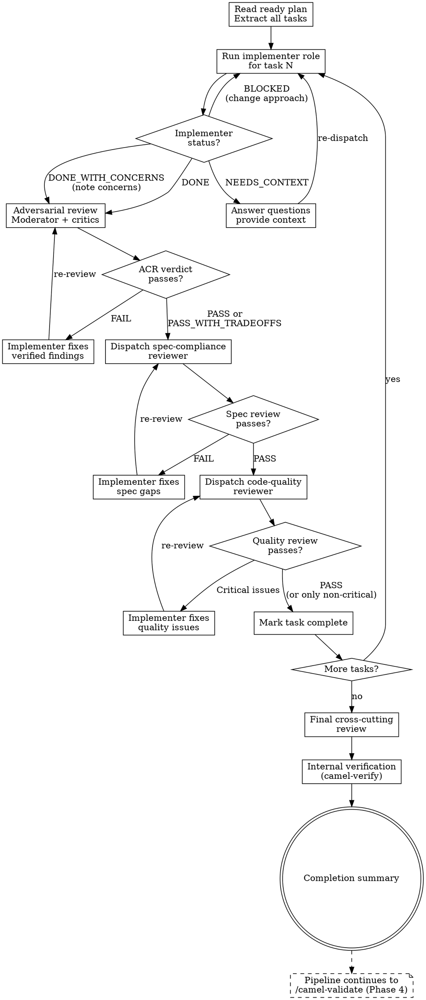

# Camel Execute — Phase 3 Orchestrator

Execute the ready implementation plan derived from the approved design with target-appropriate task execution, an adversarial pre-filter, and ordered spec and quality review after each task.

**Announce at start:** "I'm using the camel-execute skill to implement the plan."

**Core principle:** Adversarial review first, then spec compliance, then code quality.

**Capability rule:** When the target supports subagents, use the isolated roles and
parallelism described below. When it does not, assume the same personas and run
catalog research, implementation, critic lenses, staged reviews, cross-cutting
review, and verification sequentially in the current session. Record the lack of
fresh-context isolation; never skip a phase merely because dispatch is unavailable.

## When NOT to use this skill

- No implementation plan derived from an approved design exists — use `/camel-plan` first to create one
- Questions about Apache Camel — use `/camel-knowledge` instead
- Validation-only tasks (checking existing routes without changing them) — use `/camel-validate` instead
- You need a design spec — use `/camel-brainstorm` first; this skill implements plans, not ideas

<HARD-RULE>
AUTONOMOUS EXECUTION: Execute ALL tasks from the plan using wave analysis. Run `{COMMAND_PREFIX} plan analyze` first to get parallel waves. Tasks within a wave can run in parallel if the agent supports it. Tasks across waves run sequentially (wave N completes before wave N+1 starts). If wave analysis is unavailable, fall back to sequential execution. Do NOT stop, pause, or ask the user between tasks or waves. The approved design and its generated implementation plan authorize all downstream tasks.
</HARD-RULE>

**Violating the letter of these rules is violating the spirit of these rules.**

---

## Invocation Modes

This skill supports two invocation modes (see `shared/pipeline-infrastructure.md` for details):

### Chained Mode (default)

Auto-invoked by `camel-plan` after planning completes. The plan content is available in conversation context. After execution, auto-invokes `camel-validate`.

### Standalone Mode

Invoked directly (e.g., `/camel-execute` or `/camel-execute <PIPELINE_ID>`) in a new session. No conversation context — reads the implementation plan from `docs/camel-kit/<PIPELINE_ID>/implementation-plan.md`.

**Detection at start:**

1. If auto-invoked by plan in this conversation → **chained mode**
2. If invoked independently and `implementation-plan.md` exists in the pipeline directory → **standalone mode**
3. If `implementation-plan.md` does not exist → error: "No implementation plan found. Run /camel-plan first."

**Standalone behavior:**

- Read `implementation-plan.md` from disk as the input
- Also read `design-spec.md` (needed for spec compliance reviews)
- Run `{COMMAND_PREFIX} doc check <file>` on both files to detect staleness — if stale, warn but proceed
- Execute the full task loop (Step 0 through Step 4)
- Write `execution-report.md` to the pipeline directory
- Do NOT auto-invoke `camel-validate` (standalone mode suppresses auto-transitions)

---

## Process Flow



---

## Step 0: Analyze Plan for Parallel Execution

Before executing tasks, analyze the plan for parallel execution waves:

```bash
{COMMAND_PREFIX} plan analyze docs/camel-kit/<activePipeline>/implementation-plan.md
```

This outputs JSON with parallel execution waves — groups of tasks that can run simultaneously because they touch different files:

```json
{
  "waves": [
    {"wave": 1, "tasks": [1, 2, 4]},
    {"wave": 2, "tasks": [3, 5]},
    {"wave": 3, "tasks": [6]}
  ],
  "dependencies": {"3": [2], "5": [4], "6": [3, 5]}
}
```

**Execution strategy:**
- Execute all tasks within a wave **in parallel** (dispatch separate subagents simultaneously)
- Wait for ALL tasks in a wave to complete and pass review before starting the next wave
- Tasks in the same wave are guaranteed to touch different files — no conflicts
- Each task still gets two-stage review (spec compliance, then code quality)
- If the `plan analyze` command fails or is unavailable, fall back to sequential execution (execute tasks in plan order)

**For agents that cannot parallelize** (single-conversation agents):
- Execute tasks within each wave sequentially, but respect the wave ordering
- This ensures correct dependency order even without parallelism

---

### Step 0.5: Environment Probe

Before dispatching any implementers, validate the target environment.

1. Load `guides/environment-probe.md`
2. Execute the probe (skeleton pom.xml, docker-compose, empty route)
3. If probe passes → proceed to task dispatch
4. If probe finds mechanical failures → auto-fix and re-probe
5. If probe finds architectural failures → load `guides/re-plan-loop.md`
   - Re-plan modifies affected flow design sections in the active design spec, max 3 rounds
   - After successful re-plan → re-probe, then proceed
6. If probe still fails after re-plan → escalate to user

The probe prevents wasting implementation cycles on environments that cannot support the planned architecture.

---

## Iron Laws (enforced in this phase)

Read `shared/iron-laws.md` for the full Iron Laws. This phase enforces ALL six:

- **Iron Law 1: MCP Catalog Verification** — every component must be verified before YAML generation. A
  `catalog-researcher` pre-verification summary satisfies this rule for the wave; otherwise implementer subagents must
  verify directly via MCP.
- **Iron Law 2: Constitution Compliance** — quality reviewer checks all 8 constitution rules.
- **Iron Law 3: No Code Without Design Approval and an Existing Plan** — this phase runs after the design spec is approved and planning is complete. NO code is generated during design or migration phases.
- **Iron Law 4: Spec Compliance Before Quality** — ALWAYS spec review FIRST, then quality review. Never in parallel. Never reversed.
- **Iron Law 5: Adversarial Code Review** — Critic Lanes run after implementation and before Stage 1 review. Use parallel fresh contexts when supported; otherwise run the same lenses sequentially in the current session and record that isolation is unavailable.
- **Iron Law 6: Surgical Changes** — TOUCH ONLY WHAT YOU’RE ASKED TO TOUCH. No unrelated refactoring or "cleanups."

### Rationalization Table

| Excuse | Reality |
|--------|---------|
| "I can run both reviews in parallel to save time" | Iron Law 4: spec first, quality second. Sequential. Always. |
| "The implementation clearly matches the spec" | Clearly ≠ verified. Run the spec review. |
| "I'll fix issues after all tasks are done" | Fix per task. Don't accumulate tech debt across tasks. |
| "The implementer's self-review is sufficient" | Self-review catches obvious issues. Reviewer catches what self-review misses. Both needed. |
| "This task is too simple for two-stage review" | Simple tasks get simple reviews. But they still get reviews. |
| "I'll dispatch multiple implementers in parallel without wave analysis" | Only parallelize within waves from `plan analyze`. Tasks in different waves may conflict. |
| "The subagent can read the plan file itself" | Provide full task text. Don't make subagents read plan files. |
| "This extra feature is an obvious improvement" | Read `Not Doing (and Why)` first. An explicit exclusion is an approved scope boundary, not an invitation to improve it. |
| "I should ask before proceeding to the next task" | The approved design and generated plan authorize every task. Execute ALL tasks without asking. |
| "Let me check if the user wants to continue" | The design approval already authorizes downstream execution. Keep going. |
| "The input plan is stale but I'll ignore the warning" | Always warn about staleness. Execution will produce fresh output, but the user should know the plan may be outdated. |
| "Let me summarize what was completed so far" | No mid-plan summaries. Print ONE LINE per task. Summary only at the END (Step 4). |
| "The scaffolding phase is complete, ready for implementation" | Scaffolding is ONE task. The plan has N tasks. Execute all N. Don't stop at 1. |
| "Next Steps: Ready to proceed with Task N" | There are no "Next Steps" — you ARE executing the next step RIGHT NOW. |

### Red Flags — STOP If You Think:

- "Let me skip the spec review for this simple task..."
- "I can run spec and quality reviews at the same time..."
- "The implementer said it's done, I trust them..."
- "I'll batch the reviews at the end..."
- "This target has no subagents, so I can skip a required role or review..."
- "Would you like me to continue with Task N?"
- "Shall I proceed with the next task?"
- "Next Steps: Ready to proceed with..."
- "The [phase/command] has successfully completed..."
- "The project is now ready for implementation of the remaining tasks"
- "Ready to continue..." (any sentence starting with "Ready to continue")

---

## Execution Process

### Step 1: Read Plan and Extract Tasks

Resolve the active pipeline using `shared/pipeline-infrastructure.md`:
1. Read `.camel-kit/pipeline.json` -> get `activePipeline`
2. Read the plan from `docs/camel-kit/<activePipeline>/implementation-plan.md`
3. The execution report will be saved to `docs/camel-kit/<activePipeline>/execution-report.md`

Extract ALL tasks with:
- Full task text (don't summarize)
- Agent persona to dispatch
- Files to create/modify
- Guides to load
- MCP tools to call
- Design spec section reference
- Review specification

Also read the complete global `## Not Doing (and Why)` section from the approved design spec. Before considering any
capability beyond a task's explicit requirements, compare it with this list. Never implement a listed exclusion; if a
task conflicts with one, report `BLOCKED` and name the plan/spec contradiction instead of silently overriding the
approved design. If a legacy approved spec has no such section, do not invent one during execution; Iron Law 6 still
prohibits extras.

### Step 1.5: Pre-Implementation Catalog Research

Before implementing a wave, batch-verify all MCP catalog artifacts referenced in its tasks.

1. Scan each task's referenced design spec section for components, EIPs, dataformats, and languages
2. Deduplicate across tasks in the wave
3. Run the `catalog-researcher` role (from `agents/catalog-researcher.md`) in a fresh subagent when supported, or inline otherwise, with:
   - The deduplicated artifact list
   - Runtime and platformBom parameters
4. Receive the structured verification summary
5. If any artifact is NOT FOUND: flag it in the task context before implementation — the implementer must find an alternative

**The verification summary replaces per-implementer MCP lookups.** The implementer receives pre-verified catalog data and MUST use it as the source of truth for this wave. Iron Law 1 remains enforced whether research is isolated or inline.

Pass the verification summary into each implementation task context (see `guides/implementer-context.md`).

---

### Step 2: Per-Task Loop

For each wave (sequential across waves, parallel within a wave for agents that support it). For single-conversation agents, execute tasks within each wave sequentially in plan order:

#### 2a: Run the Implementer Role

Build the implementer prompt using `guides/implementer-context.md`.

Use a fresh implementer subagent when supported; otherwise assume the persona and
perform the task inline. In either case provide:
- Agent persona (from `agents/[persona].md`)
- Full task text from the plan
- Complete global `## Not Doing (and Why)` section
- Relevant design spec section (read and include — don't make the subagent find it)
- Guide file paths to load
- MCP tool parameters (runtime, platformBom)
- Project context (Camel version, runtime, module path)

**Model selection:**
- Mechanical tasks (single-route YAML, properties, Docker Compose): standard model
- Complex tasks (DataMapper XSLT, multi-route coordination, migration): most capable model
- Review tasks: standard model (spec reviewer), most capable (quality reviewer)

#### 2b: Handle Implementer Status

| Status | Action |
|--------|--------|
| **DONE** | Proceed to Adversarial Code Review (Step 2b.5) |
| **DONE_WITH_CONCERNS** | Read concerns. If correctness/scope issues: address before review. If observations: note and proceed to Adversarial Code Review. |
| **NEEDS_CONTEXT** | Provide missing context, then resume or re-dispatch the same role |
| **BLOCKED** | Assess blocker: context problem → provide more context. Task too large → break it up. Plan wrong → note for user. |

#### 2b.5: Adversarial Code Review (ACR)

After the implementer reports DONE (or DONE_WITH_CONCERNS), run the Adversarial Code Review pre-filter before the two-stage review.

1. **Run the ACR Moderator role** (from `agents/acr-moderator.md`) in a fresh subagent when supported, or inline otherwise, with:
   - The generated files (read contents, not just paths)
   - The design spec section for this task
   - Source contracts if available for migration pipelines
   - The implementer's status and concerns
2. **Moderator selects Critic Lanes** based on design spec content:
   - Route Architecture — always active
   - Security — if external boundaries
   - Performance — if throughput/aggregation/batch
   - Boundary Compliance — if data transformation/mapping
   - Behavioral Equivalence — if migration pipeline
3. **Moderator runs critics** in parallel fresh contexts when supported; otherwise applies the same critic lenses sequentially in the current session and records the missing isolation
4. **Moderator synthesizes** findings: deduplicate, prioritize, produce verdict
5. **Handle verdict:**
   - PASS → proceed to spec compliance review (Step 2c)
   - FAIL → send actionable findings to implementer, re-dispatch ACR after fixes
   - PASS_WITH_TRADEOFFS → document trade-offs, proceed to spec compliance review
6. **Hard cap:** 3 ACR cycles per task. If actionable findings persist, escalate to user
7. **Trade-offs carry forward** to spec compliance review as context

See `guides/adversarial-code-review.md` for full workflow, convergence tracking, and theater detection.

---

#### 2c: Spec Compliance Review (Stage 1)

Run the spec-compliance-reviewer role using `guides/spec-reviewer-criteria.md`,
isolated when supported and inline otherwise.

Provide:
- The generated files (or paths to them)
- The complete global `## Not Doing (and Why)` section
- The design spec section this task implements
- The task's review specification

If review FAILS: return feedback to implementer, re-dispatch implementer to fix, and re-review, for at most 3 review iterations. If Actionable findings persist after 3 rounds, escalate with the unresolved findings and documented trade-offs.

**DO NOT proceed to quality review until spec review passes.**

#### 2d: Code Quality Review (Stage 2)

Run the code-quality-reviewer role using `guides/quality-reviewer-criteria.md`,
isolated when supported and inline otherwise.

Provide:
- The generated files (or paths to them)
- Constitution rules to check
- Security and anti-pattern checks

If review finds **Critical** issues: return to implementer, fix, re-review.
If review finds only **Important/Suggestion** issues: note them, proceed.

#### 2e: Mark Task Complete and Continue

Record completion with a ONE-LINE status: `✅ Task N complete. Starting Task N+1...`

Then IMMEDIATELY start Step 2a for the next task. No summary, no "Next Steps", no pause.

<HARD-RULE>
The per-task loop is AUTOMATIC and UNINTERRUPTED.

After completing a task (implement → adversarial review → spec review → quality review):
1. Print ONE LINE: `✅ Task N complete. Starting Task N+1...`
2. IMMEDIATELY begin the next task's implementer role

Do NOT:
- Ask "Would you like me to continue?" or "Shall I proceed with Task N?"
- Print "Next Steps" or "Ready to proceed" blocks
- Print a completion summary (that's Step 4, ONLY after ALL tasks)
- Pause for confirmation between tasks
- Say "The camel-execute/camel-migrate command has completed" (it hasn't — there are more tasks)

The approved design and generated implementation plan authorize ALL tasks. Execute them ALL without interruption, following wave policy (parallel within a wave where supported, sequential across waves). The ONLY time you stop is after the LAST task, when you print the Step 4 completion summary.
</HARD-RULE>

### Step 3: Final Cross-Cutting Review

After all tasks complete, run the cross-cutting review in an isolated subagent when supported, or inline otherwise:

1. Run the `code-quality-reviewer` role (from `agents/code-quality-reviewer.md`) with:
   - ALL generated route file paths
   - Constitution rules (`docs/constitution.md`)
   - Instruction to check cross-route consistency (naming conventions, property patterns, error handling consistency)
2. Check constitution compliance across all routes (not just individually) and produce the structured review report
3. **Generate cross-cutting review report** — include the cross-route consistency findings in the Step 4 completion
   summary. Do not run a smoke/build command here; Step 3.5 owns the single project-wide runtime verification pass. The
   full validation report is generated by `/camel-validate` (Phase 4), not by this step.

When isolation is supported, only the structured report flows back to the orchestrator. Inline targets retain the same evidence in the active context.

### Step 3.5: Verification Phase

After the cross-cutting review, run the full verification loop in an isolated subagent when supported, or inline otherwise.

1. Run the verification role with:
   - The `camel-verify` skill (`skills/camel-verify/SKILL.md`)
   - Both guides: `verify-loop.md` and `error-taxonomy.md`
   - Project configuration (runtime, Camel version, module path)
2. Execute the full verification loop (3 phases: build or Camel Main startup smoke, Citrus tests, report)
3. Produce the structured verification report; when isolated, return only that report to the orchestrator

**Key rules:**
- Verification runs **once** after all tasks complete — not per-task. Camel loads all routes at startup, so per-task verification would fail on routes that depend on other not-yet-implemented routes.
- Verification failure does **NOT** block finishing. The user might want to merge/PR even with verification issues (e.g., external services unavailable in dev environment). The report is informational.
- The verification report is included in Step 4's completion summary.

**Re-plan trigger:** If verification failures persist after fix attempts within the verify loop, the verify loop may trigger `guides/re-plan-loop.md` to modify affected flow design sections and re-execute. See `camel-verify/guides/verify-loop.md` Phase 2 for trigger conditions.

### Step 4: Completion Summary

```
===============================================================
IMPLEMENTATION COMPLETE
===============================================================

Pipeline: <PIPELINE_ID>
Plan: docs/camel-kit/<PIPELINE_ID>/implementation-plan.md
Design Spec: docs/camel-kit/<PIPELINE_ID>/design-spec.md

Tasks Completed: [N/N]

Generated Files:
  [list all generated files with paths]

Review Results:
  Spec Compliance: [N/N] tasks passed
  Code Quality: [N/N] tasks passed ([M] non-critical issues noted)

Cross-Cutting Review: PASS/FAIL

Verification: PASS/PARTIAL/FAIL/NOT_RUN
  [Include the full verification report from Step 3.5]

===============================================================
```

Save the completion summary as `docs/camel-kit/<PIPELINE_ID>/execution-report.md`.

**Add frontmatter metadata** — run `{COMMAND_PREFIX} doc init --by camel-execute --from implementation-plan.md <execution-report.md>` to add provenance metadata. This is idempotent — if frontmatter already exists, it is preserved.

**Mark downstream artifacts stale** — per `shared/pipeline-infrastructure.md`, run `{COMMAND_PREFIX} doc stale --reason "execution report regenerated" --cascade <first-downstream-artifact>` (e.g., `validation-report.md`) to propagate staleness to all downstream artifacts. The `--cascade` flag walks the `generated.from` chain automatically — do NOT loop over individual artifacts. Do NOT mark the freshly regenerated `execution-report.md` itself stale.

**Post-completion transition (invocation mode dependent):**

- **Chained mode:** auto-invoke `camel-validate` (the pipeline continues to Phase 4)
- **Standalone mode:** print confirmation and STOP. Do NOT auto-invoke validate.

---

## Never

- Start implementation without a plan derived from an approved design
- Skip reviews (spec compliance OR code quality)
- Run reviews in parallel or reversed order
- Dispatch implementers simultaneously outside of wave analysis — only parallelize within waves from `plan analyze`, and only for agents that support concurrent conversations
- Make an isolated role read the plan file without receiving full task context
- Ignore subagent questions
- Accept "close enough" on spec compliance
- Add or retain a capability explicitly excluded by `## Not Doing (and Why)`
- Skip re-review after fixes
- Move to next task with open issues
- Stop or pause between tasks to ask the user
- Print "Next Steps" or completion summaries between tasks (only after the LAST task)
- Say "command has completed" or "phases are complete" while tasks remain
- Skip the catalog research step (Step 1.5) — MCP verification is delegated, not eliminated
- Let implementers re-verify components already verified by the catalog-researcher — trust the pre-verified summary
- Skip ACR — Route Architecture critic always runs. Other lanes activate dynamically based on design spec content
- Run ACR more than 3 times — escalate to user after 3 cycles without convergence
