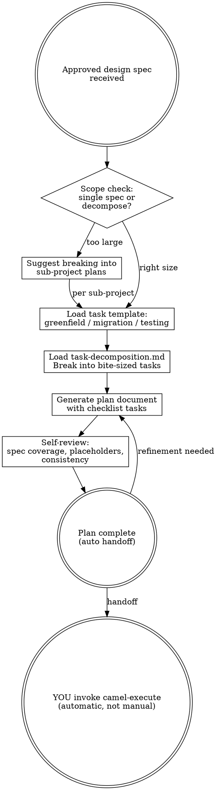

# Camel Plan — Phase 2 Orchestrator

Write comprehensive implementation plans assuming the engineer has zero context and questionable taste. Document everything they need to know: which files to touch for each task, which guides to load, which MCP tools to call, how to verify. Give them the whole plan as bite-sized tasks. DRY. YAGNI.

**Announce at start:** "I'm using the camel-plan skill to create the implementation plan."

**Core principle:** The plan contains detailed instructions on HOW to generate code, NOT the generated code itself.

**Violating the letter of these rules is violating the spirit of these rules.**

<HARD-GATE>
Do NOT generate any implementation artifacts (YAML, properties, POM, Docker Compose). The plan describes what to generate and how — the execution phase does the actual generation.
</HARD-GATE>

---

## Process Flow



---

## Iron Laws (enforced in this phase)

Read `shared/iron-laws.md` for the full Iron Laws. This phase enforces:

- **Iron Law 3: No Code Without Design Approval** — The plan is based on an APPROVED design spec. If the spec hasn't been approved, go back to camel-brainstorm.
- **Iron Law 4: Spec Compliance Before Quality** — The plan MUST specify two-stage review for every implementation task: spec compliance first, then quality.

### Rationalization Table

| Excuse | Reality |
|--------|---------|
| "The spec is clear enough to skip planning" | Clear spec ≠ clear execution. The plan tells the engineer exactly what to do. |
| "I'll put the code directly in the plan" | Code in plans = stale code. Instructions in plans = fresh code from guides. |
| "The engineer can figure out the guides to load" | Questionable taste, remember? Spell out every guide, every MCP call. |
| "I'll combine multiple flows into one task" | One task = one outcome. Split flows into separate tasks. |
| "Testing can be added later" | Test tasks are in the plan. Not later. NOW. |
| "I'll skip the review specification" | Every task gets two-stage review. Spec compliance then quality. No exceptions. |
| "I'll tell the user to run camel-execute next" | NO. YOU invoke camel-execute automatically after approval. The pipeline is seamless. |
| "I should wait for the user to approve the plan before executing" | Plan approval gate was removed. Execution auto-proceeds after planning. |

### Red Flags — STOP If You Think:

- "Let me just generate the YAML quickly..."
- "The engineer will know what to do..."
- "This plan doesn't need that much detail..."
- "I can combine these tasks to be more efficient..."
- "The review steps are unnecessary for simple tasks..."
- "To proceed, please run /camel-execute..." or "Next step: run camel-execute..."

---

## Scope Check

If the design spec covers multiple independent subsystems or has more than ~10 flows, suggest breaking into separate plans — one per subsystem or logical group. Each plan should produce working, testable software on its own.

---

## Plan Content Rules

### What Goes IN the Plan
- Which files to create/modify (exact paths from the orchestrator guide's path table)
- Which guides to load and in what order
- Which MCP tools to call and with what parameters
- Which constitution rules to check
- How to verify the task is complete (commands to run, expected output)
- Two-stage review specification per task

### What Does NOT Go in the Plan
- Generated YAML route content
- Generated application.properties content
- Generated Java code
- Generated POM dependencies
- Any artifact that the execution phase produces

The plan is a RECIPE, not the MEAL.

---

## Task Structure

Load the appropriate task template:
- Greenfield: `guides/task-template-greenfield.md`
- Migration: `guides/task-template-migration.md`
- Testing: `guides/task-template-testing.md`

Load decomposition rules: `guides/task-decomposition.md`

---

## Plan Document Format

Save to `docs/implementation-plan.md`:

```markdown
# [Project Name] Implementation Plan

> **For agentic workers:** Use camel-execute to implement this plan task-by-task.
> Steps use checkbox (`- [ ]`) syntax for tracking.

**Goal:** [One sentence from design spec]

**Architecture:** [2-3 sentences about approach]

**Tech Stack:** Apache Camel [version], [runtime], [key components]

**Design Spec:** `docs/design-spec.md` (approved [date])

---

### Task N: [Component/Flow Name]

**Agent:** [agent persona to dispatch — integration-architect / implementation-engineer / migration-specialist / test-engineer]

**Files:**
- Create: `exact/path/to/file`
- Modify: `exact/path/to/existing`

**Guides to Load:**
- `camel-implement/guides/orchestrator.md`
- `camel-implement/guides/yaml-structure.md`
- [other guides specific to this task]

**MCP Tools:**
- `camel_catalog_component(name="X", runtime="Y", platformBom="Z")`
- [other MCP calls]

**Design Spec Section:** Section 3, Flow: [flow-name]

- [ ] **Step 1:** [action description with exact instructions]
- [ ] **Step 2:** [action description]
- [ ] **Step N:** Verify: [exact command to run and expected output]

**Review:**
- [ ] Spec compliance: [what to check — components match TDD, structure correct, properties complete]
- [ ] Code quality: [what to check — constitution rules, security, anti-patterns]
```

---

## Self-Review

After writing the complete plan:

1. **Spec coverage:** Skim each flow in the design spec. Can you point to a task that implements it? List any gaps.
2. **Placeholder scan:** Search for "TBD", "TODO", "fill in", "similar to Task N". Fix them.
3. **Guide consistency:** Do all tasks reference the correct guide paths? Cross-check against `camel-implement/SKILL.md` and `camel-design/SKILL.md` guide manifests.
4. **Review completeness:** Does every implementation task have both spec compliance and code quality review steps?
5. **Verification completeness:** Does every task have a verification step with an exact command and expected output?

Fix any issues inline.

---

## Execution Handoff

After saving the plan:

1. Save the implementation plan to `docs/implementation-plan.md`
2. **If agent-specific handoff instructions exist below** (appended by traits), follow those instead of step 3
3. **Default (no trait override):** auto-invoke `camel-execute` immediately

```text
Plan saved to docs/implementation-plan.md

Plan complete. Proceeding to execution — dispatching subagents for each task
with two-stage review (spec compliance → code quality) between tasks.
```

<HARD-RULE>
After the plan is complete, YOU must transition to execution. Do NOT tell the user to run it manually. Do NOT print "please run camel-execute" or "run /camel-execute". The transition is automatic — either through the agent-specific handoff mechanism (if trait instructions exist below) or by directly invoking camel-execute.
</HARD-RULE>
