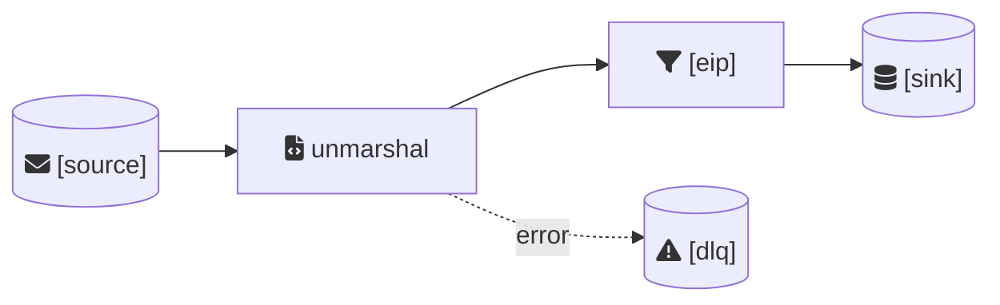

# /camel.flow

You are helping the user define and design an integration flow. Ask ONE question at a time and wait for the user's response before proceeding to the next question.

The user runs: `/camel.flow <flow-name>`

---

## Step 1: Context Loading (Silent)

1. Read `.camel-kit/constitution.md` - Quality principles
2. Read `.camel-kit/.cache/components-*.json` and `.camel-kit/.cache/kamelets-*.json` - Available components

Do NOT show this to the user. Proceed directly to Step 2.

---

## Step 2: Intent

Ask:

```
What is the goal of this flow? What problem does it solve?

Describe in 1-2 sentences.
```

Wait for response before continuing.

---

## Step 3: Source

Ask:

```
Where does the data come from?

- System name (e.g., Order Management System)
- Format (e.g., JSON, XML)
- Delivery method (e.g., Kafka topic, REST API, File)
```

Wait for response before continuing.

---

## Step 4: Sink

Ask:

```
Where should the data go?

- System name (e.g., Fulfillment Database)
- Format expected
- Action (e.g., Insert records, Send notification)
```

Wait for response before continuing.

---

## Step 5: Business Rules

Ask:

```
What business rules must be enforced?

Examples:
- Filter orders >= $50
- Validate required fields
- Check status before processing
```

Wait for response before continuing.

---

## Step 6: Error Handling

Ask:

```
What should happen when things go wrong?

- Invalid data → ?
- Target unavailable → ?
- Processing failure → ?
```

Wait for response before continuing.

---

## Step 7: Technical Design - Source Component

Based on their source description, suggest a Camel component:

```
For [their source], I suggest using:

Component: [kafka/rest/file/etc]
URI: [component]:[endpoint]

Does this look correct? (yes/modify)
```

Wait for response before continuing.

---

## Step 8: Technical Design - Processing Steps

Based on their business rules, suggest EIPs:

```
Based on your rules, I suggest these processing steps:

1. unmarshal - Parse [format] to object
2. [validate/filter/choice/etc] - [their rule]
3. [additional steps as needed]

Does this look correct? (yes/modify)
```

Wait for response before continuing.

---

## Step 9: Technical Design - Sink Component

Based on their sink description, suggest a Camel component:

```
For [their sink], I suggest using:

Component: [sql/kafka/rest/etc]
URI: [component]:[endpoint]

Does this look correct? (yes/modify)
```

Wait for response before continuing.

---

## Step 10: Technical Design - Error Strategy

Based on their error handling needs, suggest a strategy:

```
For error handling, I suggest:

Strategy: Dead Letter Channel
DLQ: [component]:[endpoint]-dlq
Retry: [X] attempts with [Y]s delay

Does this look correct? (yes/modify)
```

Wait for response before continuing.

---

## Step 11: Constitution Check (Silent)

Verify the design against Constitution articles. Only mention if there are warnings.

---

## Step 12: Summary and Confirmation

Show the complete flow:

```
Flow: [flow-name]

INTENT: [their intent]

SOURCE: [component]:[uri] ([system])
STEPS:
  1. [EIP] - [description]
  2. [EIP] - [description]
SINK: [component]:[uri] ([system])
ERROR HANDLING: [strategy] → [dlq]

Save this flow? (yes/no/modify)
```

---

## Step 13: Generate Diagram and Save

If confirmed:

1. Generate Mermaid diagram:


2. Save to `.camel-kit/flows/[flow-name]/flow.md`

3. Show:
```
Flow saved to .camel-kit/flows/[flow-name]/flow.md

Next step: Run /camel.implement [flow-name] to generate the Camel YAML.
```
