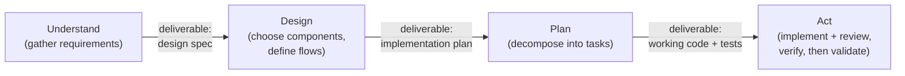
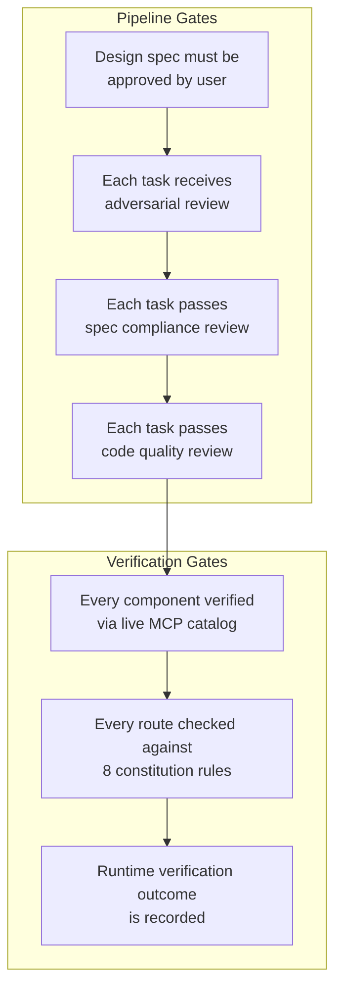
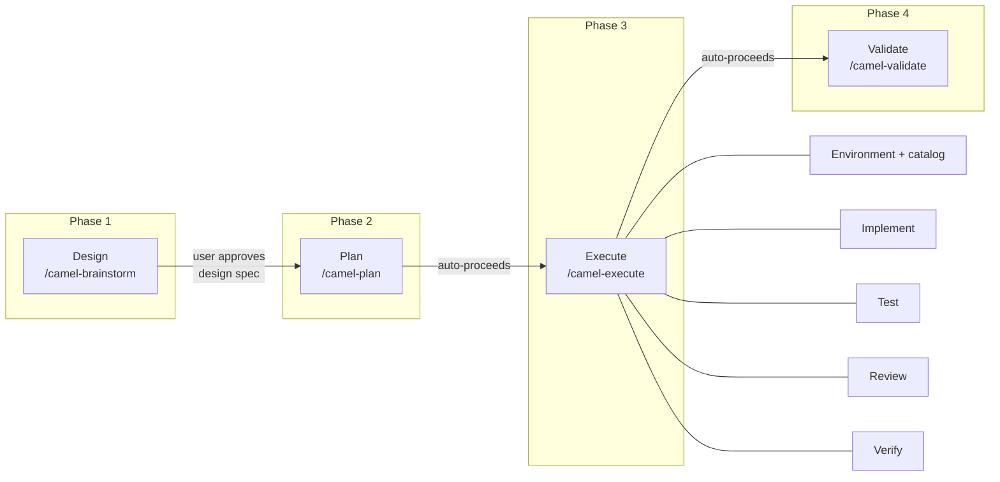
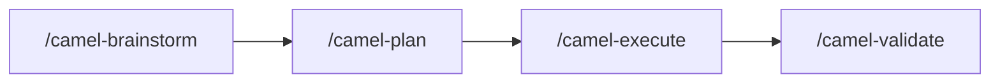
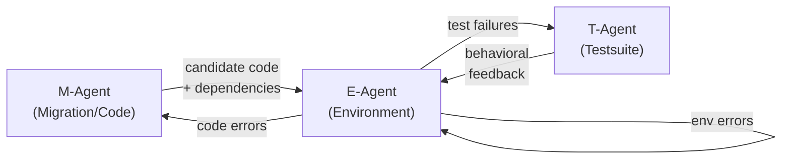
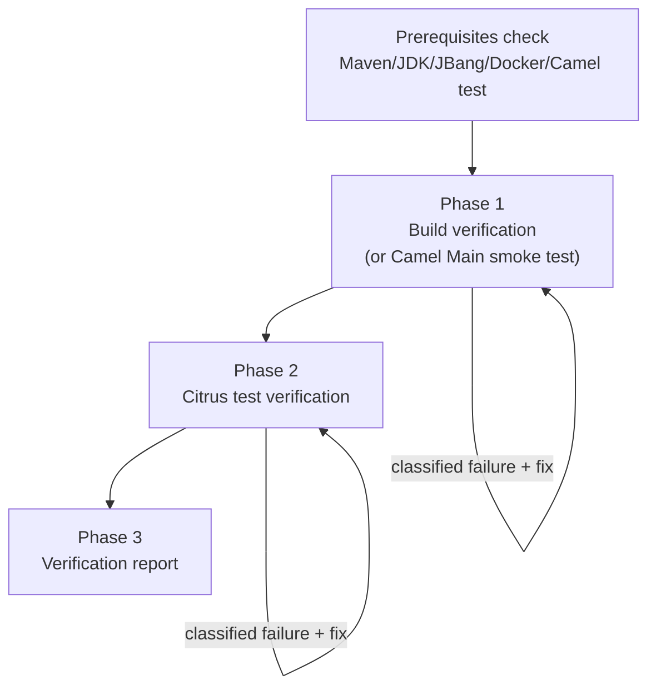
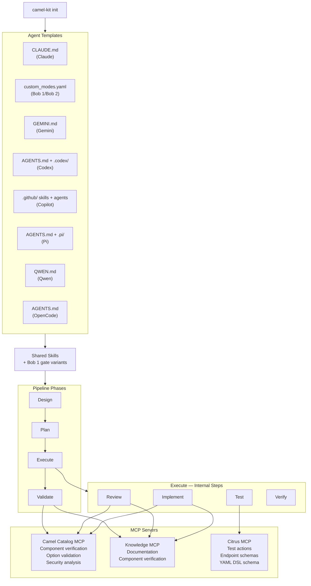

# Camel-Kit: AI-Powered Integration Development

## What Is Camel-Kit?

Camel-Kit is an open-source toolkit that brings structured AI assistance to Apache Camel integration development. It works as a layer on top of Claude Code, IBM Bob 1 legacy, IBM Bob 2, Gemini CLI, OpenAI Codex CLI, GitHub Copilot CLI, Pi, Qwen, and OpenCode, giving them domain-specific knowledge and a disciplined workflow for designing, implementing, and verifying integration routes.

Instead of an engineer writing boilerplate code by hand -- or an AI assistant generating plausible-looking but unverified code from its training data -- Camel-Kit guides the process through a structured pipeline that enforces quality at every step.

---

## The Problem It Solves

Building enterprise integrations with Apache Camel involves:

- **Component knowledge** -- Camel has 300+ connectors (Kafka, REST, databases, cloud services, etc.). Each has its own configuration options, version-specific behavior, and compatibility considerations.
- **Pattern knowledge** -- Enterprise Integration Patterns (content-based routing, message splitting, aggregation, dead letter channels) must be applied correctly for reliability and maintainability.
- **Version alignment** -- production deployments require using components and versions that are available and verified in the target Camel version. A component that exists in one version may not exist in another.
- **Quality consistency** -- hand-written or AI-generated routes often miss best practices: missing error handling, hardcoded credentials, unnamed routes that are difficult to debug, overly complex single routes that should be split.

AI coding assistants can help, but without guardrails they generate code from training data that may reference outdated components, incorrect options, or unsupported versions. The code looks correct but fails at runtime.

**Camel-Kit solves this by giving the AI real-time access to the live Camel catalog, enforcing quality rules on every generated route, and following a structured pipeline that separates design from implementation.**

---

## Why This Approach Works

The most common way to use an AI coding assistant is to describe what you want and let it generate code immediately. For simple tasks this works well. For enterprise integrations -- where a single route connects multiple systems, handles errors, transforms data, and must run on a supported platform -- it consistently produces incomplete or incorrect results. The AI makes reasonable-looking assumptions about components, options, and patterns, but those assumptions are drawn from training data that may be outdated, incomplete, or wrong for the target version.

The bottleneck in AI-assisted development is not code generation speed -- it is structured specification. An AI that writes code in seconds but builds the wrong thing wastes more time than an AI that takes twenty minutes to understand the requirements, get human approval, and then build the right thing.

Camel-Kit is built on a different principle: **understand before designing, design before planning, plan before coding.**

### Separate Thinking from Doing

The core insight is that AI assistants produce dramatically better output when the work is decomposed into distinct phases, each with a clear purpose and a concrete deliverable:

When an AI assistant tries to do all of this in a single step -- jumping straight from a vague requirement to generated code -- it skips the understanding and design phases entirely. It never asks clarifying questions, never considers alternative approaches, and never verifies that its assumptions match the user's intent. The result is code that reflects the AI's best guess rather than the user's actual requirements.

By separating thinking from doing, each phase can be reviewed independently. A flawed design is caught before any code is written. A flawed plan is caught before any code is generated. The cost of finding and fixing a mistake increases dramatically at each phase -- catching a wrong component choice during design costs one sentence of feedback; catching it during debugging costs hours.

### Gates, Not Suggestions

There is a critical distinction in how constraints are applied to AI assistants: **rules** are guidelines the AI can rationalize away; **gates** are hard blockers that must be satisfied before the pipeline can proceed.

A rule says: *"You should verify components before using them."* The AI can skip this when it feels confident from training data -- and it often does, because its confidence is unrelated to its accuracy.

A gate says: *"You cannot write a component into the spec until MCP confirms it exists."* There is no way to proceed without satisfying this condition. The gate is objective and verifiable: either the MCP response confirms the component exists, or it doesn't.

Camel-Kit uses gates at every level:

- **Iron Laws = hard gates.** "Every component MUST be verified via MCP before being written to any design spec or
  YAML file" is not a suggestion -- the pipeline blocks if a component cannot be verified. The AI cannot rationalize
  its way past this check.
- **Design approval = the progression gate.** The AI cannot start planning until the user approves the design. That approval authorizes the chained plan, execute, and validate stages; there is no second plan-approval pause.
- **Constitution rules = automated quality gates.** Eight rules are checked during validation. A route without a `routeId` is not flagged as a warning -- it fails validation. A route with hardcoded credentials fails validation. These are pass/fail checks, not advisory notes.
- **Two-stage review = sequential gates.** Spec compliance is checked before code quality. This order matters -- there is no point reviewing code quality on a route that doesn't match the design. The gate enforces the correct sequence.

### Skills as Reusable Knowledge

AI assistants are most effective when given structured, domain-specific knowledge rather than relying on general training data. General-purpose AI models know about Apache Camel the way someone who read the documentation once might -- broadly but imprecisely, with knowledge that may be months or years out of date.

Camel-Kit addresses this with **skills** -- markdown instruction files that teach the AI exactly how to perform a specific task in the Camel domain:

- How to conduct a design interview for an integration project
- How to generate a YAML route that follows the constitution rules
- How to validate a route against the live catalog
- How to handle data transformation with the right engine for the complexity level
- How to diagnose and fix runtime errors using a structured error taxonomy

Skills compose together: the brainstorm skill loads design guides for component selection and EIP patterns; the execute skill loads implementation, validation, testing, and verification guides. Each guide is a self-contained document that the AI reads and follows step by step.

Because skills are plain markdown, they are easy to read, review, audit, and extend. Adding a new capability to Camel-Kit means writing a new skill guide -- not modifying code. Most supported agents read these shared skill files. Bob 1 legacy instead receives self-contained monolithic gate variants because it cannot chain skill references, while retaining the shared rules and output contracts.

### Context Isolation and Role Separation

When an AI generates code and then reviews its own work, it tends to confirm its own choices. The same biases that led to a design decision make the self-review approve that decision. Effective AI-assisted development separates these roles.

Camel-Kit enforces role separation at multiple levels:

- **Implementation and review use distinct contracts.** After each task, a spec compliance reviewer checks whether the output matches the design, then a code quality reviewer checks the constitution. Subagent-capable targets isolate these reviewers from the implementer; Bob 1 runs the contracts sequentially in its gated session.
- **Fresh context per task.** When using Claude or Bob 2, each task can be dispatched to a fresh subagent with an isolated context window. The subagent has no memory of previous tasks, no accumulated assumptions, and no temptation to reuse a pattern that worked before but doesn't fit now.
- **Tool restrictions per phase.** For Bob 1 legacy and Bob 2, the brainstorm mode's edit tool permits only design
  Markdown and Camel-Kit configuration state; both modes also provide read and MCP access, while Bob 1 additionally
  provides browser access. Their broad command/execute groups remain constrained by generated instructions, so the edit
  boundary is platform-enforced and command discipline is instruction-enforced.

### Why Not Just Generate Code?

| Approach | What Happens |
|----------|-------------|
| **"Build me a Kafka-to-PostgreSQL integration"** | AI guesses error handling, transformation format, retry policy, naming conventions, component options. Some guesses are wrong. No gate blocks progression. User discovers issues at runtime. |
| **Understand → Design → Plan → Act** | AI asks about error handling requirements, learns the data format, confirms retry policy, and verifies component options against the live catalog. Design approval gates implementation; the downstream plan, execute, and validate stages then proceed automatically. |

The structured approach takes longer upfront but eliminates rework. In practice, the total time from requirement to working code is shorter because the AI doesn't generate code that needs to be debugged and rewritten.

---

## How It Works

### The Pipeline

Camel-Kit follows a four-stage pipeline with one user approval gate after design:

The primary `/camel-start` router selects, in order, migration for existing MuleSoft, BizTalk, Fuse, or Camel 2.x/3.x source; planning for an approved design; execution for an implementation plan; static validation for generated routes; standalone debugging for build, startup, or runtime failures; or brainstorming for new and unclear work.

**Phase 1 -- Design.** The AI conducts an interactive interview, asking about the business purpose, the systems that need to connect, data flows, error handling requirements, and transformation needs. It produces business requirements and flow designs in a single design spec. The user reviews and approves before moving forward.

**Phase 2 -- Plan.** The AI reviews the approved design and decomposes it into bite-sized implementation tasks. Each task specifies exactly what files to create, what components to use, and how to verify the result. In a chained run, execution starts automatically after the plan is written.

**Phase 3 -- Execute.** The AI probes the target environment, derives dependency waves, batch-verifies catalog artifacts, and implements all tasks autonomously. Each task receives adversarial review followed by spec-compliance and code-quality review. Execute then performs a cross-cutting review and internal runtime verification, producing execution and verification reports.

**Phase 4 -- Validate.** The final static quality gate checks route schemas, endpoints, project-relative quality thresholds, security, anti-patterns, and all constitution rules. It writes a validation report without modifying the routes.

### Real-Time Catalog Verification

Camel-Kit connects to the Apache Camel MCP server, which provides live access to the component catalog. Every component, configuration option, and expression language used in a generated route is verified against the actual catalog for the project's exact Camel version. The AI never relies on training data for component names or options.

This eliminates a common class of errors: routes that compile but fail at runtime because a component option was renamed, removed, or doesn't exist in the target version.

---

## Key Capabilities

### Greenfield Development

Start from scratch with a structured design session. The AI interviews about requirements, designs the integration flows, plans the implementation, and generates production-ready routes with tests.

### Migration

Migrate existing integrations from other platforms to Apache Camel. The AI scans all source artifacts, detects the platform automatically, maps components to Camel equivalents, and produces the same design specification format as greenfield projects. From that point, the pipeline is identical.

**Supported migration sources:**
- MuleSoft Mule (3.x, 4.x) -- including DataWeave transformation conversion and graph-accelerated flow analysis
- Apache Camel 2.x/3.x -- Java DSL, XML DSL, Blueprint
- JBoss Fuse (6.x, 7.x)
- Microsoft BizTalk (3.x, 4.x) -- including graph-accelerated orchestration, map, pipeline, and binding analysis

### Data Transformation (DataMapper)

Camel-Kit handles data transformation between formats (JSON, XML) automatically during design. It selects the right transformation engine based on complexity:

- **Simple mappings** (under 20 fields or no schemas) -- generates inline Groovy scripts directly in the route
- **Complex mappings** (20+ fields with schemas) -- generates XSLT stylesheets with visual editing support in the Kaoto IDE

The engine selection is automatic and transparent. The user only needs to describe the field mappings; the implementation details are handled by the pipeline.

### Project Graph Analysis

When working with existing projects -- whether migrating from another platform or extending an established codebase -- the AI needs to understand the project's structure before making changes. Camel-Kit includes a **project graph analyzer** with 9 parsers that parse the entire project into a queryable property graph: classes, methods, Camel routes, endpoints, Maven dependencies, configuration properties, and -- for MuleSoft projects -- flows, sub-flows, connectors, endpoints, transforms, error handlers, and DataWeave scripts, and -- for BizTalk projects -- orchestrations, shapes, maps, functoids, pipelines, pipeline components, ports, and adapters. Edges capture the relationships between nodes (extends, calls, routes-from, routes-to, depends-on, configures, flow-contains, calls-subflow, uses-connector, references-dwl, biztalk-orchestration-contains, biztalk-uses-map, biztalk-uses-schema, biztalk-calls-orchestration, biztalk-port-binding, biztalk-functoid-chain, biztalk-pipeline-stage, uses-type).

The graph now includes **dependency injection awareness** -- it automatically detects the runtime framework (Spring Boot, Quarkus, or Camel Main) from Maven dependencies and traces bean wiring. Classes annotated with @Component, @Service, @Named, or @ApplicationScoped are recognized as managed beans. Fields and parameters annotated with @Inject, @Autowired, @Value, or @ConfigProperty create USES_TYPE edges connecting consumers to the types they depend on. For property-based configuration, the PropertyBindingParser recognizes Camel's bean wiring syntax (#class:, #bean:, #autowired) and creates corresponding graph edges. When dependencies are declared via interfaces, the graph performs interface expansion -- if a class depends on interface I and multiple concrete implementations exist, the graph connects the consumer to all possible implementations.

This gives the AI structural intelligence that goes beyond reading individual files:

| Capability | What It Does | Example |
|-----------|-------------|---------|
| **Route flow tracing** | Follows the complete message path through a route chain, including cross-route links via `direct:`, `seda:`, and `vm:` endpoints | "Show me every processing step an order goes through from Kafka ingestion to database write" |
| **Impact analysis** | Traces upstream and downstream dependencies of any node -- a route, a class, a configuration property | "If I change the `orderProcessor` bean, which routes are affected?" |
| **DI-aware dependency tracking** | Discovers dependency injection relationships through annotation analysis (@Inject, @Autowired, @Value, @ConfigProperty) and property-based bean wiring (#class:, #bean:, #autowired) | "Show all routes and beans that depend on the `CustomerRepository` interface, including classes injected via property configuration" |
| **Interface expansion** | Traces interface-to-implementation relationships, connecting consumers to all concrete implementations of injected interfaces | "This route uses `PaymentProcessor` interface -- which concrete implementations are wired at runtime, and what other routes depend on them?" |
| **Dead code detection** | Identifies unused Maven dependencies, orphaned routes (not referenced by any other route), and stale configuration properties | "This project has 12 Maven dependencies but only 8 are actually used in routes" |
| **Route topology mapping** | Maps route-to-route connections to determine which routes are independent | Used by Claude and Bob 2 to dispatch independent routes to parallel subagents for simultaneous implementation |
| **Project norm extraction** | Computes statistical norms from the existing codebase -- naming patterns, error handling coverage, route complexity percentiles | Validation thresholds adapt to the project's actual conventions rather than using hardcoded defaults |
| **Migration context analysis** | Produces bounded structured JSON for nodes reached from a route, including endpoint schemes, bean classes, artifacts, properties, and synthetic-node warnings | Gives migration analysis a focused local topology view without claiming complete dependency coverage |
| **MuleSoft flow analysis** | Parses MuleSoft XML configs into graph nodes (flows, sub-flows, connectors, endpoints, transforms, error handlers) and analyzes DataWeave scripts for complexity | Understanding MuleSoft project structure before migration -- graph-accelerated analysis replaces manual XML deep-dives |
| **BizTalk artifact analysis** | Parses BizTalk orchestrations (.odx), maps (.btm), pipelines (.btp), and bindings into graph nodes (orchestrations, shapes, maps, functoids, pipelines, components, ports, adapters) | Understanding BizTalk project structure before migration -- 38 shape element names recognized, 45 functoid type mappings |

The graph integrates across multiple pipeline skills:

- **During validation**, quality thresholds are derived from the project's actual patterns (e.g., the 75th percentile of route step counts) rather than arbitrary fixed limits. A route with 15 steps is acceptable in a project where existing routes average 12 steps, but flagged in a project where they average 5.
- **During implementation**, the AI matches the project's existing conventions -- naming patterns, bean reuse, dependency versions -- rather than inventing new ones that create inconsistency.
- **During testing**, route topology awareness lets the AI understand upstream and downstream dependencies, generating tests that cover integration points rather than just individual routes in isolation.
- **During migration**, full-project graph analysis can surface structural concerns such as circular dependencies, deeply nested route chains, and unused components before code is translated. The separate `graph migration-context` query expands bidirectionally from one route across interface boundaries, with depth 3 by default and at most 50 expanded nodes. Its local JSON output does not call the Knowledge MCP or guarantee every dependency or call chain. For MuleSoft projects, the graph automatically parses Mule XML flows, sub-flows, connectors, and DataWeave scripts. For BizTalk projects, it parses orchestrations, maps, pipelines, and bindings.

A key design principle: the graph **enhances but never gates**. Greenfield projects work without any graph -- skills fall back to sensible defaults. When working with an existing project, the graph is built automatically and skills consume it for project-aware behavior. The improvement is transparent: better validation thresholds, more consistent naming, smarter test generation -- without requiring any additional user action.

### Runtime Verification (Environment-in-the-Loop)

Code that compiles is not necessarily code that works. Research on LLM-based code generation has shown that AI models cause approximately 30% of runtime errors that are invisible to static analysis -- errors that can only be detected by actually building and running the code in a real environment.

Camel-Kit's verification pipeline is grounded in the **Environment-in-the-Loop** (EiTL) paradigm described by Li et al. in their ICSE 2026 paper *"Environment-in-the-Loop: Rethinking Code Migration with LLM-based Agents"*. The core argument: code generation treated as a code-only problem is fundamentally incomplete. Code, dependencies, and the execution environment are intricately intertwined -- they must co-evolve. Without automated environment interaction, automation is "only half complete."

#### The Three-Agent Model

The EiTL paper proposes three collaborating agents:

- **M-Agent** handles code generation and migration semantics
- **E-Agent** is the central verification hub -- it builds environments, runs code, diagnoses failures, and routes errors to the appropriate agent for fixing
- **T-Agent** generates regression tests and verifies behavioral equivalence

Camel-Kit maps directly to this model:

| Paper Concept | Camel-Kit Implementation |
|---------------|-------------------------|
| M-Agent (code generation) | `camel-migrate` + `camel-implement` -- produces Camel routes, dependencies, and configuration |
| E-Agent (environment hub) | `/camel-verify` -- builds or smoke-tests, runs Citrus tests, classifies failures, routes fixes, and reports |
| T-Agent (test generation) | `camel-test` -- generates Citrus integration tests with Testcontainers |

#### The Feedback Loop

The critical insight from the EiTL paper is that verification must be a **structured, automated loop** -- not a one-shot instruction. A simple "run the app and fix errors" instruction gives the AI no structure for what errors to look for, how to classify them, where to route fixes, or when to stop trying.

`/camel-verify` first reports which prerequisites are available, then runs a three-phase flow:

For Spring Boot and Quarkus projects, Phase 1 compiles with Maven; Camel Main uses its startup smoke test instead. Phase 2 runs existing Citrus tests through `camel test run`, with Testcontainers managing external services. Build and test failures are classified and retried up to 15 times per phase, with persistent architectural failures eligible for the bounded re-plan loop. Missing tools cause the dependent phase to be skipped explicitly: Docker is required for Phase 2, as are the Camel test CLI and existing test files. The final report records passes, failures, fixes, and skipped checks.

The later `/camel-validate` stage is separate from this runtime loop. It performs static quality analysis and reports findings without modifying routes.

#### Co-Evolution: Code + Environment

A key principle from the EiTL paper is that code changes often require environment changes. When a route uses a Kafka component, the implementation may need:
- `camel-quarkus-kafka` in `pom.xml` (dependency)
- Kafka broker in `docker-compose.yaml` (environment)
- Connection properties in `application.properties` (configuration)
- The broker actually running before the app starts (operational)

Camel-Kit's execute phase addresses these dimensions through its environment probe and generated implementation artifacts. Runtime verification then checks the available build and test environment; Citrus Testcontainers start external services during Phase 2 when Docker is available.

#### Why This Matters

Traditional AI code generation follows a linear flow: generate code, hand it to the user, hope it works. The EiTL approach closes the loop: generate code, build it, run it, test it, diagnose failures, fix them, and retry -- autonomously, with structured error classification that routes each failure to the right fix strategy. The user only sees the final result (or gets escalated when the system is genuinely stuck).

### Quality Enforcement

Every generated route is checked against 8 quality rules (the "Constitution"):

1. **Route structure** -- every route must have a source and a sink
2. **Single responsibility** -- one route, one purpose
3. **Separation of concerns** -- decompose complex integrations into composable routes
4. **Naming conventions** -- consistent, meaningful route IDs and endpoint names
5. **Observability** -- every route must have an ID and description for monitoring
6. **External configuration** -- no hardcoded credentials or connection strings
7. **Component support verification** -- every component verified via MCP catalog
8. **Infrastructure via Forage** -- prefer the supported infrastructure ladder over hand-rolled bean configuration

These rules are checked automatically during the validation step and recorded in its static report.

---

## Multi-Agent Support

Camel-Kit works across multiple AI coding assistants with the same design-plan-execute-validate workflow and output contracts. Most targets load the shared markdown skills; Bob 1 legacy installs seven monolithic gate variants that carry the corresponding orchestration because it cannot chain skill references.

| Agent | Provider |
|-------|----------|
| Claude Code | Anthropic |
| Project Bob 1 legacy / Bob 2 | IBM |
| Gemini CLI | Google |
| Codex CLI | OpenAI |
| GitHub Copilot CLI | GitHub |
| Pi | Community |
| Qwen | Alibaba |
| OpenCode | Community |

**Why this matters:**
- **No vendor lock-in.** Teams can choose the AI agent that best fits their existing toolchain and licensing.
- **Consistent contracts.** Regardless of which agent generates the routes, the same workflow artifacts, quality rules, and catalog checks apply. Agent-native configuration and generated assistant assets differ according to the selected `--ai` target.
- **Future-proof.** Adding support for a new agent requires writing template files for that agent's instruction format, not rewriting the pipeline logic.

Each agent uses a different internal architecture optimized for its native capabilities (parallel subagent dispatch for Claude and Bob 2, custom modes with tool restrictions for Bob 1 legacy, policy engines for Gemini, etc.). Invocation syntax and generated assistant assets differ, while the workflow and output contracts stay aligned.

---

## Architecture at a Glance

**Skills and Bob 1 gate variants** carry the process knowledge -- how to conduct a design interview, generate a YAML route, and validate against the constitution. Most targets share the markdown skills directly; Bob 1 uses self-contained generated gates with the same contracts.

**Camel Catalog MCP** provides the data knowledge -- which components exist, what options they accept, whether an endpoint URI is valid. It queries the live catalog for the project's exact Camel version rather than relying on potentially outdated training data.

**Knowledge MCP** provides documentation and security intelligence -- documentation search, component and CVE/security-advisory lookup, release information, and JIRA issue lookup.

**Citrus MCP** provides test-generation intelligence -- which Citrus actions, endpoints, schemas, and best practices are valid for the configured Citrus version.

**Templates** adapt the workflow to each AI agent's native instruction mechanism, including Bob 1's monolithic gate files.

---

## Benefits Summary

| Benefit | How |
|---------|-----|
| **Faster integration development** | AI generates routes, tests, and configuration from a design spec. The engineer focuses on requirements and review, not boilerplate. |
| **Higher quality output** | 8 quality rules checked automatically. Every component verified against the live catalog. No hardcoded credentials, unnamed routes, or unsupported components. |
| **Reduced runtime failures** | Real-time catalog verification catches configuration errors at design time. Runtime verification catches remaining issues before deployment. |
| **Migration de-risking** | Automated analysis of MuleSoft, legacy Camel, Fuse, and BizTalk projects. DI-aware graph analysis discovers bean relationships through annotation scanning and property-based wiring, traces interface implementations, and can produce bounded local migration context for a route. Graph-accelerated MuleSoft analysis parses flows, sub-flows, connectors, and DataWeave scripts automatically. Graph-accelerated BizTalk analysis parses orchestrations, maps, pipelines, and bindings automatically. Component-by-component mapping against verified Camel equivalents identifies gaps before implementation begins. |
| **No AI vendor lock-in** | Works with multiple AI agents under the same workflow and quality contracts while generating the selected target's native assistant assets. |
| **Maintainable and extensible** | Skills are plain markdown. Adding new capabilities means writing a new skill guide, not modifying code. |

---

## Technology Stack

| Component | Technology |
|-----------|-----------|
| CLI runtime | Java 17+ / JBang |
| Build system | Maven (with wrapper) |
| Route format | Camel YAML DSL |
| Target runtime | Spring Boot, Quarkus, or JBang |
| Catalog access | Camel MCP server (live catalog queries via Model Context Protocol) |
| Documentation | Knowledge MCP server (Apache Camel docs -- hybrid semantic search) |
| Testing | Citrus MCP + Citrus YAML + Testcontainers |
| IDE support | Kaoto (visual route and DataMapper editing) |
| AI agents | Claude Code, IBM Bob 1 legacy, IBM Bob 2, Gemini CLI, OpenAI Codex CLI, GitHub Copilot CLI, Pi, Qwen, OpenCode |

---

## Current Status

Camel-Kit is an open-source project under the Apache 2.0 license. It is inspired by [GitHub Spec-Kit](https://github.com/github/spec-kit) and adapted for the Apache Camel ecosystem.

The project is actively developed, with the core pipeline (design, plan, execute, validate), internal runtime verification, migration support, DataMapper, multi-agent parity, and the knowledge layer all functional.
