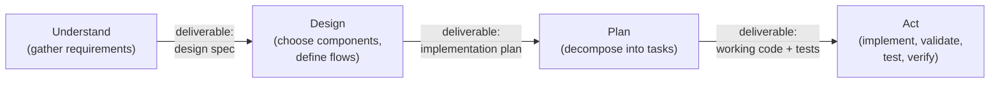
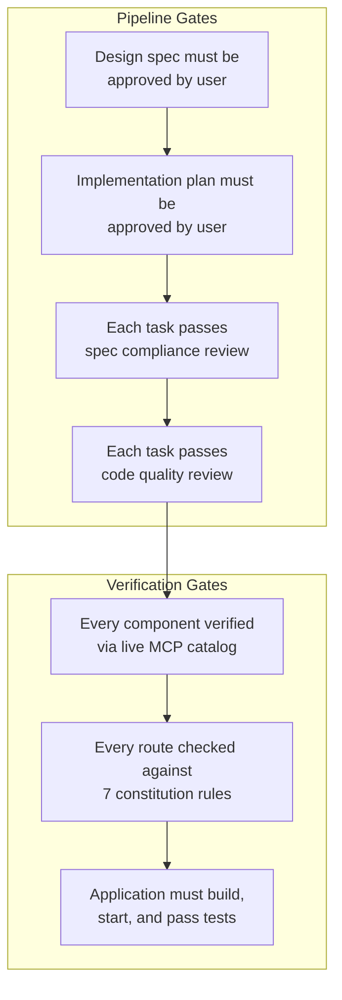
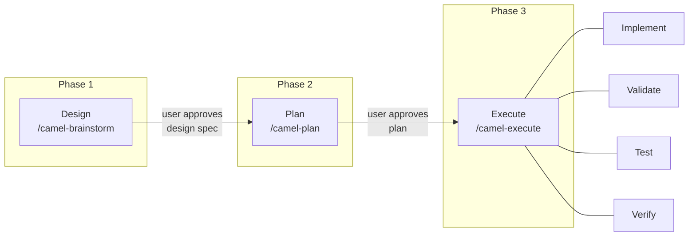
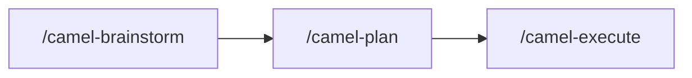
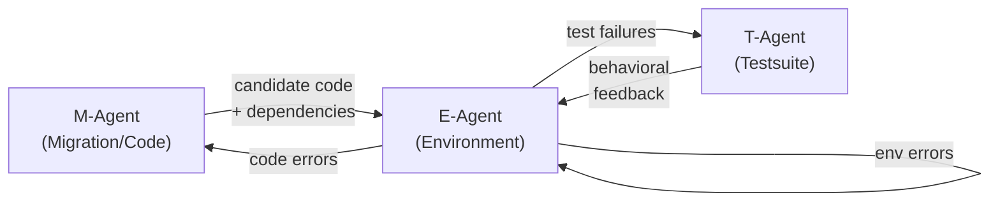
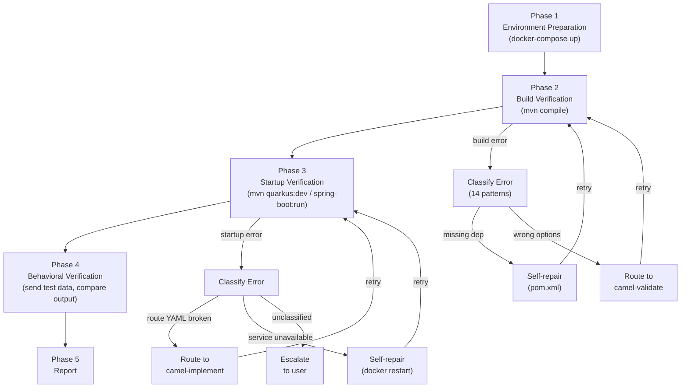
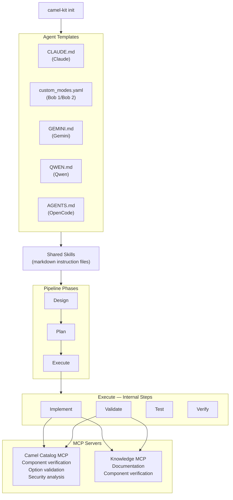

# Camel-Kit: AI-Powered Integration Development

## What Is Camel-Kit?

Camel-Kit is an open-source toolkit that brings structured AI assistance to Apache Camel integration development. It works as a layer on top of AI coding assistants (Claude, IBM Bob 1 legacy, IBM Bob 2, Gemini, Qwen, OpenCode), giving them domain-specific knowledge and a disciplined workflow for designing, implementing, and verifying integration routes.

Instead of an engineer writing boilerplate code by hand -- or an AI assistant generating plausible-looking but unverified code from its training data -- Camel-Kit guides the process through a structured pipeline that enforces quality at every step.

---

## The Problem It Solves

Building enterprise integrations with Apache Camel involves:

- **Component knowledge** -- Camel has 300+ connectors (Kafka, REST, databases, cloud services, etc.). Each has its own configuration options, version-specific behavior, and compatibility considerations.
- **Pattern knowledge** -- Enterprise Integration Patterns (content-based routing, message splitting, aggregation, dead letter channels) must be applied correctly for reliability and maintainability.
- **Version alignment** -- production deployments require using components and versions that are available and verified in the target Camel version. A component that exists in one version may not exist in another.
- **Quality consistency** -- hand-written or AI-generated routes often miss best practices: missing error handling, hardcoded credentials, unnamed routes that are difficult to debug, overly complex single routes that should be split.

AI coding assistants can help, but without guardrails they generate code from training data that may reference outdated components, incorrect options, or unsupported versions. The code looks correct but fails at runtime.

**Camel-Kit solves this by giving the AI real-time access to the live Camel catalog, enforcing quality rules on every generated route, and following a structured pipeline that separates design from implementation.**

---

## Why This Approach Works

The most common way to use an AI coding assistant is to describe what you want and let it generate code immediately. For simple tasks this works well. For enterprise integrations -- where a single route connects multiple systems, handles errors, transforms data, and must run on a supported platform -- it consistently produces incomplete or incorrect results. The AI makes reasonable-looking assumptions about components, options, and patterns, but those assumptions are drawn from training data that may be outdated, incomplete, or wrong for the target version.

The bottleneck in AI-assisted development is not code generation speed -- it is structured specification. An AI that writes code in seconds but builds the wrong thing wastes more time than an AI that takes twenty minutes to understand the requirements, get human approval, and then build the right thing.

Camel-Kit is built on a different principle: **understand before designing, design before planning, plan before coding.**

### Separate Thinking from Doing

The core insight is that AI assistants produce dramatically better output when the work is decomposed into distinct phases, each with a clear purpose and a concrete deliverable:

When an AI assistant tries to do all of this in a single step -- jumping straight from a vague requirement to generated code -- it skips the understanding and design phases entirely. It never asks clarifying questions, never considers alternative approaches, and never verifies that its assumptions match the user's intent. The result is code that reflects the AI's best guess rather than the user's actual requirements.

By separating thinking from doing, each phase can be reviewed independently. A flawed design is caught before any code is written. A flawed plan is caught before any code is generated. The cost of finding and fixing a mistake increases dramatically at each phase -- catching a wrong component choice during design costs one sentence of feedback; catching it during debugging costs hours.

### Gates, Not Suggestions

There is a critical distinction in how constraints are applied to AI assistants: **rules** are guidelines the AI can rationalize away; **gates** are hard blockers that must be satisfied before the pipeline can proceed.

A rule says: *"You should verify components before using them."* The AI can skip this when it feels confident from training data -- and it often does, because its confidence is unrelated to its accuracy.

A gate says: *"You cannot write a component into the spec until MCP confirms it exists."* There is no way to proceed without satisfying this condition. The gate is objective and verifiable: either the MCP response confirms the component exists, or it doesn't.

Camel-Kit uses gates at every level:

- **Iron Laws = hard gates.** "Every component MUST be verified via MCP before being written to any design spec or
  YAML file" is not a suggestion -- the pipeline blocks if a component cannot be verified. The AI cannot rationalize
  its way past this check.
- **Human approval between phases = progression gates.** The AI cannot start planning until the user approves the design. It cannot start implementing until the user approves the plan. This prevents the AI from building momentum on a wrong assumption.
- **Constitution rules = automated quality gates.** Seven rules are checked during validation. A route without a `routeId` is not flagged as a warning -- it fails validation. A route with hardcoded credentials fails validation. These are pass/fail checks, not advisory notes.
- **Two-stage review = sequential gates.** Spec compliance is checked before code quality. This order matters -- there is no point reviewing code quality on a route that doesn't match the design. The gate enforces the correct sequence.

### Skills as Reusable Knowledge

AI assistants are most effective when given structured, domain-specific knowledge rather than relying on general training data. General-purpose AI models know about Apache Camel the way someone who read the documentation once might -- broadly but imprecisely, with knowledge that may be months or years out of date.

Camel-Kit addresses this with **skills** -- markdown instruction files that teach the AI exactly how to perform a specific task in the Camel domain:

- How to conduct a design interview for an integration project
- How to generate a YAML route that follows the constitution rules
- How to validate a route against the live catalog
- How to handle data transformation with the right engine for the complexity level
- How to diagnose and fix runtime errors using a structured error taxonomy

Skills compose together: the brainstorm skill loads design guides for component selection and EIP patterns; the execute skill loads implementation, validation, testing, and verification guides. Each guide is a self-contained document that the AI reads and follows step by step.

Because skills are plain markdown, they are easy to read, review, audit, and extend. Adding a new capability to Camel-Kit means writing a new skill guide -- not modifying code. And because all supported AI agents read the same skill files, a fix or improvement to a guide benefits every agent simultaneously.

### Context Isolation and Role Separation

When an AI generates code and then reviews its own work, it tends to confirm its own choices. The same biases that led to a design decision make the self-review approve that decision. Effective AI-assisted development separates these roles.

Camel-Kit enforces role separation at multiple levels:

- **Implementer and reviewer are separate.** After each task, a spec compliance reviewer checks whether the output matches the design -- this is not the same agent that wrote the code. Then a code quality reviewer checks against the constitution rules. Two independent reviews, each with a different focus.
- **Fresh context per task.** When using Claude or Bob 2, each task can be dispatched to a fresh subagent with an isolated context window. The subagent has no memory of previous tasks, no accumulated assumptions, and no temptation to reuse a pattern that worked before but doesn't fit now.
- **Tool restrictions per phase.** When using Bob 1 legacy or Bob 2, the brainstorm phase physically cannot edit code files -- the custom mode restricts available tools to read-only access plus MCP queries. The AI cannot jump ahead to implementation because the tools required for implementation are not available. This is not a rule the AI follows; it is a platform constraint the AI cannot override.

### Why Not Just Generate Code?

| Approach | What Happens |
|----------|-------------|
| **"Build me a Kafka-to-PostgreSQL integration"** | AI guesses error handling, transformation format, retry policy, naming conventions, component options. Some guesses are wrong. No gate blocks progression. User discovers issues at runtime. |
| **Understand → Design → Plan → Act** | AI asks about error handling requirements, learns the data format, confirms retry policy, verifies component options against the live catalog. Gates block progression at each phase until requirements are confirmed. Issues are caught at design time. |

The structured approach takes longer upfront but eliminates rework. In practice, the total time from requirement to working code is shorter because the AI doesn't generate code that needs to be debugged and rewritten.

---

## How It Works

### The Pipeline

Camel-Kit follows a 3-phase pipeline with user approval gates between phases:

**Phase 1 -- Design.** The AI conducts an interactive interview, asking about the business purpose, the systems that need to connect, data flows, error handling requirements, and transformation needs. It produces a design specification (Blueprint Reference Document with Technical Design Documents per flow). The user reviews and approves before moving forward.

**Phase 2 -- Plan.** The AI reviews the approved design and decomposes it into bite-sized implementation tasks. Each task specifies exactly what files to create, what components to use, and how to verify the result. The user reviews and approves the plan.

**Phase 3 -- Execute.** The AI implements all tasks autonomously. For each task, it runs four internal steps:
1. **Implement** -- generate the Camel route (YAML DSL), configuration, and dependencies
2. **Validate** -- check the route against 7 quality rules and verify every component exists in the real catalog
3. **Test** -- generate integration tests
4. **Verify** -- build the application, start it, diagnose any errors, fix them, and retry until it works

Each task goes through a two-stage review: first checking that the output matches the design specification, then checking code quality. If review fails, the task is sent back for fixes automatically.

### Real-Time Catalog Verification

Camel-Kit connects to the Apache Camel MCP server, which provides live access to the component catalog. Every component, configuration option, and expression language used in a generated route is verified against the actual catalog for the project's exact Camel version. The AI never relies on training data for component names or options.

This eliminates a common class of errors: routes that compile but fail at runtime because a component option was renamed, removed, or doesn't exist in the target version.

---

## Key Capabilities

### Greenfield Development

Start from scratch with a structured design session. The AI interviews about requirements, designs the integration flows, plans the implementation, and generates production-ready routes with tests.

### Migration

Migrate existing integrations from other platforms to Apache Camel. The AI scans all source artifacts, detects the platform automatically, maps components to Camel equivalents, and produces the same design specification format as greenfield projects. From that point, the pipeline is identical.

**Supported migration sources:**
- MuleSoft Mule (3.x, 4.x) -- including DataWeave transformation conversion and graph-accelerated flow analysis
- Apache Camel 2.x/3.x -- Java DSL, XML DSL, Blueprint
- JBoss Fuse (6.x, 7.x)
- Microsoft BizTalk (3.x, 4.x) -- including graph-accelerated orchestration, map, pipeline, and binding analysis

### Data Transformation (DataMapper)

Camel-Kit handles data transformation between formats (JSON, XML) automatically during design. It selects the right transformation engine based on complexity:

- **Simple mappings** (under 20 fields or no schemas) -- generates inline Groovy scripts directly in the route
- **Complex mappings** (20+ fields with schemas) -- generates XSLT stylesheets with visual editing support in the Kaoto IDE

The engine selection is automatic and transparent. The user only needs to describe the field mappings; the implementation details are handled by the pipeline.

### Project Graph Analysis

When working with existing projects -- whether migrating from another platform or extending an established codebase -- the AI needs to understand the project's structure before making changes. Camel-Kit includes a **project graph analyzer** with 9 parsers that parse the entire project into a queryable property graph: classes, methods, Camel routes, endpoints, Maven dependencies, configuration properties, and -- for MuleSoft projects -- flows, sub-flows, connectors, endpoints, transforms, error handlers, and DataWeave scripts, and -- for BizTalk projects -- orchestrations, shapes, maps, functoids, pipelines, pipeline components, ports, and adapters. Edges capture the relationships between nodes (extends, calls, routes-from, routes-to, depends-on, configures, flow-contains, calls-subflow, uses-connector, references-dwl, biztalk-orchestration-contains, biztalk-uses-map, biztalk-uses-schema, biztalk-calls-orchestration, biztalk-port-binding, biztalk-functoid-chain, biztalk-pipeline-stage, uses-type).

The graph now includes **dependency injection awareness** -- it automatically detects the runtime framework (Spring Boot, Quarkus, or Camel Main) from Maven dependencies and traces bean wiring. Classes annotated with @Component, @Service, @Named, or @ApplicationScoped are recognized as managed beans. Fields and parameters annotated with @Inject, @Autowired, @Value, or @ConfigProperty create USES_TYPE edges connecting consumers to the types they depend on. For property-based configuration, the PropertyBindingParser recognizes Camel's bean wiring syntax (#class:, #bean:, #autowired) and creates corresponding graph edges. When dependencies are declared via interfaces, the graph performs interface expansion -- if a class depends on interface I and multiple concrete implementations exist, the graph connects the consumer to all possible implementations.

This gives the AI structural intelligence that goes beyond reading individual files:

| Capability | What It Does | Example |
|-----------|-------------|---------|
| **Route flow tracing** | Follows the complete message path through a route chain, including cross-route links via `direct:`, `seda:`, and `vm:` endpoints | "Show me every processing step an order goes through from Kafka ingestion to database write" |
| **Impact analysis** | Traces upstream and downstream dependencies of any node -- a route, a class, a configuration property | "If I change the `orderProcessor` bean, which routes are affected?" |
| **DI-aware dependency tracking** | Discovers dependency injection relationships through annotation analysis (@Inject, @Autowired, @Value, @ConfigProperty) and property-based bean wiring (#class:, #bean:, #autowired) | "Show all routes and beans that depend on the `CustomerRepository` interface, including classes injected via property configuration" |
| **Interface expansion** | Traces interface-to-implementation relationships, connecting consumers to all concrete implementations of injected interfaces | "This route uses `PaymentProcessor` interface -- which concrete implementations are wired at runtime, and what other routes depend on them?" |
| **Dead code detection** | Identifies unused Maven dependencies, orphaned routes (not referenced by any other route), and stale configuration properties | "This project has 12 Maven dependencies but only 8 are actually used in routes" |
| **Route topology mapping** | Maps route-to-route connections to determine which routes are independent | Used by Claude and Bob 2 to dispatch independent routes to parallel subagents for simultaneous implementation |
| **Project norm extraction** | Computes statistical norms from the existing codebase -- naming patterns, error handling coverage, route complexity percentiles | Validation thresholds adapt to the project's actual conventions rather than using hardcoded defaults |
| **Migration context analysis** | Produces structured JSON output capturing all dependencies, bean wiring, external service requirements, and call chains for a specific route | Used during migration to understand the complete context a route depends on before translating it to Camel |
| **MuleSoft flow analysis** | Parses MuleSoft XML configs into graph nodes (flows, sub-flows, connectors, endpoints, transforms, error handlers) and analyzes DataWeave scripts for complexity | Understanding MuleSoft project structure before migration -- graph-accelerated analysis replaces manual XML deep-dives |
| **BizTalk artifact analysis** | Parses BizTalk orchestrations (.odx), maps (.btm), pipelines (.btp), and bindings into graph nodes (orchestrations, shapes, maps, functoids, pipelines, components, ports, adapters) | Understanding BizTalk project structure before migration -- 37 shape types recognized, 45 functoid type mappings |

The graph integrates across multiple pipeline skills:

- **During validation**, quality thresholds are derived from the project's actual patterns (e.g., the 75th percentile of route step counts) rather than arbitrary fixed limits. A route with 15 steps is acceptable in a project where existing routes average 12 steps, but flagged in a project where they average 5.
- **During implementation**, the AI matches the project's existing conventions -- naming patterns, bean reuse, dependency versions -- rather than inventing new ones that create inconsistency.
- **During testing**, route topology awareness lets the AI understand upstream and downstream dependencies, generating tests that cover integration points rather than just individual routes in isolation.
- **During migration**, a full-project graph analysis in Phase 0 detects structural concerns (circular dependencies, deeply nested route chains, unused components) before any code is translated. The graph discovers dependency injection relationships through annotation analysis and property-based bean wiring, traces interface-to-implementation relationships, and produces structured migration context output that captures all dependencies and call chains for each route being migrated. For MuleSoft projects, the graph automatically parses all Mule XML flows, sub-flows, connectors, and DataWeave scripts -- giving the migration skill instant flow topology without manual XML deep-dives. For BizTalk projects, the graph parses orchestrations, maps, pipelines, and bindings -- detecting adapters, functoid types, shape patterns, and pipeline components automatically.

A key design principle: the graph **enhances but never gates**. Greenfield projects work without any graph -- skills fall back to sensible defaults. When working with an existing project, the graph is built automatically and skills consume it for project-aware behavior. The improvement is transparent: better validation thresholds, more consistent naming, smarter test generation -- without requiring any additional user action.

### Runtime Verification (Environment-in-the-Loop)

Code that compiles is not necessarily code that works. Research on LLM-based code generation has shown that AI models cause approximately 30% of runtime errors that are invisible to static analysis -- errors that can only be detected by actually building and running the code in a real environment.

Camel-Kit's verification pipeline is grounded in the **Environment-in-the-Loop** (EiTL) paradigm described by Li et al. in their ICSE 2026 paper *"Environment-in-the-Loop: Rethinking Code Migration with LLM-based Agents"*. The core argument: code generation treated as a code-only problem is fundamentally incomplete. Code, dependencies, and the execution environment are intricately intertwined -- they must co-evolve. Without automated environment interaction, automation is "only half complete."

#### The Three-Agent Model

The EiTL paper proposes three collaborating agents:

- **M-Agent** handles code generation and migration semantics
- **E-Agent** is the central verification hub -- it builds environments, runs code, diagnoses failures, and routes errors to the appropriate agent for fixing
- **T-Agent** generates regression tests and verifies behavioral equivalence

Camel-Kit maps directly to this model:

| Paper Concept | Camel-Kit Implementation |
|---------------|-------------------------|
| M-Agent (code generation) | `camel-migrate` + `camel-implement` -- produces Camel routes, dependencies, and configuration |
| E-Agent (environment hub) | `/camel-verify` -- builds, starts, diagnoses, classifies errors, routes fixes, retries |
| T-Agent (test generation) | `camel-test` -- generates Citrus integration tests with Testcontainers |

#### The Feedback Loop

The critical insight from the EiTL paper is that verification must be a **structured, automated loop** -- not a one-shot instruction. A simple "run the app and fix errors" instruction gives the AI no structure for what errors to look for, how to classify them, where to route fixes, or when to stop trying.

`/camel-verify` implements this as a 5-phase loop with classified error routing:

Each phase has an independent iteration budget (max 15 attempts). On each iteration, errors are classified against a taxonomy of 14 Camel-specific patterns, and fixes are routed to the appropriate target:

| Fix Target | Error Examples | What Happens |
|-----------|---------------|-------------|
| **Self-repair** | Missing Maven dependency, missing property, Docker service down | The verify loop fixes `pom.xml`, `application.properties`, or restarts Docker directly |
| **Route to camel-validate** | Wrong endpoint options, invalid URI | The validation skill re-checks the route against the live catalog and fixes component configuration |
| **Route to camel-implement** | Broken route YAML, missing bean, XSLT/Groovy error | The implementation skill regenerates the problematic route section |
| **Escalate to user** | Unclassified error, same error persists after fix, iteration limit reached | The user gets a structured diagnosis with the error, classification, and fix history |

#### Co-Evolution: Code + Environment

A key principle from the EiTL paper is that code changes often require environment changes. When a route uses a Kafka component, the implementation needs:
- `camel-quarkus-kafka` in `pom.xml` (dependency)
- Kafka broker in `docker-compose.yaml` (environment)
- Connection properties in `application.properties` (configuration)
- The broker actually running before the app starts (operational)

Camel-Kit handles all four dimensions. The verify loop reads the design spec to identify external service dependencies, generates Docker Compose files for them, starts the services, waits for health checks, and only then attempts to build and start the application. If a service is unavailable, it is classified as a self-repairable environment error and the loop retries.

#### Why This Matters

Traditional AI code generation follows a linear flow: generate code, hand it to the user, hope it works. The EiTL approach closes the loop: generate code, build it, run it, test it, diagnose failures, fix them, and retry -- autonomously, with structured error classification that routes each failure to the right fix strategy. The user only sees the final result (or gets escalated when the system is genuinely stuck).

### Quality Enforcement

Every generated route is checked against 7 quality rules (the "Constitution"):

1. **Route structure** -- every route must have a source and a sink
2. **Single responsibility** -- one route, one purpose
3. **Separation of concerns** -- decompose complex integrations into composable routes
4. **Naming conventions** -- consistent, meaningful route IDs and endpoint names
5. **Observability** -- every route must have an ID and description for monitoring
6. **External configuration** -- no hardcoded credentials or connection strings
7. **Component support verification** -- every component verified via MCP catalog

These rules are enforced automatically during the validation step. Violations are caught before the route reaches runtime.

---

## Multi-Agent Support

Camel-Kit works across multiple AI coding assistants. The same design-plan-execute pipeline runs identically regardless of which agent is chosen. This is possible because the pipeline logic lives in shared markdown instruction files ("skills") that all agents read and follow.

| Agent | Provider |
|-------|----------|
| Claude Code | Anthropic |
| Project Bob | IBM |
| Gemini CLI | Google |
| Qwen | Alibaba |
| OpenCode | Community |

**Why this matters:**
- **No vendor lock-in.** Teams can choose the AI agent that best fits their existing toolchain and licensing.
- **Consistent output.** Regardless of which agent generates the routes, the same quality rules are enforced and the same catalog verification runs. The output artifacts are identical.
- **Future-proof.** Adding support for a new agent requires writing template files for that agent's instruction format, not rewriting the pipeline logic.

Each agent uses a different internal architecture optimized for its native capabilities (parallel subagent dispatch for Claude and Bob 2, custom modes with tool restrictions for Bob 1 legacy, policy engines for Gemini, etc.), but these differences are transparent to the user. The commands, workflow, and output are the same.

---

## Architecture at a Glance

**Skills** carry the process knowledge -- how to conduct a design interview, how to generate a YAML route, how to validate against the constitution. They are plain markdown files, easy to read, review, and extend.

**Camel Catalog MCP** provides the data knowledge -- which components exist, what options they accept, whether an endpoint URI is valid. It queries the live catalog for the project's exact Camel version rather than relying on potentially outdated training data.

**Knowledge MCP** provides documentation intelligence -- component availability, official documentation, and version-specific guidance.

**Templates** adapt the skill delivery format to each AI agent's native instruction mechanism. A single set of skills serves all supported agents.

---

## Benefits Summary

| Benefit | How |
|---------|-----|
| **Faster integration development** | AI generates routes, tests, and configuration from a design spec. The engineer focuses on requirements and review, not boilerplate. |
| **Higher quality output** | 7 quality rules enforced automatically. Every component verified against the live catalog. No hardcoded credentials, unnamed routes, or unsupported components. |
| **Reduced runtime failures** | Real-time catalog verification catches configuration errors at design time. Runtime verification catches remaining issues before deployment. |
| **Migration de-risking** | Automated analysis of MuleSoft, legacy Camel, Fuse, and BizTalk projects. DI-aware graph analysis discovers bean dependencies through annotation scanning and property-based wiring, traces interface implementations, and produces structured migration context for accurate route translation. Graph-accelerated MuleSoft analysis parses flows, sub-flows, connectors, and DataWeave scripts automatically. Graph-accelerated BizTalk analysis parses orchestrations, maps, pipelines, and bindings automatically. Component-by-component mapping against verified Camel equivalents, with gap identification before implementation begins. |
| **No AI vendor lock-in** | Works with multiple AI agents. Same pipeline, same output, same quality -- regardless of provider. |
| **Maintainable and extensible** | Skills are plain markdown. Adding new capabilities means writing a new skill guide, not modifying code. |

---

## Technology Stack

| Component | Technology |
|-----------|-----------|
| CLI runtime | Java 17+ / JBang |
| Build system | Maven (with wrapper) |
| Route format | Camel YAML DSL |
| Target runtime | Spring Boot, Quarkus, or JBang |
| Catalog access | Camel MCP server (live catalog queries via Model Context Protocol) |
| Documentation | Knowledge MCP server (Apache Camel docs -- hybrid semantic search) |
| Testing | Citrus + Testcontainers |
| IDE support | Kaoto (visual route and DataMapper editing) |
| AI agents | Claude Code, IBM Bob 1 legacy, IBM Bob 2, Gemini CLI, Qwen, OpenCode |

---

## Current Status

Camel-Kit is an open-source project under the Apache 2.0 license. It is inspired by [GitHub Spec-Kit](https://github.com/github/spec-kit) and adapted for the Apache Camel ecosystem.

The project is actively developed, with the core pipeline (design, plan, execute, verify), migration support, DataMapper, multi-agent parity, and the knowledge layer all functional.
