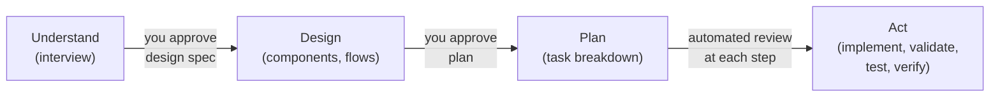
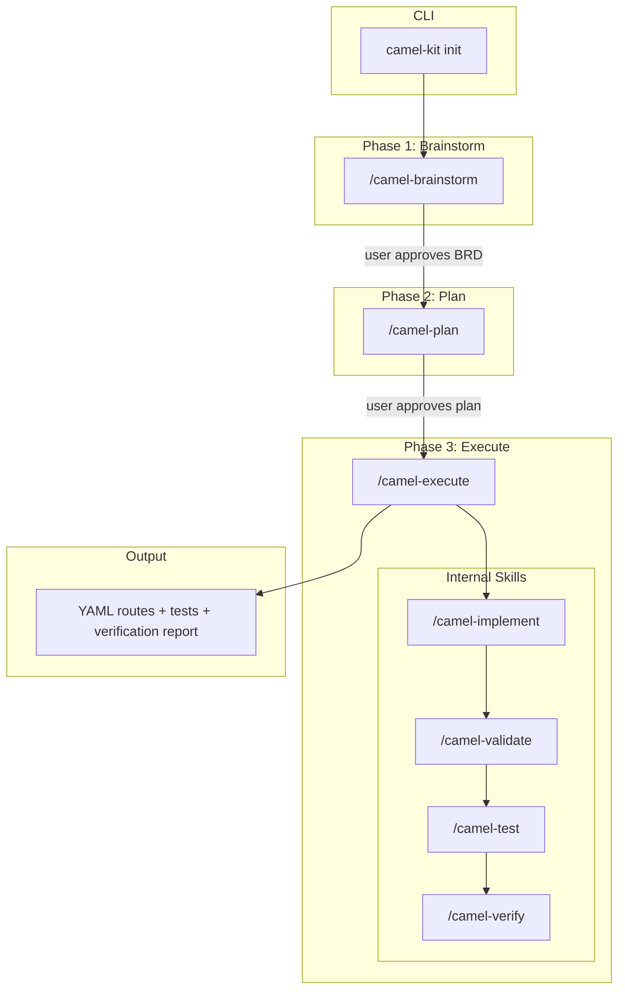

# Camel-Kit User Guide

End-user guide for designing, implementing, and verifying Apache Camel integrations with AI coding assistants.

## Table of Contents

- [1. Introduction](#1-introduction)
- [2. How Camel-Kit Thinks](#2-how-camel-kit-thinks)
- [3. Getting Started](#3-getting-started)
- [4. The Workflow: Greenfield Projects](#4-the-workflow-greenfield-projects)
- [5. The Shortcut: Single Flow](#5-the-shortcut-single-flow)
- [6. Migration](#6-migration)
- [7. Verification](#7-verification)
- [8. Data Transformation (DataMapper)](#8-data-transformation-datamapper)
- [9. Multi-Agent Support](#9-multi-agent-support)
- [10. MCP Integration](#10-mcp-integration)
- [11. Troubleshooting](#11-troubleshooting)

---

## 1. Introduction

Camel-Kit is an AI-powered toolkit that guides you through designing, planning, and implementing Apache Camel integrations. Instead of writing boilerplate code by hand, you work with an AI coding assistant that follows a structured pipeline: understand the requirements, design the integration, plan the implementation, execute the plan, and verify the result.

### Key Concepts

| Concept | What It Is |
|---------|------------|
| **BRD** (Blueprint Reference Document) | The design output from the brainstorm phase. Captures business purpose, systems landscape, flow summaries, and integration requirements. |
| **TDD** (Technical Design Document) | Per-flow specification. Describes the source, processing steps, sink, error handling, data transformation, configuration, and dependencies for a single Camel route. |
| **MCP** (Model Context Protocol) | Real-time catalog queries. The AI assistant queries the Camel MCP server to verify components, EIPs, data formats, and expression languages exist in your exact Camel version -- never relying on training data. |
| **Constitution** | Seven route quality rules enforced on every generated route: route structure, single responsibility, separation of concerns, naming conventions, observability, external configuration, and component support verification. |
| **Iron Laws** | Five non-negotiable pipeline rules that govern the entire workflow: (1) MCP catalog verification for every component, (2) Red Hat Build versions only, (3) constitution compliance on every route, (4) no code without spec approval, (5) spec compliance review before quality review. |

---

## 2. How Camel-Kit Thinks

Before diving into commands and workflows, it helps to understand the principles behind Camel-Kit's design. These explain why the pipeline is structured the way it is and what makes it different from simply asking an AI assistant to generate code.

### Understand First, Code Last

The most common way to use an AI coding assistant is: describe what you want, get code back. For simple tasks this is fine. For enterprise integrations -- multiple systems, error handling, data transformation, version-specific configuration, Red Hat support requirements -- this approach consistently produces code that looks correct but fails at runtime.

The problem is not that AI is bad at writing code. The problem is that it skips understanding. It never asks "what should happen when Kafka is unavailable?" or "do you need idempotent processing?" -- it guesses, and its guesses are drawn from training data that may be outdated or wrong for your version.

Camel-Kit enforces a strict separation: **understand before designing, design before planning, plan before coding.** Each phase has a deliverable, and you approve it before the next phase begins.



This means you are never surprised by what the AI produces. If the design is wrong, you catch it before any code exists. If the plan is wrong, you catch it before code is generated.

### Gates, Not Suggestions

There is a critical difference between a rule and a gate. A rule says "you should verify components before using them" -- the AI can skip this when it feels confident. A gate says "you cannot write this component into the spec until MCP confirms it exists" -- there is no way to proceed without satisfying the condition.

Camel-Kit uses gates everywhere:

| Gate | What It Blocks |
|------|---------------|
| **User approval after design** | Cannot start planning until you confirm the design spec matches your intent |
| **User approval after plan** | Cannot start implementing until you confirm the approach |
| **MCP catalog verification** | Cannot use a component until the live catalog confirms it exists in your Camel version |
| **Red Hat support check** | Flags components that are not Red Hat-supported before they enter the design -- not after deployment |
| **Constitution validation** | Routes without a `routeId`, with hardcoded credentials, or with unsupported components fail validation -- not warned, failed |
| **Two-stage review** | Spec compliance is checked before code quality. Cannot skip to quality review on a route that doesn't match the design. |

As a user, gates mean you stay in control. The AI cannot build momentum on a wrong assumption because the pipeline physically blocks it from advancing.

### Skills: Domain Knowledge, Not Training Data

AI assistants know about Apache Camel from their training data -- broadly but imprecisely, and often months out of date. Camel-Kit replaces this with **skills**: structured instruction files that teach the AI exactly how to perform each task.

Skills tell the AI:
- How to conduct a design interview (one question at a time, verify components via MCP, ask about error handling)
- How to generate YAML routes (follow the constitution, use external configuration, verify every component)
- How to validate (check against 7 quality rules, run security analysis, verify Red Hat support)
- How to handle data transformation (choose the right engine for the mapping complexity)
- How to diagnose errors (14 error patterns, each with a fix strategy)

Because skills are plain markdown files shared across all five agents, the pipeline behavior is consistent regardless of which AI assistant you choose. You get the same quality gates, the same MCP verification, and the same output formats -- the skills are the guarantee.

### Role Separation

When an AI generates code and reviews its own work, it tends to confirm its own choices. Camel-Kit prevents this:

- After each task, a **spec compliance reviewer** checks whether the output matches the design -- this is not the same context that wrote the code
- Then a **code quality reviewer** checks against the constitution rules -- a second independent review
- Tool restrictions prevent the AI from jumping ahead: during the brainstorm phase, the AI physically cannot edit code files (on agents that support tool restrictions)

This is why you may see the AI fix something during review that it didn't catch during implementation -- the reviewer has fresh eyes.

---

## 3. Getting Started

### Prerequisites

- **JDK 17+** -- required for building and running Camel applications
- **JBang** -- runtime for camel-kit itself
- **Docker** (optional) -- for running external services (databases, message brokers) during verification
- **AI coding assistant** -- one of the five supported agents (see [Multi-Agent Support](#8-multi-agent-support))

### Initializing a Project

```bash
# Install JBang if you don't have it
curl -Ls https://sh.jbang.dev | bash -s - app setup

# Create a new project (choose your AI assistant)
camel-kit init order-processing --ai claude
camel-kit init order-processing --ai bob
camel-kit init order-processing --ai gemini
camel-kit init order-processing --ai qwen
camel-kit init order-processing --ai opencode
```

To initialize inside an existing directory:

```bash
camel-kit init --here --ai claude
```

### Init TUI

When you run `camel-kit init` in a terminal that supports a native image protocol (Kitty, iTerm2, Sixel), the command displays a split-screen TUI with a logo on the left and a live task list on the right. The TUI shows animated progress for each initialization step and exits automatically when all tasks complete.

In terminals without image support, the output falls back to an ASCII art banner above colored text.

### Project Structure After Init

```
order-processing/
  .camel-kit/
    config.yaml              # Project config (Camel version, runtime)
  docs/
    constitution.md          # 7 route quality rules
  .mcp.json                  # MCP server config (agent-specific location)
  pom.xml                    # Maven project with Camel BOM
  mvnw / mvnw.cmd            # Maven wrapper
```

The init command copies skill files, configures MCP, and sets up the Maven wrapper so you can start designing immediately.

---

## 4. The Workflow: Greenfield Projects

Camel-Kit follows a 3-phase pipeline: **Brainstorm** (design), **Plan** (task decomposition), **Execute** (implement + validate + test + verify). Each phase produces a document, the user approves it, and the pipeline advances automatically.



### Phase 1: Brainstorm (`/camel-brainstorm`)

The brainstorm phase is an interactive interview that produces the design spec. The AI asks questions one at a time -- never in batches -- to understand your integration before designing it.

**What it covers:**
- Business purpose and goals
- Systems landscape (which systems need to connect)
- Integration flows (what data moves where)
- Components (MCP-verified against the real catalog)
- EIPs (filter, split, aggregate, transform, etc.)
- Error handling strategy (dead letter channels, retry policies)
- Data transformation requirements
- Red Hat Build version selection

**Output:** A BRD (`.camel-kit/business-requirements.md`) with TDDs (`.camel-kit/flows/{flow-name}/{flow-name}.tdd.md`) for each flow.

After the user reviews and approves the design spec, the pipeline transitions automatically to the plan phase.

### Phase 2: Plan (`/camel-plan`)

The plan phase reviews the approved BRD and decomposes it into bite-sized implementation tasks. The plan is a recipe, not the meal -- it describes exactly what to generate and how, without containing any generated code.

**What it produces:**
- Task decomposition with one task per flow or concern
- For each task: files to create, MCP tools to call, and verification steps
- Two-stage review specification per task (spec compliance, then code quality)
- Agent persona assignment per task

**Output:** An implementation plan (`docs/implementation-plan.md`).

After the user reviews and approves the plan, the pipeline transitions automatically to the execute phase.

### Phase 3: Execute (`/camel-execute`)

The execute phase runs all tasks from the approved plan autonomously, without pausing between tasks. For each task, it orchestrates four internal skills:

1. **`/camel-implement`** -- generates Camel YAML routes, properties, pom.xml dependencies, and DataMapper transformations from the TDD
2. **`/camel-validate`** -- checks generated routes against the MCP catalog and the constitution's 7 rules
3. **`/camel-test`** -- generates Citrus integration tests
4. **`/camel-verify`** -- runs the full 5-phase verification loop (build, startup, behavioral)

Each task goes through two-stage review: spec compliance first (does it match the design?), then code quality (does it follow the constitution?). If review fails, the task is sent back for fixes before moving on.

**Output:** Working YAML routes, test files, and a verification report.

### Example Walkthrough

Suppose you need an order processing integration that reads orders from Kafka, validates and enriches them, then writes to a PostgreSQL database.

```bash
# 1. Initialize the project
camel-kit init order-processing --ai claude
cd order-processing

# 2. Start the brainstorm (in your AI assistant)
/camel-brainstorm

# The AI asks about your business requirements, systems, and data flows.
# After the interview, it presents a design spec with:
#   - BRD covering the order processing domain
#   - TDD for the order-ingestion flow (Kafka -> validate -> enrich -> PostgreSQL)
#   - Error handling: dead letter queue on kafka:orders-dlq
# You review and approve.

# 3. The pipeline auto-transitions to /camel-plan
# The AI creates an implementation plan with tasks:
#   Task 1: Project scaffolding (pom.xml, application.properties)
#   Task 2: Order ingestion route (Kafka source, SQL sink)
#   Task 3: Integration tests
# You review and approve.

# 4. The pipeline auto-transitions to /camel-execute
# The AI executes all tasks:
#   - Generates route YAML with MCP-verified components
#   - Validates against the constitution
#   - Generates Citrus tests
#   - Runs verification (build, startup, behavioral)
# Final report shows all tasks completed.
```

---

## 5. The Shortcut: Single Flow

### `/camel-flow`

Use `/camel-flow` when you want to skip the full pipeline and work on a single integration flow quickly. This is useful for:

- Rapid prototyping of a single flow
- Adding one new flow to an existing project
- Exploring a component or pattern

```
/camel-flow order-ingestion
```

`/camel-flow` is a shortcut that enters `/camel-brainstorm` with the project type pre-set to greenfield -- it skips the "greenfield or migration?" detection question and goes straight to the interview for a single flow. After the interview, the pipeline continues through plan and execute as usual.

---

## 6. Migration

### `/camel-migrate`

Use `/camel-migrate` when you have an existing integration built on another platform and want to move it to Apache Camel.

```
/camel-migrate
```

### Supported Platforms

| Platform | Versions | What It Scans |
|----------|----------|---------------|
| MuleSoft Mule | 3.x, 4.x | XML flows, DataWeave transformations, connectors |
| Apache Camel | 2.x, 3.x | Java DSL, XML DSL, Blueprint |
| JBoss Fuse | All | Fuse-specific configurations and components |

### How It Works

The command scans all project artifacts, detects the source platform automatically, and runs a two-phase analysis:

**Phase 1: Business Analyst** -- reads all source files and builds a complete inventory of flows and connectors. Identifies which components have direct Camel equivalents and which are proprietary (e.g., Anypoint MQ). For proprietary connectors, it presents alternatives and lets you decide. Then it asks only the business questions the source code cannot answer -- purpose, SLAs, compliance requirements.

**Phase 2: Integration Architect** -- maps each source component to its Camel equivalent, converts transformations (e.g., DataWeave to field mapping tables), and asks only what the source artifacts cannot answer (authentication details, retry strategy, missing endpoint URLs).

### Output

The migration produces a BRD and TDDs in the same format as `/camel-brainstorm`. This means the rest of the pipeline is identical:

```
/camel-migrate  -->  /camel-plan  -->  /camel-execute  -->  /camel-verify
```

The migration output is fully compatible with the greenfield pipeline. From the plan phase onward, there is no difference between a migrated project and a greenfield project.

---

## 7. Verification

### `/camel-verify`

Verification is a structured 5-phase feedback loop that builds, starts, tests, diagnoses errors, applies fixes, and retries until the application runs correctly or the iteration limit is reached.

**When it runs:**
- **Automatically** at the end of `/camel-execute`, after all implementation tasks complete
- **Manually** via `/camel-verify` if you want to re-verify an existing project

### The 5 Phases

| Phase | What It Does |
|-------|-------------|
| **1. Environment Preparation** | Starts external services (databases, message brokers) via `docker compose`. Skipped if Docker is unavailable. |
| **2. Build Verification** | Runs `./mvnw compile` and classifies any build errors. Skipped for JBang runtime (JBang compiles at runtime). |
| **3. Startup Verification** | Starts the application and watches logs for success or failure patterns. Runtime-specific commands (`./mvnw quarkus:dev`, `./mvnw spring-boot:run`, `camel run`). |
| **4. Behavioral Verification** | Sends test data to running flows and compares actual output against expected output using semantic comparison (field-by-field, ignoring key ordering and insignificant whitespace). |
| **5. Report** | Structured summary of all phases, fixes applied, and issues found. |

### Error Classification

Each phase uses an error taxonomy of 14 patterns organized by phase (build errors, startup errors, runtime errors). Every error is classified into a category with a fix target:

| Fix Target | Examples |
|-----------|----------|
| **Self-repair** | Missing dependency in pom.xml, missing property in `application.properties`, Docker service restart |
| **Route to internal skill** | Wrong component options (to `/camel-validate`), broken route YAML (to `/camel-implement`), XSLT/Groovy transformation error (to `/camel-implement`) |
| **Escalate to user** | Unclassified errors, same error after fix attempt, iteration limit (15) reached |

### Graceful Degradation

Verification adapts to available tools. If Maven is missing, build and startup phases are skipped. If Docker is unavailable, environment preparation is skipped. If the `camel` CLI is missing, behavioral verification is skipped. Every skipped phase is reported explicitly -- nothing fails silently.

---

## 8. Data Transformation (DataMapper)

Camel-Kit automatically handles data transformation during the design phase. The AI determines the transformation engine, gathers field mappings, and writes the canonical mapping specification to the TDD. Implementation is handled by `/camel-execute`.

### Two Engines

| Engine | When Used | Output |
|--------|-----------|--------|
| **XSLT** | 20 or more field mappings AND at least one schema exists | External `.xsl` file, `xslt-saxon:` URI in route, `.kaoto` metadata for Kaoto IDE visual editing |
| **Groovy** | Fewer than 20 field mappings, OR no schemas for both source and target | Inline Groovy script in YAML route, no external files |

### Engine Selection Rules

The engine is chosen automatically during the design phase. You do not need to pick one -- the rules are applied based on your field mappings and schemas:

1. **Rule 1:** Both source AND target have no schema --> **Groovy** (no schemas to drive XSLT structure)
2. **Rule 2:** Field count < 20 --> **Groovy** (small mapping, inline script is simpler)
3. **Rule 3:** Field count >= 20 AND at least one schema exists --> **XSLT** (large mapping benefits from XSLT + Kaoto visual editor)

### What Each Engine Produces

**XSLT:**
- External XSLT stylesheet (`{flow-name}-datamapper-{id}.xsl`)
- Route step using `xslt-saxon:` URI
- `.kaoto` metadata file for Kaoto IDE visual editing
- Handles all format pairs: XML-to-XML, JSON-to-JSON, JSON-to-XML, XML-to-JSON

**Groovy:**
- Inline Groovy script embedded directly in the YAML route
- No external files
- Same format pair support, using Groovy dot notation and map/builder syntax

### Kaoto IDE Integration

XSLT transformations include Kaoto DataMapper metadata, allowing you to visually edit field mappings in the Kaoto IDE after generation. Groovy transformations have no visual editor support -- they are edited directly in the YAML route file.

### Supported Transformation Types

| Type | Example |
|------|---------|
| Direct copy | `orderId` --> `orderId` |
| Nested flattening | `order.customer.name` --> `customerName` |
| Date formatting | ISO 8601 --> `dd-MM-yyyy` |
| Concatenation | `firstName` + `lastName` --> `fullName` |
| Calculation | `price * quantity` --> `lineTotal` |
| Conditional (IF) | IF `amount > 1000` THEN `HIGH` ELSE `NORMAL` |
| Conditional (CHOOSE) | Switch-case style multi-branch logic |
| Collection iteration | FOR-EACH `items[]`, transform each item |
| Parameter usage | Use Camel headers/variables in transformation |

---

## 9. Multi-Agent Support

The same skills work across all five supported AI coding assistants. Camel-Kit uses markdown instruction files that are loaded by whichever agent you choose -- the workflow, rules, and output quality are identical regardless of agent.

### Supported Agents

| Agent | Init Flag | How `/camel-execute` Dispatches Work |
|-------|-----------|--------------------------------------|
| **Claude** (Anthropic Claude Code) | `--ai claude` | Dispatches subagents in parallel per independent task |
| **Bob** (IBM Project Bob) | `--ai bob` | Switches between 5 custom modes with scoped tool permissions |
| **Gemini** (Google Gemini CLI) | `--ai gemini` | Dispatches to 6 subagents; execute phase runs in main agent |
| **Qwen** (Alibaba Qwen CLI) | `--ai qwen` | Auto-delegates to 7 sub-agents based on intent matching |
| **OpenCode** | `--ai opencode` | Dispatches to 7 agents with granular permission control |

### Choosing an Agent

All agents produce the same output (YAML routes, properties files, tests). The differences are in how they manage the pipeline internally:

| If you value... | Consider |
|-----------------|----------|
| **Speed** (parallel implementation of independent flows) | Claude |
| **Safety** (strictest tool restrictions per phase) | Bob or OpenCode |
| **Automatic routing** (say what you want, agent picks the right phase) | Qwen |
| **Customizability** (override policies, compose instructions) | Gemini |
| **Fine-grained file permissions** (auto-allow test dirs, ask for source) | OpenCode |

### What Differs Between Agents

| Aspect | What You'll Notice |
|--------|-------------------|
| **Dispatch transparency** | Claude shows subagent dispatch; Bob shows mode switching; Gemini/Qwen/OpenCode delegate to specialized agents |
| **Tool restrictions** | During brainstorm, Bob physically cannot edit code files (mode restriction). Claude and Qwen rely on skill instructions. OpenCode uses glob-pattern permissions. |
| **Parallel execution** | Only Claude can implement multiple independent flows simultaneously |
| **MCP approval prompts** | Gemini auto-approves MCP tool calls via its policy engine. Other agents may prompt you for each MCP call. |
| **Execution limits** | OpenCode and Gemini enforce step/turn limits per phase. Other agents have no hard limits. |

### The Equalization Layer

Skills are markdown instruction files that the AI agent loads and follows. Because every agent reads the same skill files, the pipeline behavior is consistent across agents:

- The same Iron Laws are enforced
- The same constitution rules are checked
- The same MCP tools are called
- The same output formats are produced

The dispatch model is internal to the agent. You run the same commands (`/camel-brainstorm`, `/camel-execute`, etc.) and get the same artifacts regardless of which agent you chose.

For contributor-level details on each agent's architecture (template files, permission models, dispatch internals), see [Agent Architectures](agent-architectures.md).

---

## 10. MCP Integration

Camel-Kit integrates with the Apache Camel MCP (Model Context Protocol) server to provide real-time catalog queries and validation. This ensures the AI assistant never guesses component names or options from training data.

### What MCP Provides

| Capability | Description |
|------------|-------------|
| Component catalog | Search and verify 300+ Camel components by name or category |
| EIP catalog | Verify Enterprise Integration Patterns exist and get configuration options |
| Data format catalog | Verify data formats (JSON, XML, CSV, etc.) |
| Language catalog | Verify expression languages (Simple, Groovy, XPath, etc.) |
| Route validation | Check endpoint URIs against the catalog schema, catch typos |
| Security analysis | 47 automated security checks for credentials, encryption, authentication |

### Configuration

MCP is auto-configured during `camel-kit init`. The init command creates agent-specific MCP configuration files:

- **Claude:** `.mcp.json`
- **Bob:** `.bob/mcp.json`
- **Gemini:** `.gemini/mcp.json`
- **Qwen/OpenCode:** agent-specific config locations

No additional configuration is needed. The AI assistant automatically uses MCP tools when available.

### Knowledge MCP

In addition to the catalog MCP, Camel-Kit can connect to a Knowledge MCP server that provides:

- Red Hat Build of Apache Camel documentation via semantic search
- Errata and security advisories (CVEs) with CVSS scores and affected packages
- Component support status (Production Support, Technology Preview, Community Support)

### Graceful Degradation

If the MCP server is unavailable, the AI assistant falls back to bundled component skill files. MCP is never a hard requirement -- it enhances accuracy but the pipeline continues without it.

---

## 11. Troubleshooting

### Catalog Not Found

```
Error: Catalog not cached
```

**Solution:** Re-run init to re-fetch the catalog:
```bash
camel-kit init --here --ai claude
```

### Validation Errors

```
Component 'kafak' not found
```

**Solution:** Check for typos. The MCP server suggests corrections when it finds a close match.

### Maven Wrapper Not Found

```
./mvnw: No such file or directory
```

**Solution:** Re-initialize the project to regenerate the Maven wrapper:
```bash
camel-kit init --here --ai claude
```

### Docker Not Available

When Docker is not installed or not running, verification phases that depend on it are skipped:
- Environment preparation (external services) is skipped
- Startup verification may fail if the application depends on external services

**Solution:** Install Docker and start the Docker daemon, or start the required external services manually.

### Verification Fails Repeatedly

If `/camel-verify` fails after multiple fix iterations:
1. Check the verification report for the error classification and fix history
2. Look for "same error after fix attempt" messages -- these indicate the automated fix did not resolve the root cause
3. Check if the error is classified as "Escalate" -- these require manual intervention
4. For connection errors, verify that external services are actually running and reachable
5. For component errors, ask your AI assistant to check whether the component is supported in your Red Hat Build version
