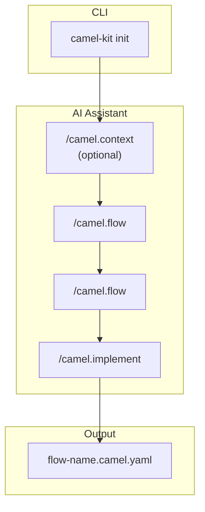
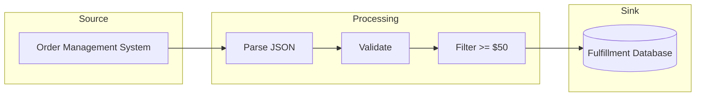
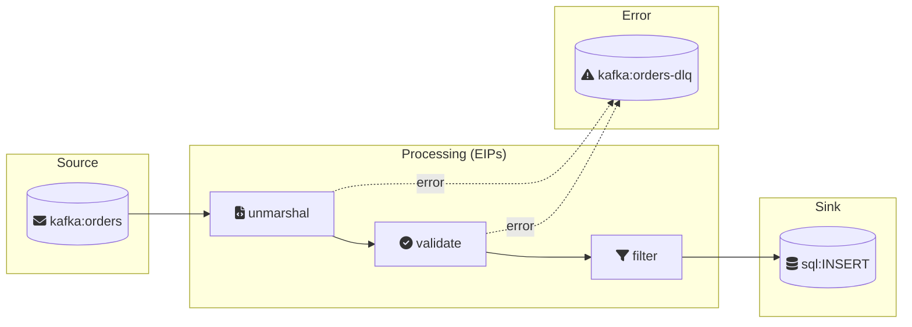

# Camel-Kit User Guide

This guide walks you through using Camel-Kit to design Apache Camel integrations with AI coding assistants.

## Table of Contents

- [Introduction](#introduction)
- [Installation](#installation)
- [Quick Start](#quick-start)
- [Workflow Overview](#workflow-overview)
- [Flow Definition](#flow-definition)
- [Route Design](#route-design)
- [YAML Generation](#yaml-generation)
- [Validation](#validation)
- [Test Generation](#test-generation)
- [Best Practices](#best-practices)
- [Troubleshooting](#troubleshooting)

---

## Introduction

Camel-Kit is a toolkit that guides you through designing Apache Camel integrations using AI coding assistants. Instead of writing code directly, you work with structured specifications that capture your integration requirements, then generate Kaoto-compatible YAML.

**Key concepts:**

- **Flow** - The business intent: what the integration does and why
- **Route** - The technical design: how the integration is built
- **Constitution** - Best practices that guide design decisions
- **Catalog** - Live component and Kamelet information from Apache Camel

**Workflow: 1 Flow = 1 Route** — Each integration flow maps to a single Camel route, making it easy to design, implement, and maintain your integrations.

---

## Installation

### Using uv (Recommended)

```bash
# Install persistently
uv tool install camel-kit-cli --from git+https://github.com/luigidemasi/camel-kit.git

# Or run once without installing
uvx --from git+https://github.com/luigidemasi/camel-kit.git camel-kit --help
```

### Using pip

```bash
pip install git+https://github.com/luigidemasi/camel-kit.git
```

### Verify Installation

```bash
camel-kit version
camel-kit --help
```

---

## Quick Start

```bash
# 1. Create a new project
camel-kit init order-processing --ai bob

# 2. Open in your AI assistant (e.g., IBM Project Bob)
cd order-processing

# 3. Use slash commands in the AI assistant:
#    /camel.context     - (Optional) Define integration landscape
#    /camel.flow        - Define flow (business level)
#    /camel.flow       - Design route (technical level)
#    /camel.implement   - Generate Camel YAML
#    /camel.validate    - Check specifications
#    /camel.test        - Generate integration tests

# 4. Run the generated route
camel run order-ingestion.camel.yaml
```

---

## Workflow Overview



| Step | Command | Purpose |
|------|---------|---------|
| 1 | `camel-kit init` | Create project structure and fetch catalogs |
| 2 | `/camel.context` | (Optional) Define integration landscape |
| 3 | `/camel.flow` | Define flow: source, sink, business rules |
| 4 | `/camel.flow` | Design route: components, EIPs, error handling |
| 5 | `/camel.implement` | Generate Kaoto-compatible Camel YAML |
| 6 | `/camel.validate` | Verify compliance with constitution |
| 7 | `/camel.test` | Generate Citrus integration tests |

---

## Flow Definition

The flow definition captures **WHAT** the integration does from a business perspective, without technical details.

### Creating a Flow

Run `/camel.flow <flow-name>` in your AI assistant. You'll be guided through:

1. **Business Purpose** - What problem does this flow solve?
2. **Source & Sink** - Where data comes from and goes to
3. **Processing Steps** - High-level steps (validate, filter, transform)
4. **Data Contracts** - Input/output formats and schemas
5. **Error Scenarios** - What can go wrong and expected behavior
6. **Flow Diagram** - Mermaid visualization

### Flow File

The flow is saved to `.camel-kit/flows/<flow-name>/flow.md`.

**Example flow diagram:**



---

## Route Design

The route design defines **HOW** the flow is technically implemented using Apache Camel.

### Creating a Route Design

Run `/camel.flow <flow-name>` in your AI assistant. It will:

1. **Select Source** - Choose Camel component/Kamelet
2. **Define EIPs** - Filter, Split, Aggregate, Transform, etc.
3. **Select Sink** - Choose Camel component/Kamelet
4. **Configure Error Handling** - Dead Letter Channel, Retry, Circuit Breaker
5. **Check Constitution** - Verify against best practices
6. **Generate Route Diagram** - Mermaid visualization with EIP icons

### Route Design File

The route design is saved to `.camel-kit/flows/<flow-name>/flow.md`.

**Example route diagram:**



---

## YAML Generation

Generate Kaoto-compatible Camel YAML DSL from your route design.

### Running Generation

```
/camel.implement <flow-name>
```

This:
1. Verifies route design and schemas exist
2. Transforms the design into Camel YAML DSL
3. Outputs to `<flow-name>.camel.yaml`

### Kaoto Compatibility

Generated YAML follows Kaoto requirements:
- Nested EIPs under parent's `steps` array
- Proper expression format for Simple, JSONPath, etc.
- Error handlers at route level
- Environment variables as `{{VARIABLE}}`

### Running Generated Routes

```bash
# With Camel JBang
camel run order-ingestion.camel.yaml

# With environment variables
KAFKA_BROKERS=localhost:9092 camel run order-ingestion.camel.yaml

# Export to Maven project
camel export order-ingestion.camel.yaml \
  --runtime quarkus \
  --gav com.example:my-integration:1.0.0
```

---

## Validation

Validation checks your specifications before generating YAML.

### Running Validation

```
/camel.validate           # Validate all flows
/camel.validate <flow-name>  # Validate specific flow
```

### What's Checked

| Category | Examples |
|----------|----------|
| **Completeness** | Source defined, sink defined, error handling |
| **Correctness** | Valid component names, valid EIP usage |
| **Constitution** | Naming conventions, circuit breakers, schema validation |
| **Dependencies** | All direct: endpoints have routes, no circular deps |

### Validation Report

Results are saved to `.camel-kit/validation-report.md` with:
- Pass/fail status for each check
- Error codes for failures
- Suggested fixes

---

## Test Generation

Generate Citrus integration tests for your routes.

### Running Test Generation

```
/camel.test <flow-name>    # Generate tests for one flow
/camel.test --all          # Generate tests for all flows
```

### Test Scenarios

Based on your route design, tests are generated for:
- Happy path
- Error handling / invalid input
- Dead letter queue
- Idempotency (if using idempotent consumer)
- Circuit breaker fallback (if using resilience patterns)
- Filter conditions (if using filter EIP)

### Test Files

Tests are saved to `test/<flow-name>.camel.it.yaml` following the Camel JBang naming convention, with test data in `test/data/`.

### Running Tests

```bash
# Install Camel test plugin
camel plugin add test

# Run tests
camel test run test/order-ingestion.camel.it.yaml
```

---

## Best Practices

Camel-Kit enforces best practices through the **constitution** (`.camel-kit/constitution.md`):

| Principle | Description |
|-----------|-------------|
| Route Structure | Every route has a clear source and sink |
| Single Responsibility | One route = one clear purpose |
| Error Handling | Every route declares error strategy |
| Resilience | External service calls use circuit breakers |
| Idempotency | Consumer routes handle duplicates |
| Data Format Discipline | Validate at integration boundaries |
| External Configuration | Use environment variables, never hardcode |
| Throttling | High-throughput routes have rate limiting |

### Customizing the Constitution

Edit `.camel-kit/constitution.md` to:
- Disable specific rules
- Add organization-specific guidelines
- Adjust strictness levels

---

## Troubleshooting

### Catalog Not Found

```
Error: Catalog not cached
```

**Solution:** Fetch the catalog:
```bash
camel-kit catalog fetch
```

### Validation Errors

```
COMP-001: Component 'kafak' not found
```

**Solution:** Check for typos. The validation will suggest corrections.

### Flow Not Found

```
Error: Flow definition not found. Run /camel.flow [flow-name] first.
```

**Solution:** Create the flow definition first:
```
/camel.flow order-ingestion
```

### Test Failures

If generated tests fail, check:
1. Infrastructure is running (Kafka, database, etc.)
2. Test data matches current schema
3. Route behavior matches test expectations

Regenerate tests after route changes:
```
/camel.test <flow-name>
```

---

## Next Steps

- See [Command Reference](commands.md) for detailed command documentation
- See [Constitution](constitution.md) for best practices details
- See [CONTRIBUTING.md](../CONTRIBUTING.md) to contribute to Camel-Kit
