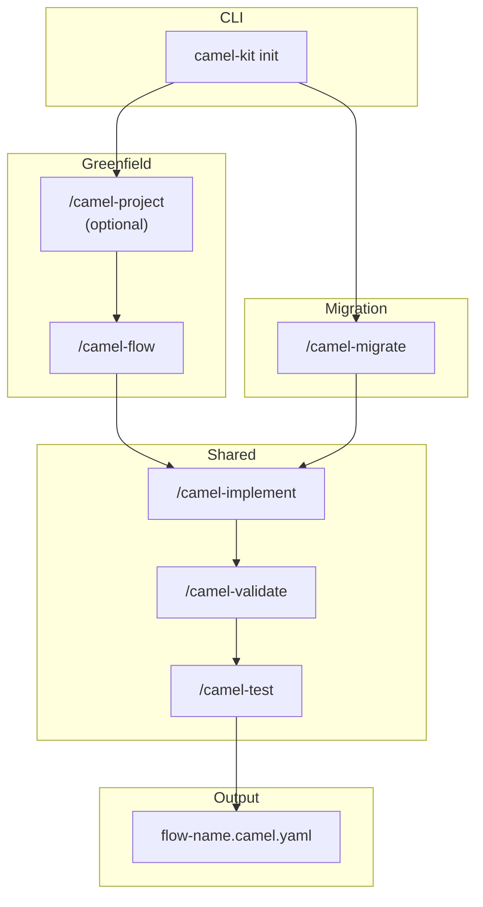
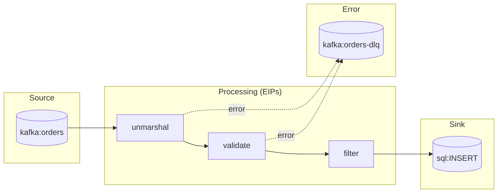

# Camel-Kit User Guide

This guide walks you through using Camel-Kit to design Apache Camel integrations with AI coding assistants.

## Table of Contents

- [Introduction](#introduction)
- [Installation](#installation)
- [Quick Start](#quick-start)
- [Init TUI](#init-tui)
- [Workflow Overview](#workflow-overview)
- [Migration Workflow](#migration-workflow)
- [Flow Definition](#flow-definition)
- [Data Transformation](#data-transformation)
- [YAML Generation](#yaml-generation)
- [Validation](#validation)
- [Test Generation](#test-generation)
- [Best Practices](#best-practices)
- [Troubleshooting](#troubleshooting)

---

## Introduction

Camel-Kit is a toolkit that guides you through designing Apache Camel integrations using AI coding assistants. Instead of writing code directly, you work with structured specifications that capture your integration requirements, then generate Kaoto-compatible YAML.

**Key concepts:**

- **Flow** - The business and technical design: what the integration does and how
- **Constitution** - Best practices that guide design decisions
- **Catalog** - Live component and Kamelet information from Apache Camel
- **MCP Server** - Real-time catalog queries and validation (60-70% token savings)
- **Validation** - Automated schema validation using MCP tools and Maven plugins

**Workflow: 1 Flow = 1 Route** — Each integration flow maps to a single Camel route, making it easy to design, implement, and maintain your integrations.

---

## MCP Integration

Camel-Kit integrates with the **Apache Camel MCP (Model Context Protocol) Server** to provide real-time catalog queries, route validation, and security analysis directly within your AI coding assistant.

### What is the Camel MCP Server?

The Camel MCP server (`camel-jbang-mcp`) exposes the complete Apache Camel catalog through the Model Context Protocol, allowing AI assistants to:

- **Query components** - Search and filter 300+ Camel components by category
- **Get documentation** - Retrieve always-current component docs for your exact Camel version
- **Validate routes** - Check endpoint URIs against the catalog schema, catch typos
- **Analyze security** - Run 47 automated security checks on routes
- **Extract context** - Analyze routes to identify components and EIPs used

### Benefits

- **60-70% token savings** - AI assistant queries MCP server instead of loading full catalog
- **Always current** - Documentation matches your exact Camel version
- **Better validation** - Catches typos and configuration errors before runtime
- **Security analysis** - Automated checks for credentials, encryption, authentication
- **Faster workflow** - No Maven needed for basic validation

### MCP Tools Used

| Tool | Purpose | Used By |
|------|---------|---------|
| `camel_version_list` | List Camel versions with LTS status | camel-project |
| `camel_catalog_components` | Search components by category | camel-flow, camel-migrate |
| `camel_catalog_component_doc` | Get component documentation | camel-flow, camel-migrate, camel-implement, camel-test |
| `camel_validate_route` | Validate endpoint URIs | camel-implement, camel-validate |
| `camel_route_context` | Extract components/EIPs from route | camel-implement, camel-test |
| `camel_route_harden_context` | Security analysis (47 checks) | camel-validate |

### Configuration

The MCP server is automatically configured when you run `camel-kit init`:

- **Claude Code**: `.mcp.json`
- **IBM Bob**: `.bob/mcp.json`
- **Gemini CLI**: `.gemini/mcp.json`

The AI assistant automatically uses MCP tools when available. No additional configuration needed!

---

## Installation

### Using JBang (Recommended)

```bash
# Install JBang first
curl -Ls https://sh.jbang.dev | bash -s - app setup

# Install camel-kit (after local build)
cd camel-kit
mvn install
jbang app install --force camel-kit@io.github.luigidemasi:camel-kit-main:0.3.2-SNAPSHOT

# Verify installation
camel-kit --help
```

### Run Without Installing

```bash
jbang io.github.luigidemasi:camel-kit-main:1.0.0-SNAPSHOT init my-integration --ai bob
```

### Verify Installation

```bash
camel-kit --help
```

---

## Quick Start

```bash
# 1. Create a new project (choose your AI assistant)
camel-kit init order-processing --ai bob      # IBM Project Bob
camel-kit init order-processing --ai gemini   # Google Gemini CLI
camel-kit init order-processing --ai claude   # Anthropic Claude Code

# 2. Open in your AI assistant
cd order-processing

# 3. Use slash commands in the AI assistant:
#    Greenfield:
#    /camel-project     - (Optional) Define integration landscape
#    /camel-flow        - Define and design the flow
#    Migration:
#    /camel-migrate     - Migrate from MuleSoft Mule (or other supported platforms)
#    Shared:
#    /camel-implement   - Generate Camel YAML with validation
#    /camel-validate    - Check specifications
#    /camel-test        - Generate integration tests with validation

# 4. Run the generated route (include application.properties for config)
camel run order-ingestion.camel.yaml application.properties
```

---

## Init TUI

When you run `camel-kit init` (or `camel kit init` via the Camel JBang plugin) in a terminal that supports a native image protocol (Kitty, iTerm2, Sixel), the command displays a split-screen TUI instead of sequential text output.

```
┌──────────────────────────┐  ┌─ Camel Kit ──────────────┐
│                          │  │                          │
│      [logo image]        │  │  ⠋ 📁  Creating project  │
│                          │  │  ✓ 📝  Writing config    │
│                          │  │  ✓ 🤖  Registering cmds  │
│                          │  │  ✓ 📚  Copying skills    │
│                          │  │  ✓ 🔌  Configuring MCP   │
│                          │  │  ✓ ⬇️   Downloading schemas│
└──────────────────────────┘  └──────────────────────────┘
```

**Left panel** — the Camel-Kit logo, sized to preserve its pixel aspect ratio.
**Right panel** — live task list: animated DOTS spinner (⠋⠙⠹…) for the running task, green ✓ for completed tasks, each with an emoji icon.

The TUI exits automatically when all tasks are done. Ctrl+C exits early at any point.

### Fallback behaviour

| Terminal capability | Experience |
|--------------------|-|
| Native image protocol (Kitty, iTerm2, Sixel) | Full split-screen TUI |
| Native image but no TUI backend | Logo rendered inline above coloured text output |
| No native image support | ASCII art banner above coloured text output |

The Camel JBang plugin (`camel kit init`) uses the same TUI when running in a Kitty/iTerm2 terminal.

---

## Workflow Overview

Camel-Kit supports two paths to `/camel-implement` — greenfield (new integrations) and migration (from another platform). Both paths produce the same artifacts, so the implementation and testing steps are identical.



### Greenfield steps

| Step | Command | Purpose |
|------|---------|---------|
| 1 | `camel-kit init` | Create project structure and fetch catalogs |
| 2 | `/camel-project` | (Optional) Define integration landscape |
| 3 | `/camel-flow <flow-name>` | Define flow: source, sink, EIPs, error handling |
| 4 | `/camel-implement <flow-name>` | Generate Kaoto-compatible Camel YAML with validation loop |
| 5 | `/camel-validate` | Verify compliance with constitution |
| 6 | `/camel-test <flow-name>` | Generate Citrus integration tests with validation loop |

### Migration steps

| Step | Command | Purpose |
|------|---------|---------|
| 1 | `camel-kit init` | Create project structure and fetch catalogs |
| 2 | `/camel-migrate` | Detect vendor, analyse flows, produce BRD + TDD files |
| 3 | `/camel-implement <flow-name>` | Generate Camel YAML — same as greenfield |
| 4 | `/camel-validate` | Verify compliance with constitution |
| 5 | `/camel-test <flow-name>` | Generate Citrus integration tests |

---

## Migration Workflow

Use `/camel-migrate` when you have an existing integration built on another platform and want to move it to Apache Camel. The command analyses your existing artifacts, asks targeted questions, and produces the same BRD + TDD files that the greenfield workflow produces — making `/camel-implement` the shared step for both paths.

### Supported platforms

| Platform | Versions | Notes |
|----------|---------|-------|
| MuleSoft Mule | 3.x, 4.x | XML flows, DataWeave transformations, all standard connectors |

### Running a migration

```
/camel-migrate
```

The command asks for the path to your source project interactively.

### What the command does

**Phase 1 — Business Analyst**

The command reads all Mule XML files and builds a complete inventory of flows. Before asking any questions, it identifies which components have direct Camel equivalents and which are proprietary connectors that need a decision:

```
I found the following connector(s) with no direct Apache Camel equivalent:

- Anypoint MQ (used in: order-ingestion-flow)
  Suggested alternatives:
  a) Amazon SQS (camel-aws2-sqs)
  b) RabbitMQ (camel-rabbitmq)
  c) ActiveMQ (camel-activemq)
  d) Keep as TODO placeholder
```

After resolving proprietary connectors, it asks only the business questions the XML cannot answer — purpose, SLA, compliance requirements, and failure behaviour.

Produces:
- `.camel-kit/business-requirements.md`
- `.camel-kit/constitution.md`

**Phase 2 — Integration Architect**

Maps each Mule component to its Camel equivalent, converts DataWeave transformations into TDD field mapping tables, and asks only what the XML cannot answer (DataWeave transformation intent, missing endpoint URLs, authentication, retry strategy).

Produces one TDD file per Mule flow:
- `.camel-kit/flows/{flow-name}/{flow-name}.tdd.md`

### Mule → Camel component mapping highlights

| Mule Component | Camel Equivalent |
|----------------|-----------------|
| HTTP Listener | `platform-http` (consumer) |
| HTTP Request | `camel-http` (producer) |
| JMS | `camel-jms` / `camel-sjms` |
| Database | `camel-sql` / `camel-jdbc` |
| Scheduler | `camel-timer` / `camel-quartz` |
| Choice Router | `choice` EIP |
| Scatter-Gather | `multicast` EIP |
| For Each | `split` EIP |
| Sub Flow | `direct:` route |
| DataWeave Transform | XSLT (Kaoto DataMapper) |
| Set Payload | `setBody` EIP |
| Set Variable | `setHeader` EIP |

For a complete mapping table, see `skills/camel-migrate-mule/guides/mule-component-mapping.md` in your project's skills folder after running `camel-kit init`.

### After `/camel-migrate`

The produced files are fully compatible with the rest of the workflow:

```
/camel-implement order-ingestion     # Generate Camel YAML
/camel-validate order-ingestion      # Verify compliance
/camel-test order-ingestion          # Generate Citrus tests
```

---

## Flow Definition

The flow definition captures **WHAT** the integration does and **HOW** it's implemented.

### Creating a Flow

Run `/camel-flow <flow-name>` in your AI assistant. You'll be guided through:

1. **Flow Intent** - What data is processed and what is the goal
2. **Source System** - Where data comes from and which Camel component handles it
3. **Processing Steps** - EIPs required (filter, split, aggregate, transform, etc.)
4. **Sink System** - Where data goes and which Camel component handles it
5. **Error Handling** - Dead Letter Channel and retry strategy

Then, only if relevant, the agent asks follow-up questions for:
- **Data transformation** - Schemas for DataMapper/XSLT generation; `unmarshal` only as a fallback
- **Circuit Breaker** - Only if an external HTTP/REST service is involved
- **Idempotent Consumer** - Only if consuming from a message broker or deduplication is needed
- **Transactions** - Only if writing to more than one external system
- **Performance, Security, Monitoring** - Only if mentioned during the interview

### Flow File

The flow is saved to `.camel-kit/flows/<flow-name>/flow.md`.

**Example flow diagram:**



---

## Data Transformation

Camel-Kit provides comprehensive support for data transformation with automatic XSLT generation based on field mappings defined during flow design.

### When to Use Data Transformation

Use the transformation feature when your integration needs to:
- Convert between different message formats (JSON ↔ XML)
- Map fields from source schema to destination schema
- Transform nested structures (flatten or nest fields)
- Apply conditional logic during transformation
- Process collections/arrays with iterations
- Use Camel context (Variables/Headers) in transformations

### Defining Field Mappings

During `/camel-flow`, when you mention data transformation, the AI will guide you through an interactive field mapping session:

#### Step 1: Provide Schemas

```
Do you have schemas for source and destination messages?

Options:
a) Yes, I have both schemas (XML Schema / JSON Schema)
b) Yes, source schema only
c) Yes, destination schema only
d) No schemas available
```

**Supported schema formats:**
- XML Schema (XSD)
- JSON Schema (draft 7 and earlier)

#### Step 2: Automatic Field Matching

The AI analyzes both schemas and proposes automapping:

```
EXACT MATCHES (will auto-map):
- orderId → orderId
- customer.name → customer.name
- items[].productId → items[].productId

POTENTIAL MATCHES (similar names):
- order.customerId → customerId (flatten nested field)
- items[].qty → items[].quantity (name variation)

Should I automatically map all exact matches? (yes/no)
```

#### Step 3: Manual Mapping

For unmapped fields, specify the mappings:

```
UNMAPPED SOURCE FIELDS:
- order.timestamp (type: datetime)
- order.total (type: decimal)

UNMAPPED TARGET FIELDS:
- orderDate (type: datetime)
- totalAmount (type: decimal)

Example: "order.timestamp → orderDate (format from ISO to dd-MM-yyyy)"
```

#### Step 4: Advanced Features (Optional)

**Parameters (Camel Variables/Headers):**
```
Do you need to use Camel Variables or Message Headers?

Examples:
- userId (Header) - User ID for audit trail
- customerProfile (Variable with schema) - Customer reference data
```

**Conditional Mappings:**
```
Do you need conditional logic?

Examples:
- IF: "If amount > 1000, set priority to 'HIGH'"
- CHOOSE: "When status='PENDING' THEN 'REVIEW'; When status='APPROVED' THEN 'PROCESS'"
```

**Collection Processing:**
```
Do you need array/collection processing?

Examples:
- "Iterate through items[] array and transform each item"
- "Use position tracking with $_index for line numbers"
```

### Transformation Types Supported

| Type | Description | Example |
|------|-------------|---------|
| **Direct Copy** | Simple field-to-field | `orderId` → `orderId` |
| **Nested Flattening** | Extract from nested object | `order.total` → `totalAmount` |
| **Date Formatting** | Convert date formats | ISO 8601 → dd-MM-yyyy |
| **Concatenation** | Combine multiple fields | `firstName` + `lastName` → `fullName` |
| **Calculation** | Mathematical operations | `price * quantity` → `lineTotal` |
| **Conditional (IF)** | Single condition | IF amount > 1000 THEN 'HIGH' |
| **Conditional (CHOOSE)** | Multiple branches | Switch-case style logic |
| **FOR-EACH** | Array iteration | Process each item in collection |
| **Parameter Usage** | Use Camel context | `$userId` from Header |

### TDD Documentation

All field mappings are documented in the Technical Design Document (TDD) in structured sections:

**Section 3.2 - Field Mappings:**
```markdown
| Source Field | Source Type | Target Field | Target Type | Transformation | Notes |
|--------------|-------------|--------------|-------------|----------------|-------|
| orderId | string | orderId | string | Direct copy | Auto-mapped |
| order.timestamp | datetime | orderDate | date | Format conversion | ISO → dd-MM-yyyy |
```

**Section 3.3 - Transformation Parameters:**
```markdown
| Parameter Name | Source | Type | Schema | Purpose |
|----------------|--------|------|--------|---------|
| userId | Header | string | No schema | Audit trail |
```

**Section 3.4 - Conditional Mappings:**
```markdown
| Target Field | Condition | True Value | False Value |
|--------------|-----------|------------|-------------|
| priority | amount > 1000 | HIGH | NORMAL |
```

**Section 3.5 - Collection Mappings:**
```markdown
| Source Collection | Target Collection | Iteration Logic | Special Variables |
|-------------------|-------------------|-----------------|-------------------|
| order.items[] | items[] | Transform each item | $_index for lineNumber |
```

### Automatic XSLT Generation

During `/camel-implement`, camel-kit automatically generates a Kaoto DataMapper-compatible XSLT file based on your TDD field mappings.

**Generated file:** `{flow-name}-datamapper-{random-id}.xsl`

**Location:** Project root (same folder as route YAML)

**Features:**
- XSLT 2.0 for XML transformations
- XSLT 3.0 for JSON transformations (with `fn:json-to-xml()` and `fn:xml-to-json()`)
- All mapping types implemented as XPath expressions
- Parameter declarations for Camel Variables/Headers
- Namespace handling for XML schemas
- Comprehensive XPath function library

**Integration in route:**
```yaml
- step:
    id: order-transform-datamapper-step
    steps:
      - to:
          id: order-transform-datamapper-xslt
          uri: "xslt-saxon:order-transform-datamapper-a1b2c3d4.xsl"
          parameters:
            userId: "${header.userId}"
            tenantId: "${header.tenantId}"
```

**Dependency:** `camel-saxon` automatically added to pom.xml

### XPath Functions Available

**String Functions:**
- `concat()` - Combine strings
- `substring()` - Extract substring
- `upper-case()` / `lower-case()` - Case conversion
- `contains()` - String contains check

**Numeric Functions:**
- `sum()` / `avg()` - Aggregate calculations
- `round()` - Rounding numbers
- `format-number()` - Number formatting

**Date/Time Functions:**
- `format-dateTime()` - Date/time formatting
- `current-dateTime()` - Current timestamp

**Boolean Functions:**
- `not()` - Boolean negation
- Operators: `and`, `or`, `=`, `!=`, `&gt;`, `&lt;`

### Best Practices

**DO:**
- ✅ Provide schemas when available for better automapping
- ✅ Use parameters for reusable context data (userId, tenantId)
- ✅ Keep conditionals simple (1-3 levels max)
- ✅ Use FOR-EACH for collections rather than hardcoding indices
- ✅ Test XPath expressions match actual data structure

**DON'T:**
- ❌ Mix XML and JSON in single transformation (use marshal/unmarshal)
- ❌ Create deeply nested conditionals (>3 levels)
- ❌ Hardcode values that change per environment
- ❌ Use XSLT for very large documents (>10MB) - consider streaming

### When to Use Kaoto UI

While camel-kit can generate XSLT automatically for most scenarios, use the [Kaoto](https://kaoto.io/) visual designer when:
- Very complex transformations (>50 fields)
- Need visual validation of mappings
- Custom XSLT functions required
- Troubleshooting generated XSLT
- Advanced XSLT features needed

---

## YAML Generation

Generate Kaoto-compatible Camel YAML DSL from your flow definition.

### Running Generation

```
/camel-implement <flow-name>
```

This:
1. Verifies flow definition and schemas exist
2. Looks up components via MCP or cached catalog
3. Transforms the design into Camel YAML DSL
4. **Automatically validates** with MCP tools (if available)
5. Runs Maven validation loop if needed
6. Outputs to `<flow-name>.camel.yaml`

### Automatic MCP Validation

If the Camel MCP server is configured, `/camel-implement` **automatically validates** the generated route before Maven runs:

1. **Route Structure Analysis** (`camel_route_context`) — extracts all components and EIPs, verifies they exist in the catalog
2. **URI and Route Validation** (`camel_validate_route`) — validates all endpoint URIs against the catalog schema, catches typos and unknown options
3. **Auto-fix loop** — if errors are found, the AI agent fixes them and re-validates (up to 3 attempts)

See [Command Reference — /camel-implement](commands.md#camel-implement) for the detailed process.

### Kaoto Compatibility

Generated YAML follows Kaoto requirements:
- Nested EIPs under parent's `steps` array
- Proper expression format for Simple, JSONPath, etc.
- Error handlers at route level
- Environment variables as `{{VARIABLE}}`

### Running Generated Routes

```bash
# With Camel JBang (dependencies from application.properties)
camel run order-ingestion.camel.yaml application.properties

# Export to Maven project
camel export order-ingestion.camel.yaml \
  --runtime quarkus \
  --gav com.example:my-integration:1.0.0
```

Dependencies are configured in `application.properties`:
```properties
camel.jbang.dependencies=org.postgresql:postgresql:42.7.3,\
org.apache.commons:commons-dbcp2:2.12.0
```

---

## Validation

Validation checks your routes for correctness, security, and compliance.

### Running Validation

```
/camel-validate           # Validate all flows
/camel-validate <flow-name>  # Validate specific flow
```

### MCP-Enhanced Validation

When the Camel MCP server is configured, validation adds three automated phases: route structure analysis, URI validation, and security analysis (47 checks covering credentials, encryption, authentication, input validation, data exposure, and compliance).

### What's Checked

| Category | MCP Tool | Examples |
|----------|----------|----------|
| **Completeness** | - | Source defined, sink defined, error handling |
| **URI Validation** | `camel_validate_route` | Valid component names, valid options |
| **Security** | `camel_route_harden_context` | Credentials, encryption, authentication |
| **Constitution** | - | Naming conventions, circuit breakers |

### Validation Report

When using MCP, you get instant feedback:
```
✅ Route structure: VALID
✅ URI validation: VALID (3/3 endpoints)
⚠️  Security: 45/47 checks passed

Security Issues:
  Line 12: HTTP instead of HTTPS
  Risk: Unencrypted communication
  Fix: Change to https://api.example.com
```

Without MCP, results are saved to `.camel-kit/validation-report.md` with:
- Pass/fail status for each check
- Error codes for failures
- Suggested fixes

---

## Test Generation

Generate Citrus integration tests for your routes.

### Running Test Generation

```
/camel-test <flow-name>    # Generate tests for one flow
/camel-test --all          # Generate tests for all flows
```

### Validation Loop

The `/camel-test` command includes an automated validation loop using the json-yaml-validator-maven-plugin:

```bash
./mvnw com.dataliquid.maven:json-yaml-validator-maven-plugin:2.0.0:validate \
  -Dschema.validator.schemaFile=.camel-kit/.cache/citrus/{version}/citrus-testcase.json \
  -Dschema.validator.sourceDirectory=test \
  -Dschema.validator.includes=**/*.camel.it.yaml
```

### Test Scenarios

Based on your flow design, tests are generated for:
- Happy path
- Error handling / invalid input
- Dead letter queue
- Idempotency (if using idempotent consumer)
- Circuit breaker fallback (if using resilience patterns)
- Filter conditions (if using filter EIP)

### Test Files

Tests are saved to `test/<flow-name>.camel.it.yaml` following the Camel JBang naming convention, with test data in `test/data/`.

### Running Tests

```bash
# Install Citrus JBang app
jbang app install citrus@citrusframework/citrus

# Run tests (Docker required for Testcontainers)
cd test
citrus run order-ingestion.camel.it.yaml

# Or using Camel test plugin
camel plugin add test
camel test run test/order-ingestion.camel.it.yaml
```

---

## Best Practices

### Constitution v2.0 — Six Enforced Rules

The constitution (`.camel-kit/constitution.md`) enforces exactly six rules on every generated route:

| Rule | Description | Violation |
|------|-------------|-----------|
| Route Structure | Every route has a `from:` source and a final `to:` sink | ERROR |
| Single Responsibility | One route = one clear purpose; ≤ 7 processing steps | WARNING if > 7 |
| Separation of Concerns | Ingestion → Processing → Delivery; `direct:` for sync, `seda:` for async | WARNING |
| Naming Conventions | Route IDs follow `<domain>-<action>[-<qualifier>]` | WARNING |
| Observability | Every route declares `routeId` and `description` | ERROR |
| External Configuration | No hardcoded credentials or connection strings; use `{{PLACEHOLDER}}` | ERROR |

All other design guidance (error handling strategy, retry policy, circuit breaker, transactions, idempotency, throttling, Kubernetes, data format choices) is applied context-specifically during `/camel-flow` and `/camel-migrate` flow design — not enforced globally.

### Generated Route Quality

`/camel-implement` enforces catalog-verified accuracy on every generated route:
- All component names, endpoint option names, and Maven coordinates come from `camel_catalog_component_doc` — never from training data
- All data format names and options come from `camel_catalog_dataformat_doc`
- All expression language names and syntax come from `camel_catalog_language_doc`
- All EIP names and options come from `camel_catalog_eip_doc`
- When the route has both an HTTP consumer and an HTTP producer, `removeHeaders("CamelHttp*")` is inserted before each outbound HTTP call to prevent header leakage
- DataMapper XSLT generation is blocked if the field mapping table is empty — an actionable error is reported instead of producing a non-functional skeleton
- After generation, the route is validated with `camel_validate_route` in a fix→re-query→retry loop (up to 3 attempts)

### Customizing the Constitution

Edit `.camel-kit/constitution.md` to add project-specific overrides:
- Restrict allowed components
- Override naming patterns
- Define project-specific DLQ topics or security requirements

---

## Troubleshooting

### Catalog Not Found

```
Error: Catalog not cached
```

**Solution:** Re-run init without `--no-fetch`:
```bash
camel-kit init --here --ai bob
```

### Validation Errors

```
COMP-001: Component 'kafak' not found
```

**Solution:** Check for typos. The validation will suggest corrections.

### Flow Not Found

```
Error: Flow definition not found. Run /camel-flow [flow-name] first.
```

**Solution:** Create the flow definition first:
```
/camel-flow order-ingestion
```

### Maven Wrapper Not Found

```
./mvnw: No such file or directory
```

**Solution:** Re-initialize the project to generate Maven Wrapper:
```bash
camel-kit init --here --ai bob
```

### Test Failures

If generated tests fail, check:
1. Docker is running (required for Testcontainers)
2. Test data matches current schema
3. Route behavior matches test expectations

Regenerate tests after route changes:
```
/camel-test <flow-name>
```

---

## Next Steps

- See [Command Reference](commands.md) for detailed command documentation
- See [Architecture Guide](architecture.md) for skills and MCP internals
- See [CONTRIBUTING.md](../CONTRIBUTING.md) to contribute to Camel-Kit
