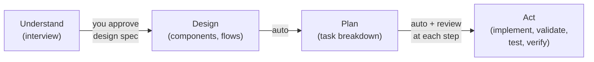
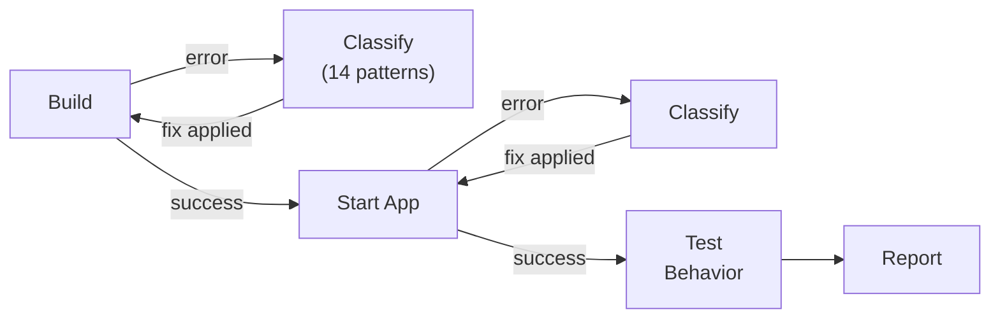
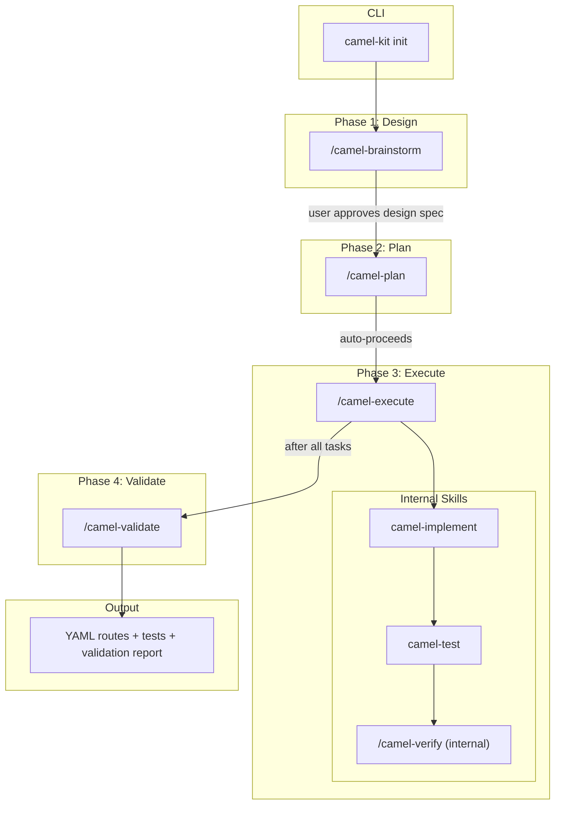

# Camel-Kit User Guide

End-user guide for designing, implementing, and verifying Apache Camel integrations with AI coding assistants.

## Table of Contents

- [1. Introduction](#1-introduction)
- [2. How Camel-Kit Thinks](#2-how-camel-kit-thinks)
- [3. Getting Started](#3-getting-started)
- [4. The Workflow: Greenfield Projects](#4-the-workflow-greenfield-projects)
- [5. Migration](#5-migration)
- [6. Verification](#6-verification)
- [7. Data Transformation (DataMapper)](#7-data-transformation-datamapper)
- [8. Project Graph Analysis](#8-project-graph-analysis)
- [9. Multi-Agent Support](#9-multi-agent-support)
- [10. MCP Integration](#10-mcp-integration)
- [11. Troubleshooting](#11-troubleshooting)

---

## 1. Introduction

Camel-Kit is an AI-powered toolkit that guides you through designing, planning, and implementing Apache Camel integrations. Instead of writing boilerplate code by hand, you work with an AI coding assistant that follows a structured pipeline: understand the requirements, design the integration, plan the implementation, execute the plan, and verify the result.

### Key Concepts

| Concept | What It Is |
|---------|------------|
| **Business Requirements** | The requirements output from the brainstorm phase. Captures business purpose, systems landscape, flow summaries, and integration requirements. |
| **Design Spec** | The pipeline design contract. Describes each flow's source, processing steps, sink, error handling, data transformation, configuration, dependencies, and test criteria. |
| **MCP** (Model Context Protocol) | Real-time catalog queries. The AI assistant queries the Camel MCP server to verify components, EIPs, data formats, and expression languages exist in your exact Camel version -- never relying on training data. |
| **Constitution** | Seven route quality rules enforced on every generated route: route structure, single responsibility, separation of concerns, naming conventions, observability, external configuration, and component support verification. |
| **Iron Laws** | Non-negotiable pipeline rules that govern the entire workflow: MCP catalog verification for every component, constitution compliance on every route, no code without design approval, and spec compliance review before quality review. |

---

## 2. How Camel-Kit Thinks

Before diving into commands and workflows, it helps to understand the principles behind Camel-Kit's design. These explain why the pipeline is structured the way it is and what makes it different from simply asking an AI assistant to generate code.

### Understand First, Code Last

The most common way to use an AI coding assistant is: describe what you want, get code back. For simple tasks this is fine. For enterprise integrations -- multiple systems, error handling, data transformation, version-specific configuration -- this approach consistently produces code that looks correct but fails at runtime.

The problem is not that AI is bad at writing code. The problem is that it skips understanding. It never asks "what should happen when Kafka is unavailable?" or "do you need idempotent processing?" -- it guesses, and its guesses are drawn from training data that may be outdated or wrong for your version.

Camel-Kit enforces a strict separation: **understand before designing, design before planning, plan before coding.** The design phase has a deliverable that you approve before anything else proceeds. After design approval, planning and execution flow continuously.



This means you are never surprised by what the AI produces. If the design is wrong, you catch it before any code exists. If the plan is wrong, you catch it before code is generated.

### Gates, Not Suggestions

There is a critical difference between a rule and a gate. A rule says "you should verify components before using them" -- the AI can skip this when it feels confident. A gate says "you cannot write this component into the spec until MCP confirms it exists" -- there is no way to proceed without satisfying the condition.

Camel-Kit uses gates everywhere:

| Gate | What It Blocks |
|------|---------------|
| **User approval after design** | Cannot start planning until you confirm the design spec matches your intent |
| **Environment probe** | Cannot start implementing until the environment probe confirms dependencies resolve and runtime boots |
| **MCP catalog verification** | Cannot use a component until the live catalog confirms it exists in your Camel version |
| **Constitution validation** | Routes without a `routeId`, with hardcoded credentials, or with unsupported components fail validation -- not warned, failed |
| **Two-stage review** | Spec compliance is checked before code quality. Cannot skip to quality review on a route that doesn't match the design. |

As a user, gates mean you stay in control. The AI cannot build momentum on a wrong assumption because the pipeline physically blocks it from advancing.

### Skills: Domain Knowledge, Not Training Data

AI assistants know about Apache Camel from their training data -- broadly but imprecisely, and often months out of date. Camel-Kit replaces this with **skills**: structured instruction files that teach the AI exactly how to perform each task.

Skills tell the AI:
- How to conduct a design interview (one question at a time, verify components via MCP, ask about error handling)
- How to generate YAML routes (follow the constitution, use external configuration, verify every component)
- How to validate (check against 7 quality rules, run security analysis)
- How to handle data transformation (choose the right engine for the mapping complexity)
- How to diagnose errors (14 error patterns, each with a fix strategy)

Because skills are plain markdown files shared across all supported agents, the pipeline behavior is consistent regardless of which AI assistant you choose. You get the same quality gates, the same MCP verification, and the same output formats -- the skills are the guarantee.

### Role Separation

When an AI generates code and reviews its own work, it tends to confirm its own choices. Camel-Kit prevents this:

- After each task, a **spec compliance reviewer** checks whether the output matches the design -- this is not the same context that wrote the code
- Then a **code quality reviewer** checks against the constitution rules -- a second independent review
- Tool restrictions prevent the AI from jumping ahead: during the brainstorm phase, the AI physically cannot edit code files (on agents that support tool restrictions)

This is why you may see the AI fix something during review that it didn't catch during implementation -- the reviewer has fresh eyes.

### Environment-in-the-Loop: Code That Compiles Is Not Code That Works

Code that passes static analysis can still fail at runtime -- wrong component options for the target version, missing dependencies at startup, external services not running. Research has shown that AI models cause approximately 30% of runtime errors that are invisible to static analysis (Li et al., *"Environment-in-the-Loop"*, ICSE 2026). The fix is not better prediction -- it is actual execution in a real environment.

Camel-Kit applies this principle through its verification loop (now internal to `/camel-execute`), which implements a structured feedback loop. For standalone quality checks after execution, use `/camel-validate`:



The key idea: every error is **classified** against a taxonomy of 14 Camel-specific patterns, and each classification has a **deterministic fix target**. A `ClassNotFoundException` means a missing dependency in `pom.xml` -- the loop fixes it and retries. A `FailedToCreateRouteException` means broken route YAML -- the loop routes the fix to the implementation skill. An unclassified error is escalated to you with a structured diagnosis.

This means:
- You do not need to debug build errors manually -- the loop classifies and fixes them
- You do not need to check if Docker services are running -- the loop starts them
- You only see the final report, or get asked when the system is genuinely stuck (after 15 attempts per phase)

The verification loop treats code, dependencies, and the execution environment as a single unit that must co-evolve. When a route uses Kafka, the loop ensures `camel-quarkus-kafka` is in `pom.xml`, the Kafka broker is running in Docker, and the connection properties are in `application.properties` -- not just that the route YAML is syntactically correct.

---

## 3. Getting Started

### Prerequisites

- **JDK 17+** -- required for building and running Camel applications
- **JBang** -- runtime for camel-kit itself
- **Docker** (optional) -- for running external services (databases, message brokers) during verification
- **AI coding assistant** -- one of the supported agents (see [Multi-Agent Support](#8-multi-agent-support))

### Initializing a Project

```bash
# Install JBang if you don't have it
curl -Ls https://sh.jbang.dev | bash -s - app setup

# Create a new project (choose your AI assistant)
camel-kit init order-processing             # IBM Bob 2 (default)
camel-kit init order-processing --ai claude
camel-kit init order-processing --ai bob      # IBM Bob 1 legacy
camel-kit init order-processing --ai bob2     # IBM Bob 2
camel-kit init order-processing --ai gemini
camel-kit init order-processing --ai qwen
camel-kit init order-processing --ai opencode
```

To initialize inside an existing directory:

```bash
camel-kit init --here --ai claude
```

### Customizing Configuration

All defaults (Camel version, BOM versions, MCP server versions) are read from a built-in `distribution.properties` file. You can override any property in two ways:

**Per-invocation overrides** (highest priority):
```bash
camel-kit init my-integration --ai claude -p "camel.main.version=4.18.2"
```

**Persistent user config** (applies to all invocations):
Create `~/.camel-kit/config.properties` with your overrides:
```properties
camel.main.version=4.18.2
camel.quarkus.version=4.18.2
quarkus.platform.version=3.33.1
```

Or point to a custom config file:
```bash
camel-kit init my-integration --ai claude -c /path/to/my-config.properties
```

The resolution order is: `-p` flags > `-c` file (or `~/.camel-kit/config.properties`) > built-in JAR defaults.

### Init TUI

When you run `camel-kit init` in a terminal that supports a native image protocol (Kitty, iTerm2, Sixel), the command displays a split-screen TUI with a logo on the left and a live task list on the right. The TUI shows animated progress for each initialization step and exits automatically when all tasks complete.

In terminals without image support, the output falls back to an ASCII art banner above colored text.

### Project Structure After Init

```
order-processing/
  .camel-kit/
    config.properties        # Project config (Camel version, runtime)
  docs/
    constitution.md          # 7 route quality rules
  .mcp.json                  # MCP server config (agent-specific location)
  pom.xml                    # Maven project with Camel BOM
  mvnw / mvnw.cmd            # Maven wrapper
```

The init command checks prerequisites (Java, JBang, Camel JBang, test plugin), copies skill files, configures MCP, and sets up the Maven wrapper so you can start designing immediately. If the target directory already contains a camel-kit project (`AGENTS.md` or `.camel-kit/`), init warns and exits — use `--force` to overwrite.

### Validating the Workspace

After initialization, run `doctor` from the workspace root:

```bash
camel-kit doctor
# or, when installed as a Camel JBang plugin:
camel kit doctor
```

`doctor` checks the generated configuration, command stubs, skill files, MCP config and allowlists, project graph, command prefix, prerequisites, and common stale generated references. It also verifies that internal skills such as `camel-verify` are present as skills but not exposed as user command stubs. It prints `PASS`, `WARN`, and `FAIL` findings with remediation text. External tools such as JBang and Camel JBang are reported as warnings when unavailable; broken generated workspace files are failures.

For automation:

```bash
camel-kit doctor --json
camel kit doctor --json
```

---

## 4. The Workflow: Greenfield Projects

Camel-Kit follows a 3-phase pipeline: **Design**, **Plan**, **Execute**. You approve the design output, then planning and execution auto-proceed under that approval.



### Pipeline Files

Each pipeline run creates a directory under `docs/camel-kit/` to persist artifacts across sessions:

```text
docs/camel-kit/001-order-processing/
  design-spec.md           <- brainstorm output (Phase 1)
  implementation-plan.md   <- plan output (Phase 2)
  execution-report.md      <- execute output (Phase 3)
  validation-report.md     <- validate output (Phase 4)
```

**Starting a pipeline:**

```bash
# Generate a pipeline ID and create the directory
{COMMAND_PREFIX} nextId order-processing
# Output: 001-order-processing
```

The pipeline state is tracked in `.camel-kit/pipeline.json`, which records the active pipeline ID. Each skill reads this file to know where to find and save artifacts.

**Session resilience:** Because all artifacts are saved to disk, you can close your session and resume later. The pipeline picks up where you left off based on which artifacts already exist.

### Standalone Mode

Every pipeline skill supports **standalone invocation** — you can run any stage independently in a new session by passing the pipeline ID:

```bash
# Run plan standalone (reads design-spec.md from disk)
/camel-plan 001-order-processing

# Run execute standalone (reads implementation-plan.md from disk)
/camel-execute 001-order-processing
```

In standalone mode, skills read their input from pipeline artifacts on disk instead of conversation context, and they do NOT auto-invoke the next stage. This enables:

- **Session resilience** — close your session, come back later, and pick up any stage
- **CI/CD integration** — trigger individual pipeline stages from automation
- **Selective re-runs** — re-run just the stages you need after changes

### Re-iteration (Amending a Design)

If you need to change a design spec after downstream artifacts have been generated:

```bash
# Amend an existing design spec
/camel-brainstorm 001-order-processing
```

When brainstorm detects that `design-spec.md` already exists, it enters **amend mode**:
1. Loads the existing spec and presents it for modification
2. After you approve the amendments, overwrites the design spec
3. Marks all downstream artifacts as **stale** via `camel-kit doc stale --reason "design spec was amended" --cascade docs/camel-kit/001-order-processing/implementation-plan.md`

Staleness is tracked in structured YAML frontmatter within each artifact. You can check any artifact's status:
```bash
camel-kit doc check docs/camel-kit/001-order-processing/implementation-plan.md
```

To regenerate stale artifacts, either:
- Run each stale stage standalone: `/camel-plan 001-order-processing`, then `/camel-execute 001-order-processing`
- Use `camel-ship --resume` — it automatically detects staleness and re-runs from the earliest stale stage

See [camel-kit doc](commands.md#camel-kit-doc) for the full CLI reference.

### Phase 1: Design (`/camel-brainstorm`)

The design phase is an interactive interview that produces the design spec. The AI asks questions one at a time -- never in batches -- to understand your integration before designing it.

**What it covers:**
- Business purpose and goals
- Systems landscape (which systems need to connect)
- Integration flows (what data moves where)
- Components (MCP-verified against the real catalog)
- EIPs (filter, split, aggregate, transform, etc.)
- Error handling strategy (dead letter channels, retry policies)
- Data transformation requirements
- Camel version selection

**Output:** Business requirements and a design spec under `docs/camel-kit/<PIPELINE_ID>/`.

After the user reviews and approves the design spec, the pipeline transitions automatically to the plan phase.

### Phase 2: Plan (`/camel-plan`)

The plan phase reviews the approved design spec and decomposes it into bite-sized implementation tasks. The plan is a recipe, not the meal -- it describes exactly what to generate and how, without containing any generated code.

**What it produces:**
- Task decomposition with one task per flow or concern
- For each task: files to create, MCP tools to call, and verification steps
- Structured `yaml plan-metadata` with file, logical, and explicit task dependencies for wave analysis
- Two-stage review specification per task (spec compliance, then code quality)
- Agent persona assignment per task

**Output:** An implementation plan (`docs/camel-kit/<PIPELINE_ID>/implementation-plan.md`).

The structured metadata block mirrors the Markdown tasks. Each task entry includes `id`, `title`, grouped `files`,
logical `provides` and `consumes` resources, and explicit `dependsOn` task IDs. Logical resources include endpoints,
routes, properties, schemas, test data, beans, external services, and route contracts. Older Markdown-only plans still
work, but new plans use the metadata block so `/camel-execute` can avoid parallelizing tasks with hidden dependencies.

After the plan is complete, the pipeline transitions automatically to the execute phase. There is no separate plan approval gate -- the design approval authorizes all downstream work. The environment probe (first step of execute) validates feasibility before code generation begins.

### Phase 3: Execute (`/camel-execute`)

The execute phase runs all tasks from the approved plan autonomously, without pausing between tasks. For each task, it
orchestrates internal skills:

1. **`camel-implement`** -- generates Camel YAML routes, properties, pom.xml dependencies, and DataMapper transformations from the approved design spec and implementation plan
2. **`camel-test`** -- generates Citrus integration tests
3. **`/camel-verify`** (internal) -- runs the 3-phase verification loop (build, Citrus tests, report)

After all execute tasks complete, `/camel-validate` runs as a separate Tier 1 pipeline step -- the final user-facing quality gate.

Each task goes through two-stage review: spec compliance first (does it match the design?), then code quality (does it follow the constitution?). If review fails, the task is sent back for fixes before moving on.

**Output:** Working YAML routes, test files, and a verification report.

### Example Walkthrough

Suppose you need an order processing integration that reads orders from Kafka, validates and enriches them, then writes to a PostgreSQL database.

```bash
# 1. Initialize the project
camel-kit init order-processing --ai claude
cd order-processing

# 2. Start the workflow (in your AI assistant)
/camel-start

# The AI asks about your business requirements, systems, and data flows.
# After the interview, it presents a design spec with:
#   - Business requirements covering the order processing domain
#   - Flow design for order-ingestion (Kafka -> validate -> enrich -> PostgreSQL)
#   - Error handling: dead letter queue on kafka:orders-dlq
# You review and approve the design.

# 3. /camel-start routes to /camel-brainstorm, then the pipeline auto-transitions to /camel-plan
# The AI creates an implementation plan with tasks:
#   Task 1: Project scaffolding (pom.xml, application.properties)
#   Task 2: Order ingestion route (Kafka source, SQL sink)
#   Task 3: Integration tests
# No separate plan approval — pipeline auto-transitions to /camel-execute.

# 4. /camel-execute starts with the environment probe, then implements
# The AI executes all tasks:
#   - Generates route YAML with MCP-verified components
#   - Validates against the constitution
#   - Generates Citrus tests
#   - Runs verification (build, startup, behavioral)
# Final report shows all tasks completed.
```

---

## 5. Migration

### `/camel-migrate`

Use `/camel-migrate` when you have an existing integration built on another platform and want to move it to Apache Camel.

```
/camel-migrate
```

### Supported Platforms

| Platform | Versions | What It Scans |
|----------|----------|---------------|
| MuleSoft Mule | 3.x, 4.x | XML flows, DataWeave transformations, connectors |
| Apache Camel | 2.x, 3.x | Java DSL, XML DSL, Blueprint |
| JBoss Fuse | 6.x, 7.x | Fuse-specific configurations and components |
| Microsoft BizTalk | 3.x, 4.x | Orchestrations (.odx), maps (.btm), pipelines (.btp), bindings (.xml) |

### Graph-Accelerated Analysis

MuleSoft migrations now benefit from the project graph. When a project contains MuleSoft XML files, the graph automatically detects them via XML namespace sniffing (`mulesoft.org/schema/mule`) and parses all flows, sub-flows, connectors, endpoints, transforms, error handlers, and DataWeave scripts. The migration skill gets instant flow topology -- connectors used per flow, sub-flow call chains, DataWeave complexity -- without manual XML deep-dives.

Previously, only Maven dependencies were captured in the graph for MuleSoft projects. Now, the `MuleXmlFlowParser` and `DataWeaveParser` provide full structural analysis of the source project.

DataWeave `.dwl` files are analyzed for version declarations, input/output content types, function definitions, and field access patterns. This helps identify complex transformations that need manual attention during migration -- multi-function scripts, recursive field access, or format conversions that have no direct XSLT equivalent.

### Graph-Accelerated Analysis for BizTalk

BizTalk migrations now benefit from the project graph. When a project contains BizTalk artifacts, the graph automatically detects them via XML namespace sniffing (`schemas.microsoft.com/BizTalk`) and parses all orchestrations, maps, pipelines, and port bindings. The migration skill gets instant artifact topology -- adapters used per orchestration, map functoid complexity, pipeline component chains, port bindings -- without manual XML deep-dives.

The `BizTalkParser` analyzes:
- **Orchestrations (.odx files)** -- orchestration shapes (Receive, Send, Decide, Loop, Parallel, Call, Scope, and more)
- **Maps (.btm files)** -- functoid types (string ops, math, looping, scripting, database lookup, and more)
- **Pipelines (.btp files)** -- pipeline stages and component chains
- **Bindings (.xml files)** -- port configurations and adapter types

This helps identify proprietary BizTalk patterns that need manual attention during migration -- scripting functoids, custom pipeline components, WCF-specific configurations.

**BizTalk-to-Camel adapter mapping highlights:**

| BizTalk Adapter | Camel Equivalent | Notes |
|---|---|---|
| FILE | `file` | Direct drop-in replacement for file system operations |
| FTP / FTPS | `ftp` / `ftps` | Connection pooling via Camel configuration |
| SFTP | `sftp` | SSH key authentication supported |
| SQL | `sql` / `jdbc` | `sql` for queries, `jdbc` for batch operations |
| WCF-BasicHttp / WCF-WSHttp | `cxf` | SOAP 1.1/1.2 support via `camel-cxf` |
| HTTP / HTTPS | `http` / `https` | RESTful endpoint support |
| MSMQ | `jms` | Map to ActiveMQ or other JMS provider |
| SMTP / POP3 / IMAP | `mail` | All from `camel-mail` artifact |
| MQ Series | `jms` | Via IBM MQ JMS bindings |
| SAP | `sap` | Requires SAP JCo libraries (licensed) |

**`--source-platform` flag:** Auto-detection works in most cases (no flag needed). For projects with non-standard layouts, use `--source-platform {platform}` to explicitly declare the source platform:

```bash
camel-kit init my-migration --ai claude --source-platform mulesoft
camel-kit init my-migration --ai claude --source-platform biztalk
```

### How It Works

The command scans all project artifacts, detects the source platform automatically, and runs a two-phase analysis:

**Phase 1: Business Analyst** -- reads all source files and builds a complete inventory of flows and connectors. Identifies which components have direct Camel equivalents and which are proprietary (e.g., Anypoint MQ). For proprietary connectors, it presents alternatives and lets you decide. Then it asks only the business questions the source code cannot answer -- purpose, SLAs, compliance requirements.

**Phase 2: Integration Architect** -- maps each source component to its Camel equivalent, converts transformations (e.g., DataWeave to field mapping tables), and asks only what the source artifacts cannot answer (authentication details, retry strategy, missing endpoint URLs).

### Output

The migration produces business requirements and a design spec in the same format as `/camel-brainstorm`. This means the rest of the pipeline is identical:

```
/camel-migrate  -->  /camel-plan  -->  /camel-execute  -->  /camel-validate
```

The migration output is fully compatible with the greenfield pipeline. From the plan phase onward, there is no difference between a migrated project and a greenfield project.

---

## 6. Verification

### `/camel-verify` (Internal to `/camel-execute`)

Verification is a structured 3-phase feedback loop that builds the project, runs Citrus integration tests via `camel test run`, diagnoses errors, applies fixes, and retries until all tests pass or the iteration limit is reached. Citrus tests are self-contained: Testcontainers manage external services and `camel:jbang:run` starts the Camel integration within the test.

**When it runs:**
- **Automatically** inside `/camel-execute`, as a subagent-only skill dispatched per task
- `/camel-verify` is not a standalone user-facing command. For standalone quality checks after execution, use `/camel-validate`.

### The 3 Phases

| Phase | What It Does |
|-------|-------------|
| **1. Build Verification** | Runs `./mvnw compile` and classifies any build errors. Skipped for JBang runtime (JBang compiles at runtime). |
| **2. Test Verification** | Runs Citrus integration tests via `camel test run`. Citrus tests are self-contained: Testcontainers start external services, `camel:jbang:run` starts the Camel integration, send/receive actions validate behavior. |
| **3. Report** | Structured summary of all phases, fixes applied, and issues found. |

### Error Classification

Each phase uses an error taxonomy of 14 patterns organized by phase (build errors, startup errors, runtime errors). Every error is classified into a category with a fix target:

| Fix Target | Examples |
|-----------|----------|
| **Self-repair** | Missing dependency in pom.xml, missing property in `application.properties`, Docker service restart |
| **Route to internal handling** | Wrong component options (to `/camel-validate`), broken route YAML, test syntax error |
| **Re-plan** | Persistent architectural failures trigger automatic design-spec modification via the re-plan loop (max 3 rounds) |
| **Escalate to user** | Unclassified errors, same error after fix attempt, iteration limit (15) reached, re-plan limit (3) reached |

### Graceful Degradation

Verification adapts to available tools. If Maven is missing, build verification is skipped. If Docker is unavailable, test verification is skipped (Testcontainers requires Docker). If the `camel test` CLI is unavailable, test verification is skipped. Every skipped phase is reported explicitly -- nothing fails silently.

---

## 7. Data Transformation (DataMapper)

Camel-Kit automatically handles data transformation during the design phase. The AI determines the transformation
engine, gathers field mappings, and writes the canonical mapping specification to the design spec. Implementation is
handled by `/camel-execute`.

### Two Engines

| Engine | When Used | Output |
|--------|-----------|--------|
| **XSLT** | 20 or more field mappings AND at least one schema exists | External `.xsl` file, `xslt-saxon:` URI in route, `.kaoto` metadata for Kaoto IDE visual editing |
| **Groovy** | Fewer than 20 field mappings, OR no schemas for both source and target | Inline Groovy script in YAML route, no external files |

### Engine Selection Rules

The engine is chosen automatically during the design phase. You do not need to pick one -- the rules are applied based on your field mappings and schemas:

1. **Rule 1:** Both source AND target have no schema --> **Groovy** (no schemas to drive XSLT structure)
2. **Rule 2:** Field count < 20 --> **Groovy** (small mapping, inline script is simpler)
3. **Rule 3:** Field count >= 20 AND at least one schema exists --> **XSLT** (large mapping benefits from XSLT + Kaoto visual editor)

### What Each Engine Produces

**XSLT:**
- External XSLT stylesheet (`{flow-name}-datamapper-{id}.xsl`)
- Route step using `xslt-saxon:` URI
- `.kaoto` metadata file for Kaoto IDE visual editing
- Handles all format pairs: XML-to-XML, JSON-to-JSON, JSON-to-XML, XML-to-JSON

**Groovy:**
- Inline Groovy script embedded directly in the YAML route
- No external files
- Same format pair support, using Groovy dot notation and map/builder syntax

### Kaoto IDE Integration

XSLT transformations include Kaoto DataMapper metadata, allowing you to visually edit field mappings in the Kaoto IDE after generation. Groovy transformations have no visual editor support -- they are edited directly in the YAML route file.

### Supported Transformation Types

| Type | Example |
|------|---------|
| Direct copy | `orderId` --> `orderId` |
| Nested flattening | `order.customer.name` --> `customerName` |
| Date formatting | ISO 8601 --> `dd-MM-yyyy` |
| Concatenation | `firstName` + `lastName` --> `fullName` |
| Calculation | `price * quantity` --> `lineTotal` |
| Conditional (IF) | IF `amount > 1000` THEN `HIGH` ELSE `NORMAL` |
| Conditional (CHOOSE) | Switch-case style multi-branch logic |
| Collection iteration | FOR-EACH `items[]`, transform each item |
| Parameter usage | Use Camel headers/variables in transformation |

---

## 8. Project Graph Analysis

When working with existing projects -- whether migrating from another platform, extending an established codebase, or validating a generated project -- Camel-Kit can build a **property graph** of the entire project structure. The graph captures classes, methods, Camel routes, endpoints, Maven dependencies, configuration properties, and -- for MuleSoft projects -- flows, sub-flows, connectors, endpoints, transforms, error handlers, and DataWeave scripts, and -- for BizTalk projects -- orchestrations, shapes, maps, functoids, pipelines, pipeline components, ports, and adapters. Typed edges represent the relationships between nodes (extends, calls, routes-from, routes-to, depends-on, configures, flow-contains, calls-subflow, uses-connector, references-dwl, biztalk-orchestration-contains, biztalk-uses-map, biztalk-uses-schema, biztalk-calls-orchestration, biztalk-port-binding, biztalk-functoid-chain, biztalk-pipeline-stage).

### What the Graph Provides

| Capability | What It Does | When It Helps |
|-----------|-------------|---------------|
| **Route flow tracing** | Follows the complete message path through a route chain, including cross-route links via `direct:`, `seda:`, and `vm:` endpoints | Understanding how data flows end-to-end through a multi-route integration |
| **Impact analysis** | Traces upstream and downstream dependencies of any node -- a route, a class, a configuration property | Before changing a shared bean or endpoint, knowing which routes will be affected |
| **Dead code detection** | Identifies unused Maven dependencies, orphaned routes (not referenced by any other route), and stale configuration properties | Cleaning up projects after incremental changes, catching leftover artifacts from migration |
| **Route topology mapping** | Maps route-to-route connections to determine which routes are independent | Claude uses this to dispatch independent routes to parallel subagents during `/camel-execute` |
| **Project norm extraction** | Computes statistical norms from the codebase -- naming patterns, error handling coverage, route complexity (P75 step count) | Validation uses project-specific thresholds instead of hardcoded defaults |
| **DI-aware dependency tracking** | Detects dependency injection annotations (@Inject, @Autowired, @Value, @ConfigProperty) and creates USES_TYPE edges for injected fields and constructor parameters | Understanding which services are injected into routes, processors, or beans -- traces dependencies across interface boundaries |
| **Property-based bean wiring** | Parses `application.properties` for Camel's PropertyBindingSupport syntax (#class:, #bean:, #autowired, #type:) to discover beans instantiated or referenced in configuration | Finding beans that exist only in properties files, not in source code -- critical for migration projects where beans are configured via properties |
| **Interface expansion** | Creates DEPENDS_ON_VIA_INTERFACE shortcut edges and expands queries to traverse across interface boundaries via `GraphQuery.expandWithInterfaces()` | Tracing dependencies when a route injects `OrderService` interface but needs to know the concrete `OrderServiceImpl` dependencies |
| **MuleSoft flow analysis** | Parses MuleSoft XML configs into graph nodes (flows, sub-flows, connectors, endpoints, transforms, error handlers) and DataWeave scripts | Understanding MuleSoft project structure before migration -- no manual XML deep-dives required |
| **BizTalk artifact analysis** | Parses BizTalk orchestrations (.odx), maps (.btm), pipelines (.btp), and bindings into graph nodes (orchestrations, shapes, maps, functoids, pipelines, components, ports, adapters) | Understanding BizTalk project structure before migration -- 37 shape types recognized, 45 functoid type mappings |

### How the Pipeline Uses the Graph

The graph is consumed transparently by multiple skills:

- **`/camel-validate`** -- Validation thresholds adapt to the project's actual patterns. A route with 15 steps is acceptable in a project where existing routes average 12 steps, but flagged in a project where they average 5. Dead code detection finds unused dependencies and orphaned routes.
- **`camel-implement`** -- The AI matches the project's existing conventions (naming patterns, bean reuse, dependency versions) rather than inventing new ones.
- **`camel-test`** -- Route topology awareness lets the AI understand upstream and downstream dependencies, generating tests that cover integration points rather than just individual routes.
- **`/camel-migrate`** -- A full-project graph analysis in Phase 0 detects structural concerns (circular dependencies, deeply nested route chains, unused components) before any code is translated. Per-route impact analysis in Phase 2 identifies cross-cutting concerns for each route being migrated. For MuleSoft projects, the graph automatically parses all Mule XML flows, sub-flows, connectors, and DataWeave scripts -- giving the migration skill instant flow topology without manual XML deep-dives. For BizTalk projects, the graph parses orchestrations, maps, pipelines, and bindings -- detecting adapters, functoid types, shape patterns, and pipeline components automatically.

### Graph Commands

```bash
# Build the project graph
camel-kit graph generate

# View graph statistics (node/edge counts by type)
camel-kit graph stats

# Extract project norms for validation
camel-kit graph project-norms

# Extract implementation conventions
camel-kit graph project-context

# Map route topology (connections between routes)
camel-kit graph route-topology

# Extract migration context for a specific route (JSON output)
camel-kit graph migration-context <routeId> [--depth N]
```

The graph is stored in `.camel-kit/project-graph.json` and rebuilt automatically when relevant commands detect changes. For greenfield projects where no code exists yet, the graph is not generated -- all skills fall back to sensible defaults. The graph **enhances but never gates**: its presence improves output quality, but its absence never blocks the pipeline.

### Migration Context Command

The `migration-context` command produces a structured JSON report containing all dependencies, services, artifacts, and properties relevant to a specific route. This is used internally by the `/camel-migrate` skill to gather comprehensive context before translating a route.

**Example usage:**
```bash
camel-kit graph migration-context order-ingestion-route
camel-kit graph migration-context order-ingestion-route --depth 5
```

**Output structure:**
```json
{
  "route": "processOrders",
  "runtime": "spring-boot",
  "components": ["kafka", "http", "bean"],
  "routes": [
    {
      "id": "processOrders",
      "from": "kafka:orders",
      "file": "src/main/resources/routes/orders.camel.yaml"
    }
  ],
  "services": [
    {
      "class": "com.example.OrderService",
      "bean": true,
      "beanName": "orderService"
    }
  ],
  "artifacts": [
    {
      "groupId": "org.apache.camel",
      "artifactId": "camel-kafka",
      "version": "4.14.4"
    }
  ],
  "properties": [
    {
      "key": "camel.component.kafka.brokers",
      "value": "localhost:9092",
      "edgeType": "REFERENCES_PROPERTY",
      "target": "component:kafka"
    }
  ],
  "warnings": [
    {
      "type": "synthetic-node",
      "name": "UnknownService",
      "reason": "Node was inferred, not parsed from source"
    }
  ]
}
```

**What it includes:**
- **Runtime detection** -- Spring Boot, Quarkus, Camel Main, or Karaf (inferred from Maven artifacts)
- **Related routes** -- all routes connected via `direct:`, `seda:`, or `vm:` endpoints
- **Camel components** -- components used by this route and their Maven artifacts
- **Services** -- beans/services injected into processors or referenced in route steps, with injection type (@Inject, @Autowired, @Value, @ConfigProperty) and interface hierarchy
- **Maven artifacts** -- non-Camel dependencies relevant to this route (JDBC drivers, Jackson modules, etc.)
- **Configuration properties** -- properties from `application.properties` used by this route or its services
- **Warnings** -- migration-relevant alerts (DI annotation mismatches, version incompatibilities, deprecated components)

The migration context query uses **interface expansion** automatically. If a route injects `OrderService` interface, the query follows the `DEPENDS_ON_VIA_INTERFACE` edge to find `OrderServiceImpl`, then recursively discovers all dependencies of the concrete implementation -- including its injected fields, referenced properties, and Maven artifacts. This ensures the migration has complete visibility into what a route actually depends on at runtime, not just what it declares in its annotations.

For MuleSoft projects, `graph generate` automatically detects Mule XML files (namespace sniffing for `mulesoft.org/schema/mule`) and parses them using the `MuleXmlFlowParser`. DataWeave `.dwl` files are parsed by the `DataWeaveParser`. No explicit configuration is required -- if the project contains MuleSoft artifacts, they are included in the graph automatically. Use `graph stats` to see MuleSoft-specific node counts (`MULE_FLOW`, `MULE_SUB_FLOW`, `MULE_CONNECTOR`, `MULE_ENDPOINT`, `MULE_PROCESSOR`, `MULE_TRANSFORM`, `MULE_ERROR_HANDLER`, `DATAWEAVE_SCRIPT`).

For BizTalk projects, `graph generate` automatically detects BizTalk artifacts (namespace sniffing for `schemas.microsoft.com/BizTalk`) and parses them using the `BizTalkParser`. Orchestration (.odx), map (.btm), pipeline (.btp), and binding (.xml) files are analyzed. Use `graph stats` to see BizTalk-specific node counts (`BIZTALK_ORCHESTRATION`, `BIZTALK_SHAPE`, `BIZTALK_MAP`, `BIZTALK_FUNCTOID`, `BIZTALK_SCHEMA`, `BIZTALK_PIPELINE`, `BIZTALK_PIPELINE_COMPONENT`, `BIZTALK_PORT`, `BIZTALK_ADAPTER`, `BIZTALK_MESSAGE`).

---

## 9. Multi-Agent Support

The same skills work across all supported AI coding assistants. Camel-Kit uses markdown instruction files that are loaded by whichever agent you choose -- the workflow, rules, and output quality are identical regardless of agent.

### Supported Agents

| Agent | Init Flag | How `/camel-execute` Dispatches Work |
|-------|-----------|--------------------------------------|
| **Claude** (Anthropic Claude Code) | `--ai claude` | Dispatches subagents in parallel per independent task |
| **Bob 1 legacy** (IBM Bob) | `--ai bob` | Switches between custom modes and monolithic gate files |
| **Bob 2** (IBM Bob, default) | `--ai bob2` | Uses native `spawn_subagent` plus Bob custom modes and shared skills |
| **Gemini** (Google Gemini CLI) | `--ai gemini` | Dispatches to 6 subagents; execute phase runs in main agent |
| **Qwen** (Alibaba Qwen CLI) | `--ai qwen` | Auto-delegates to 7 sub-agents based on intent matching |
| **OpenCode** | `--ai opencode` | Dispatches to 7 agents with granular permission control |

### Choosing an Agent

All agents produce the same output (YAML routes, properties files, tests). The differences are in how they manage the pipeline internally:

| If you value... | Consider |
|-----------------|----------|
| **Speed** (parallel implementation of independent flows) | Claude or Bob 2 |
| **Safety** (strictest tool restrictions per phase) | Bob 1 legacy, Bob 2, or OpenCode |
| **Automatic routing** (say what you want, agent picks the right phase) | Qwen |
| **Customizability** (override policies, compose instructions) | Gemini |
| **Fine-grained file permissions** (auto-allow test dirs, ask for source) | OpenCode |

### What Differs Between Agents

| Aspect | What You'll Notice |
|--------|-------------------|
| **Dispatch transparency** | Claude and Bob 2 show subagent dispatch; Bob 1 legacy shows mode switching; Gemini/Qwen/OpenCode delegate to specialized agents |
| **Tool restrictions** | During brainstorm, Bob modes can physically prevent code edits. Claude and Qwen rely on skill instructions. OpenCode uses glob-pattern permissions. |
| **Parallel execution** | Claude and Bob 2 can dispatch independent tasks in the same wave; other agents have more limited parallelism |
| **MCP approval prompts** | Gemini auto-approves MCP tool calls via its policy engine. Other agents may prompt you for each MCP call. |
| **Execution limits** | OpenCode and Gemini enforce step/turn limits per phase. Other agents have no hard limits. |

### How Execution Works: Subagents vs. Mode Switching

During `/camel-execute`, the AI must implement multiple tasks, review each one, and fix issues -- all autonomously. How it manages this work internally depends on the agent's native capabilities.

**Agents with subagent support (Claude, Bob 2, Gemini, Qwen, OpenCode)** dispatch each pipeline task to a fresh, isolated subagent. The subagent receives only the information it needs -- the task description, the relevant design spec section, and the skill guides -- and works in its own context window. When it finishes, a separate reviewer subagent checks the output. This isolation prevents cross-contamination: a mistake in one task cannot leak into the next, and the reviewer has no bias from having written the code.

The execution loop for these agents:

1. Read the implementation plan and extract all tasks
2. For each task, dispatch an **implementer subagent** with the task text and context
3. When done, dispatch a **spec compliance reviewer** -- does the output match the design?
4. If spec review passes, dispatch a **code quality reviewer** -- constitution rules, security, anti-patterns
5. If either reviewer finds issues, the implementer fixes them and the reviewer re-checks
6. Mark task complete and move to the next

**Claude and Bob 2** use `camel-kit plan analyze` waves from structured task metadata, logical dependencies, and file overlap, then dispatch independent tasks to subagents in the same wave. For Bob 2, the parent Bob task calls `spawn_subagent`; multiple spawn calls in one turn run in parallel. Bob 2 uses `explore` for read-only research/review and `general` for implementation/test/fix work.

**Bob 1 legacy (`--ai bob`)** uses a **mode-switching** approach instead of native subagents. The pipeline loads in Advanced mode (unrestricted, so it can read all skill files and context), then switches to a restricted custom mode (`camel-implement`, `camel-validate`, etc.) with scoped tool permissions. Each mode constrains what the AI can do -- during brainstorm, Bob physically cannot edit code files because the mode's tool group excludes file editing. This is enforced at the platform level, not through instructions the AI could ignore.

The Bob 1 trade-off is that work stays in a single session and reviewer checks are not isolated. The compensation is strict platform-enforced mode restrictions. Bob 2 keeps those mode restrictions where useful and adds native isolated subagents.

| Capability | Subagent Agents (Claude, Bob 2, Gemini, Qwen, OpenCode) | Bob 1 Legacy Mode Switching |
|-----------|----------------------------------------------------------|-----------------------------|
| Context isolation per task | Fresh subagent with clean context | Same session, accumulated context |
| Reviewer independence | Separate subagent reviews the work | Same session reviews its own work |
| Parallel execution | Claude and Bob 2 for implementation waves; other agents vary | Not possible |
| Tool restriction enforcement | Varies by agent; Bob 2 combines modes with subagent restrictions | Platform-enforced mode restrictions |
| Phase transition | Dispatch subagent or switch mode depending on agent | Switch custom mode |

Despite these architectural differences, the output is identical -- same YAML routes, same quality rules enforced, same MCP verification. The equalization layer ensures that the *what* is consistent; only the *how* differs.

### The Equalization Layer

Skills are markdown instruction files that the AI agent loads and follows. Because every agent reads the same skill files, the pipeline behavior is consistent across agents:

- The same Iron Laws are enforced
- The same constitution rules are checked
- The same MCP tools are called
- The same output formats are produced

The dispatch model is internal to the agent. You run the same commands (`/camel-brainstorm`, `/camel-execute`, etc.) and get the same artifacts regardless of which agent you chose.

For contributor-level details on each agent's architecture (template files, permission models, dispatch internals), see [Agent Architectures](agent-architectures.md).

---

## 10. MCP Integration

Camel-Kit integrates with the Apache Camel MCP (Model Context Protocol) server to provide real-time catalog queries and validation. This ensures the AI assistant never guesses component names or options from training data.

### What MCP Provides

| Capability | Description |
|------------|-------------|
| Component catalog | Search and verify 300+ Camel components by name or category |
| EIP catalog | Verify Enterprise Integration Patterns exist and get configuration options |
| Data format catalog | Verify data formats (JSON, XML, CSV, etc.) |
| Language catalog | Verify expression languages (Simple, Groovy, XPath, etc.) |
| Route validation | Check endpoint URIs against the catalog schema, catch typos |
| Security analysis | 47 automated security checks for credentials, encryption, authentication |

### Configuration

MCP is auto-configured during `camel-kit init`. The init command creates agent-specific MCP configuration files:

- **Claude:** `.mcp.json`
- **Bob:** `.bob/mcp.json`
- **Gemini:** `.gemini/mcp.json`
- **Qwen/OpenCode:** agent-specific config locations

No additional configuration is needed. The AI assistant automatically uses MCP tools when available.

### Knowledge MCP

In addition to the catalog MCP, Camel-Kit can connect to a Knowledge MCP server that provides:

- Apache Camel documentation via semantic search
- Component availability verification

### Graceful Degradation

If the MCP server is unavailable, the AI assistant falls back to bundled component skill files. MCP is never a hard requirement -- it enhances accuracy but the pipeline continues without it.

---

## 11. Troubleshooting

Start with the workspace diagnostic:

```bash
camel-kit doctor
camel kit doctor
```

Use `camel-kit doctor --json` or `camel kit doctor --json` in scripts or CI to detect broken generated files. A `FAIL` means the generated workspace needs repair; a `WARN` usually means an optional prerequisite or persisted graph file is missing.

### Catalog Not Found

```
Error: Catalog not cached
```

**Solution:** Re-run init to re-fetch the catalog:
```bash
camel-kit init --here --ai claude
```

### Validation Errors

```
Component 'kafak' not found
```

**Solution:** Check for typos. The MCP server suggests corrections when it finds a close match.

### Maven Wrapper Not Found

```
./mvnw: No such file or directory
```

**Solution:** Re-initialize the project to regenerate the Maven wrapper:
```bash
camel-kit init --here --ai claude
```

### Docker Not Available

When Docker is not installed or not running, verification phases that depend on it are skipped:
- Environment preparation (external services) is skipped
- Startup verification may fail if the application depends on external services

**Solution:** Install Docker and start the Docker daemon, or start the required external services manually.

### Verification Fails Repeatedly

If verification fails after multiple fix iterations (the verify loop runs inside `/camel-execute`):
1. Check the verification report for the error classification and fix history
2. Look for "same error after fix attempt" messages -- these indicate the automated fix did not resolve the root cause
3. Check if the error is classified as "Escalate" -- these require manual intervention
4. For connection errors, verify that external services are actually running and reachable
5. For component errors, ask your AI assistant to check whether the component exists in your Camel version

### Ad-hoc Route Debugging

If a route breaks outside of a pipeline run (e.g., after a manual edit, dependency upgrade, or configuration change), use the standalone debug skill:

```
/camel-debug
```

This runs a structured troubleshooting workflow (STOP → PRESERVE → DIAGNOSE → FIX → GUARD) that captures state before making changes, classifies the error, and applies targeted fixes. Unlike the pipeline verification loop (`camel-verify`), the debug skill is designed for ad-hoc use and does not require an active pipeline.
