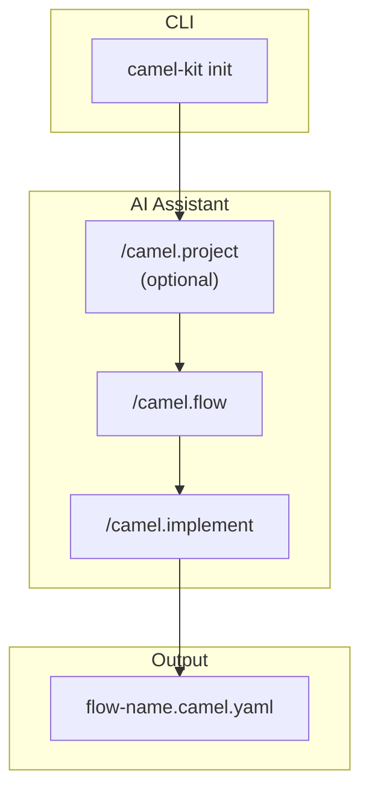
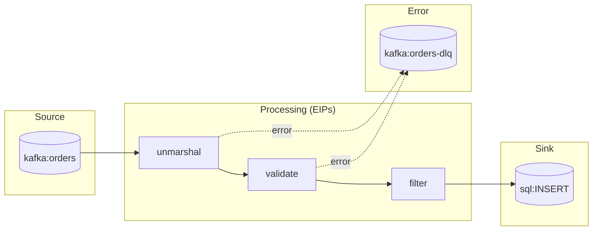

# Camel-Kit User Guide

This guide walks you through using Camel-Kit to design Apache Camel integrations with AI coding assistants.

## Table of Contents

- [Introduction](#introduction)
- [Installation](#installation)
- [Quick Start](#quick-start)
- [Workflow Overview](#workflow-overview)
- [Flow Definition](#flow-definition)
- [YAML Generation](#yaml-generation)
- [Validation](#validation)
- [Test Generation](#test-generation)
- [Best Practices](#best-practices)
- [Troubleshooting](#troubleshooting)

---

## Introduction

Camel-Kit is a toolkit that guides you through designing Apache Camel integrations using AI coding assistants. Instead of writing code directly, you work with structured specifications that capture your integration requirements, then generate Kaoto-compatible YAML.

**Key concepts:**

- **Flow** - The business and technical design: what the integration does and how
- **Constitution** - Best practices that guide design decisions
- **Catalog** - Live component and Kamelet information from Apache Camel
- **Validation** - Automated schema validation using Maven plugins

**Workflow: 1 Flow = 1 Route** — Each integration flow maps to a single Camel route, making it easy to design, implement, and maintain your integrations.

---

## Installation

### Using JBang (Recommended)

```bash
# Install JBang first
curl -Ls https://sh.jbang.dev | bash -s - app setup

# Install camel-kit (after local build)
cd camel-kit
mvn install
jbang app install --force camel-kit@io.github.luigidemasi:camel-kit-main:1.0.0-SNAPSHOT

# Verify installation
camel-kit --help
```

### Run Without Installing

```bash
jbang io.github.luigidemasi:camel-kit-main:1.0.0-SNAPSHOT init my-integration --ai bob
```

### Verify Installation

```bash
camel-kit --help
```

---

## Quick Start

```bash
# 1. Create a new project (choose your AI assistant)
camel-kit init order-processing --ai bob      # IBM Project Bob
camel-kit init order-processing --ai gemini   # Google Gemini CLI
camel-kit init order-processing --ai claude   # Anthropic Claude Code

# 2. Open in your AI assistant
cd order-processing

# 3. Use slash commands in the AI assistant:
#    /camel.project     - (Optional) Define integration landscape
#    /camel.flow        - Define and design the flow
#    /camel.implement   - Generate Camel YAML with validation
#    /camel.validate    - Check specifications
#    /camel.test        - Generate integration tests with validation

# 4. Run the generated route (include application.properties for config)
camel run order-ingestion.camel.yaml application.properties
```

---

## Workflow Overview



| Step | Command | Purpose |
|------|---------|---------|
| 1 | `camel-kit init` | Create project structure and fetch catalogs |
| 2 | `/camel.project` | (Optional) Define integration landscape |
| 3 | `/camel.flow` | Define flow: source, sink, EIPs, error handling |
| 4 | `/camel.implement` | Generate Kaoto-compatible Camel YAML with validation loop |
| 5 | `/camel.validate` | Verify compliance with constitution |
| 6 | `/camel.test` | Generate Citrus integration tests with validation loop |

---

## Flow Definition

The flow definition captures **WHAT** the integration does and **HOW** it's implemented.

### Creating a Flow

Run `/camel.flow <flow-name>` in your AI assistant. You'll be guided through:

1. **Business Purpose** - What problem does this flow solve?
2. **Source & Sink** - Where data comes from and goes to
3. **Processing Steps** - EIPs (Filter, Split, Aggregate, Transform)
4. **Data Contracts** - Input/output formats and schemas
5. **Error Scenarios** - What can go wrong and expected behavior
6. **Error Handling** - Dead Letter Channel, Retry, Circuit Breaker
7. **Flow Diagram** - Mermaid visualization

### Flow File

The flow is saved to `.camel-kit/flows/<flow-name>/flow.md`.

**Example flow diagram:**



---

## YAML Generation

Generate Kaoto-compatible Camel YAML DSL from your flow definition.

### Running Generation

```
/camel.implement <flow-name>
```

This:
1. Verifies flow definition and schemas exist
2. Looks up components in the cached catalog
3. Transforms the design into Camel YAML DSL
4. Runs validation loop until YAML is valid
5. Outputs to `<flow-name>.camel.yaml`

### Validation Loop

The `/camel.implement` command includes an automated validation loop using the official Camel YAML DSL Validator Maven plugin:

```bash
./mvnw org.apache.camel:camel-yaml-dsl-validator:{version}:validate \
  -Dcamel.validator.files=<flow-name>.camel.yaml
```

The AI agent will:
1. Generate the YAML
2. Run the validation command
3. If errors are found, parse them and fix
4. Repeat until validation passes

### Kaoto Compatibility

Generated YAML follows Kaoto requirements:
- Nested EIPs under parent's `steps` array
- Proper expression format for Simple, JSONPath, etc.
- Error handlers at route level
- Environment variables as `{{VARIABLE}}`

### Running Generated Routes

```bash
# With Camel JBang (dependencies from application.properties)
camel run order-ingestion.camel.yaml application.properties

# Export to Maven project
camel export order-ingestion.camel.yaml \
  --runtime quarkus \
  --gav com.example:my-integration:1.0.0
```

Dependencies are configured in `application.properties`:
```properties
camel.jbang.dependencies=org.postgresql:postgresql:42.7.3,\
org.apache.commons:commons-dbcp2:2.12.0
```

---

## Validation

Validation checks your specifications before generating YAML.

### Running Validation

```
/camel.validate           # Validate all flows
/camel.validate <flow-name>  # Validate specific flow
```

### What's Checked

| Category | Examples |
|----------|----------|
| **Completeness** | Source defined, sink defined, error handling |
| **Correctness** | Valid component names, valid EIP usage |
| **Constitution** | Naming conventions, circuit breakers, schema validation |
| **Dependencies** | All direct: endpoints have routes, no circular deps |

### Validation Report

Results are saved to `.camel-kit/validation-report.md` with:
- Pass/fail status for each check
- Error codes for failures
- Suggested fixes

---

## Test Generation

Generate Citrus integration tests for your routes.

### Running Test Generation

```
/camel.test <flow-name>    # Generate tests for one flow
/camel.test --all          # Generate tests for all flows
```

### Validation Loop

The `/camel.test` command includes an automated validation loop using the json-yaml-validator-maven-plugin:

```bash
./mvnw com.dataliquid.maven:json-yaml-validator-maven-plugin:2.0.0:validate \
  -Dschema.validator.schemaFile=.camel-kit/.cache/citrus/{version}/citrus-testcase.json \
  -Dschema.validator.sourceDirectory=test \
  -Dschema.validator.includes=**/*.camel.it.yaml
```

### Test Scenarios

Based on your flow design, tests are generated for:
- Happy path
- Error handling / invalid input
- Dead letter queue
- Idempotency (if using idempotent consumer)
- Circuit breaker fallback (if using resilience patterns)
- Filter conditions (if using filter EIP)

### Test Files

Tests are saved to `test/<flow-name>.camel.it.yaml` following the Camel JBang naming convention, with test data in `test/data/`.

### Running Tests

```bash
# Install Citrus JBang app
jbang app install citrus@citrusframework/citrus

# Run tests (Docker required for Testcontainers)
cd test
citrus run order-ingestion.camel.it.yaml

# Or using Camel test plugin
camel plugin add test
camel test run test/order-ingestion.camel.it.yaml
```

---

## Best Practices

Camel-Kit enforces best practices through the **constitution** (`.camel-kit/constitution.md`):

| Principle | Description |
|-----------|-------------|
| Route Structure | Every route has a clear source and sink |
| Single Responsibility | One route = one clear purpose |
| Error Handling | Every route declares error strategy |
| Resilience | External service calls use circuit breakers |
| Idempotency | Consumer routes handle duplicates |
| Data Format Discipline | Validate at integration boundaries |
| External Configuration | Use environment variables, never hardcode |
| Throttling | High-throughput routes have rate limiting |

### Customizing the Constitution

Edit `.camel-kit/constitution.md` to:
- Disable specific rules
- Add organization-specific guidelines
- Adjust strictness levels

---

## Troubleshooting

### Catalog Not Found

```
Error: Catalog not cached
```

**Solution:** Re-run init without `--no-fetch`:
```bash
camel-kit init --here --ai bob
```

### Validation Errors

```
COMP-001: Component 'kafak' not found
```

**Solution:** Check for typos. The validation will suggest corrections.

### Flow Not Found

```
Error: Flow definition not found. Run /camel.flow [flow-name] first.
```

**Solution:** Create the flow definition first:
```
/camel.flow order-ingestion
```

### Maven Wrapper Not Found

```
./mvnw: No such file or directory
```

**Solution:** Re-initialize the project to generate Maven Wrapper:
```bash
camel-kit init --here --ai bob
```

### Test Failures

If generated tests fail, check:
1. Docker is running (required for Testcontainers)
2. Test data matches current schema
3. Route behavior matches test expectations

Regenerate tests after route changes:
```
/camel.test <flow-name>
```

---

## Next Steps

- See [Command Reference](commands.md) for detailed command documentation
- See [Constitution](constitution.md) for best practices details
- See [CONTRIBUTING.md](../CONTRIBUTING.md) to contribute to Camel-Kit
