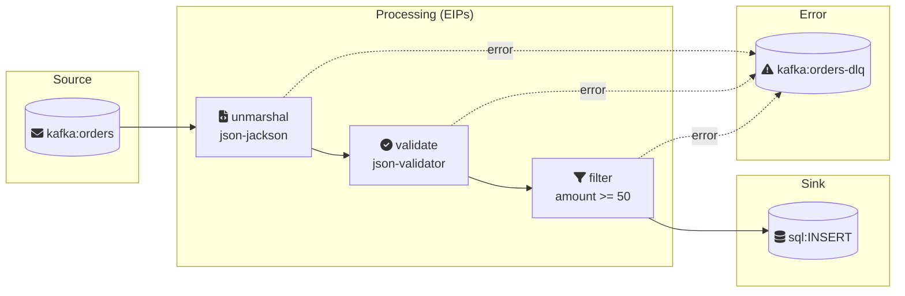

# Flow: Order Ingestion

## Status
Approved

## 1. Overview

**Route ID**: order-ingestion
**Description**: Reliable ingestion pipeline for customer orders, moving them from a Kafka topic to a PostgreSQL database for fulfillment.
**Target Camel Version**: 4.10.0
**Runtime Environment**: Camel JBang

---

## 2. Flow Definition

### Intent
Automate order ingestion ensuring data consistency and faster processing.

### Source
- **System**: Order Management System
- **Component/Kamelet**: kafka
- **URI**: kafka:orders
- **Data**: Customer order messages in JSON format
- **Trigger**: New message on Kafka `orders` topic
- **Configuration**:
  | Property | Value | Description |
  |----------|-------|-------------|
  | brokers | {{KAFKA_BROKERS}} | Kafka broker addresses |
  | groupId | order-processor | Consumer group ID |

### Sink
- **System**: Fulfillment Database (PostgreSQL)
- **Component/Kamelet**: sql
- **URI**: sql:INSERT INTO orders (id, amount, status) VALUES (:#${body[id]}, :#${body[amount]}, 'RECEIVED')
- **Data**: Validated order records
- **Action**: Insert new order record
- **Configuration**:
  | Property | Value | Description |
  |----------|-------|-------------|
  | dataSource | #myDataSource | Database connection reference |

### Processing Steps (EIPs)
| Step | EIP | Description | Configuration |
|------|-----|-------------|---------------|
| 1 | `unmarshal` | Parse JSON to Map | `json-jackson` |
| 2 | `to` | Validate against JSON schema | `json-validator:schemas/order-message.json` |
| 3 | `filter` | Drop orders < $50 | `${body[amount]} >= 50` |

### Error Handling
- **Strategy**: Dead Letter Channel
- **Dead Letter URI**: kafka:orders-dlq
- **Redelivery Policy**:
  | Property | Value |
  |----------|-------|
  | maximumRedeliveries | 3 |
  | redeliveryDelay | 1000 |
  | backOffMultiplier | 2 |
  | useExponentialBackOff | true |

### Flow Diagram



---

## 3. Data Contracts

### Input Schema
- **File**: `schemas/order-message.json`
- **Format**: JSON
- **Key Fields**:
  | Field | Type | Required | Description |
  |-------|------|----------|-------------|
  | id | string | yes | Order unique identifier |
  | customerId | string | yes | Customer reference |
  | amount | number | yes | Order total value |
  | items | array | yes | List of order items |

### Output Schema
- **File**: `schemas/order-entity.json`
- **Format**: Database record
- **Key Fields**:
  | Field | Type | Description |
  |-------|------|-------------|
  | id | string | Order unique identifier |
  | amount | number | Order total value |
  | status | string | Order status (RECEIVED) |

### Transformations
No complex transformations. Direct field mapping from JSON to SQL insert.

---

## 4. Business Rules
| Rule | Description | Example |
|------|-------------|---------|
| Minimum Order Value | Orders below $50 are filtered out | $20 order -> filtered |
| Valid Schema | Orders must match JSON schema | Invalid JSON -> DLQ |

---

## 5. Error Scenarios
| Scenario | Expected Behavior |
|----------|-------------------|
| Invalid JSON schema | Send to Dead Letter Queue (orders-dlq) |
| Database unavailable | Retry 3 times with backoff, then DLQ |
| Malformed message | Log error, send to DLQ |

---

## 6. Non-Functional Requirements
- **Throughput**: 1000 messages/minute
- **Latency**: < 500ms per message
- **Availability**: 99.9% uptime
- **Ordering**: Order not critical (idempotent by order ID)

---

## 7. Constitution Gate Checks
| Article | Principle | Status | Rationale/Deviation |
|---------|-----------|--------|---------------------|
| I | Route Structure (Source + Sink required) | [x] | Kafka source -> SQL sink |
| II | Single Responsibility | [x] | Single purpose: ingest orders |
| III | Separation of Concerns | [x] | Simple linear flow |
| IV | Error Handling Mandatory | [x] | Using Dead Letter Channel |
| V | Resilience for External Calls | [n/a] | No external HTTP calls |
| VI | Idempotent Processing | [ ] | Consider adding for production |
| VII | Data Format Discipline | [x] | Unmarshal and validate at entry |
| VIII | External Configuration | [x] | Using {{KAFKA_BROKERS}} placeholder |
| IX | Throttling (if high-throughput) | [n/a] | 1000 msg/min is manageable |

---

## 8. Environment Variables
| Variable | Description | Example |
|----------|-------------|---------|
| KAFKA_BROKERS | Kafka broker addresses | localhost:9092 |
| DATABASE_URL | PostgreSQL connection string | jdbc:postgresql://localhost:5432/orders |

---

## 9. Dependencies

```properties
# jbang.properties
camel.jbang.dependencies=org.postgresql:postgresql:42.7.3
```
