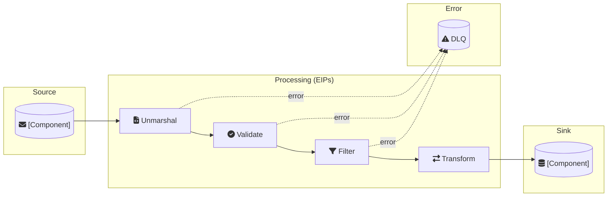

# Flow: [Flow Name]

## Status
Draft | Review | Approved

## 1. Overview

**Route ID**: [flow-name]
**Description**: [A concise overview of this integration flow's purpose]
**Target Camel Version**: {{CAMEL_VERSION}}
**Runtime Environment**: [e.g., JBang, Quarkus, Spring Boot]

---

## 2. Flow Definition

### Intent
[What is the goal of this flow? What problem does it solve?]

### Source
- **System**: [e.g., Order Management System]
- **Component/Kamelet**: [e.g., kafka, aws-s3-source]
- **URI**: [e.g., kafka:{{KAFKA_TOPIC}}]
- **Data**: [e.g., New customer orders in JSON format]
- **Trigger**: [e.g., New message on topic, scheduled poll]
- **Configuration**:
  | Property | Value | Description |
  |----------|-------|-------------|
  | brokers | {{KAFKA_BROKERS}} | Kafka broker addresses |
  | groupId | [consumer-group] | Consumer group ID |

### Sink
- **System**: [e.g., Fulfillment Database]
- **Component/Kamelet**: [e.g., sql, kafka, aws-s3-sink]
- **URI**: [e.g., sql:INSERT INTO ...]
- **Data**: [e.g., Validated order records]
- **Action**: [e.g., Insert new record, update existing]
- **Configuration**:
  | Property | Value | Description |
  |----------|-------|-------------|
  | dataSource | #myDataSource | Database connection |

### Processing Steps (EIPs)
| Step | EIP | Description | Configuration |
|------|-----|-------------|---------------|
| 1 | `unmarshal` | Parse JSON to object | `json-jackson` |
| 2 | `validate` | Validate against schema | `json-validator:schemas/[name].json` |
| 3 | `filter` | Apply business rule | `${body.field} == value` |
| 4 | `transform` | Map to target format | [transformation details] |

### Error Handling
- **Strategy**: [e.g., Dead Letter Channel, Retry, Circuit Breaker]
- **Dead Letter URI**: [e.g., kafka:{{KAFKA_DLQ}}]
- **Redelivery Policy**:
  | Property | Value |
  |----------|-------|
  | maximumRedeliveries | 3 |
  | redeliveryDelay | 1000 |
  | backOffMultiplier | 2 |
  | useExponentialBackOff | true |

### Flow Diagram



---

## 3. Data Contracts

### Input Schema
- **File**: `schemas/[input-schema].json`
- **Format**: [e.g., JSON, XML, CSV]
- **Key Fields**:
  | Field | Type | Required | Description |
  |-------|------|----------|-------------|
  | id | string | yes | Unique identifier |

### Output Schema
- **File**: `schemas/[output-schema].json`
- **Format**: [e.g., JSON, Database record]
- **Key Fields**:
  | Field | Type | Description |
  |-------|------|-------------|
  | id | string | Unique identifier |

### Transformations
[Describe any complex field mappings or transformations]

---

## 4. Business Rules
| Rule | Description | Example |
|------|-------------|---------|
| [Rule Name] | [What the rule does] | [Example case] |

---

## 5. Error Scenarios
| Scenario | Expected Behavior |
|----------|-------------------|
| Invalid input data | [e.g., Send to error queue for manual review] |
| Target system unavailable | [e.g., Retry with backoff, then fail to DLQ] |
| Transformation failure | [e.g., Log and skip record] |

---

## 6. Non-Functional Requirements
- **Throughput**: [e.g., 1000 messages/minute]
- **Latency**: [e.g., < 500ms per message]
- **Availability**: [e.g., 99.9% uptime]
- **Ordering**: [e.g., Must preserve order, or order not important]

---

## 7. Constitution Gate Checks
| Article | Principle | Status | Rationale/Deviation |
|---------|-----------|--------|---------------------|
| I | Route Structure (Source + Sink required) | [ ] | |
| II | Single Responsibility | [ ] | |
| III | Separation of Concerns | [ ] | |
| IV | Error Handling Mandatory | [ ] | |
| V | Resilience for External Calls | [ ] | |
| VI | Idempotent Processing | [ ] | |
| VII | Data Format Discipline | [ ] | |
| VIII | External Configuration | [ ] | |
| IX | Throttling (if high-throughput) | [ ] | |

---

## 8. Environment Variables
| Variable | Description | Example |
|----------|-------------|---------|
| KAFKA_BROKERS | Kafka broker addresses | localhost:9092 |
| DATABASE_URL | Database connection string | jdbc:postgresql://localhost:5432/db |

---

## 9. Dependencies

```properties
# jbang.properties
camel.jbang.dependencies=org.postgresql:postgresql:42.7.3
```

---

## 10. Open Questions
[NEEDS CLARIFICATION: List any unclear requirements here]
