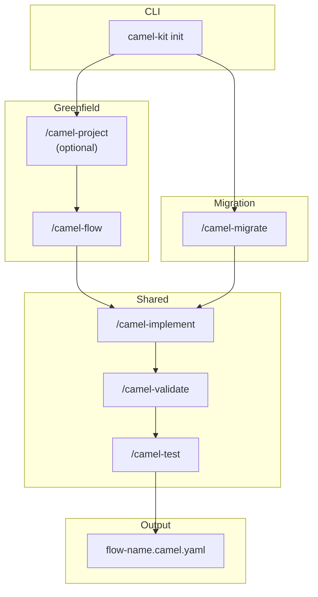

<div style="display: flex; align-items: center; gap: 3rem; margin-top: 2rem; margin-bottom: 2rem; flex-wrap: wrap; justify-content: center;">
  <div style="flex-shrink: 0;">
    
  </div>
  <div style="flex: 1; min-width: 280px;">


  Design and Migrate Apache Camel&nbsp;<br class="sm:block hidden" />Integrations with AI



  Structured slash commands for Claude Code, IBM Project Bob, and Gemini CLI&nbsp;<br class="sm:block hidden" />that guide you through designing, implementing, and testing Camel routes.


<div class="hx:mb-12 hx:mt-6 hx:flex hx:gap-3">


</div>

  </div>
</div>

<div class="hx:mt-6"></div>


  
  
  
  
  
  


<div class="hx:mt-16"></div>


  Quick Install


```bash
# Install via JBang
jbang app install camel-kit@luigidemasi/camel-kit

# Or run without installing
jbang run camel-kit@luigidemasi/camel-kit init my-project --ai claude

# Or as a Camel JBang plugin
camel plugin add kit \
  --gav io.github.luigidemasi:camel-kit-jbang-plugin:0.3.1 \
  -d "Design Apache Camel Integrations with AI"
```


  Workflow



