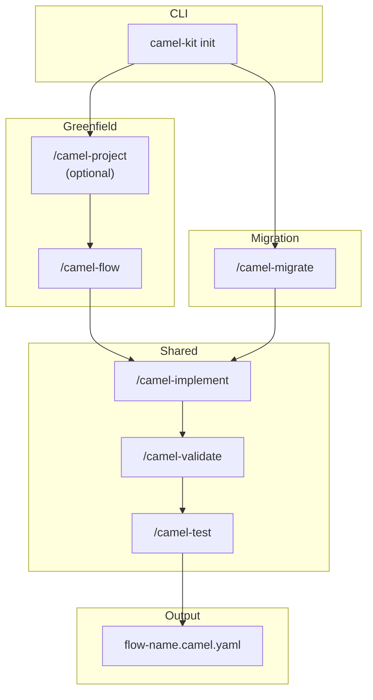

This guide walks you through installing Camel-Kit and creating your first integration project.

## What is Camel-Kit?

Camel-Kit is a toolkit that guides you through designing Apache Camel integrations using AI coding assistants. Instead of writing code directly, you work with structured specifications that capture your integration requirements, then generate Kaoto-compatible YAML.

**Key concepts:**

- **Flow** — The business and technical design: what the integration does and how
- **Constitution** — Best practices that guide design decisions
- **MCP Server** — Real-time catalog queries and validation (60-70% token savings)
- **1 Flow = 1 Route** — Each integration flow maps to a single Camel route

## Installation

### Using JBang (Recommended)

```bash
# Install JBang first
curl -Ls https://sh.jbang.dev | bash -s - app setup

# Install camel-kit
jbang app install camel-kit@luigidemasi/camel-kit

# Verify installation
camel-kit --help
```

### Run Without Installing

```bash
jbang run camel-kit@luigidemasi/camel-kit init my-integration --ai bob
```

### As a Camel JBang Plugin

```bash
camel plugin add kit \
  --gav io.github.luigidemasi:camel-kit-jbang-plugin:0.3.1 \
  -d "Design Apache Camel Integrations with AI"

camel kit init my-integration --ai bob
```

## Quick Start

```bash
# 1. Create a new project (choose your AI assistant)
camel-kit init order-processing --ai bob      # IBM Project Bob
camel-kit init order-processing --ai gemini   # Google Gemini CLI
camel-kit init order-processing --ai claude   # Anthropic Claude Code

# 2. Open in your AI assistant
cd order-processing

# 3. Use slash commands — see workflows below
```

## Two Workflows

Camel-Kit supports two paths. Both converge at `/camel-implement`, so the implementation and testing steps are identical.




  
  
