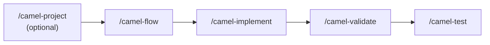

Build a new Apache Camel integration from scratch using AI-guided slash commands.

## Overview

The greenfield workflow walks you through designing an integration step by step: define what data moves where, which components handle it, how errors are managed, and then generate production-ready Camel YAML.



## Step 1 — Initialize the Project

```bash
camel-kit init order-processing --ai bob
cd order-processing
```

This creates the project structure, downloads the Camel catalog, configures MCP, and registers all slash commands.

## Step 2 — Define the Integration Landscape (Optional)

```
/camel-project
```

Use this when your project has multiple flows. The command asks three questions:
1. What business problem does this integration solve?
2. Which systems are involved (sources and sinks)?
3. What data flows between them?

**Output:** `.camel-kit/project.md`

Skip this step if you're building a single flow.

## Step 3 — Design the Flow

```
/camel-flow order-ingestion
```

This is the core design step. The AI assistant guides you through an interactive interview:

1. **Flow intent** — What does this flow do? (e.g., "Consume orders from Kafka and persist to database")
2. **Source system** — Where does data come from? The AI queries the Camel catalog via MCP to suggest the right component
3. **Processing steps** — Which EIPs are needed? (filter, split, transform, aggregate, etc.)
4. **Sink system** — Where does data go?
5. **Error handling** — Dead Letter Channel configuration, retry strategy

If your flow needs data transformation, the AI will ask for source and target schemas and build a field mapping table for automatic XSLT generation.

**Output:** `.camel-kit/flows/order-ingestion/order-ingestion.tdd.md` (Technical Design Document)

## Step 4 — Generate Camel YAML

```
/camel-implement order-ingestion
```

The AI reads the TDD, looks up every component in the catalog via MCP, and generates Kaoto-compatible Camel YAML DSL. It then validates the route automatically:

1. Checks all component names and options against the catalog
2. Validates all endpoint URIs
3. Fixes any errors (up to 3 attempts)
4. Runs Maven schema validation

**Output:** `order-ingestion.camel.yaml`

If your flow includes data transformation, a DataMapper XSLT file is also generated.

## Step 5 — Validate

```
/camel-validate order-ingestion
```

Runs completeness checks, URI validation, 47 automated security checks, and constitution compliance.

## Step 6 — Generate Tests

```
/camel-test order-ingestion
```

Generates Citrus integration tests based on the flow design — happy path, error handling, DLQ, and scenario-specific tests (filter, split, circuit breaker).

**Output:** `test/order-ingestion.camel.it.yaml`

## Run the Route

```bash
camel run order-ingestion.camel.yaml application.properties
```

## What You End Up With

```
order-processing/
├── order-ingestion.camel.yaml          # Generated Camel route
├── order-ingestion-datamapper-*.xsl    # XSLT (if transformation needed)
├── application.properties              # Dependencies and config
├── test/
│   ├── order-ingestion.camel.it.yaml   # Citrus integration tests
│   └── data/                           # Test data
└── .camel-kit/
    ├── constitution.md                 # Best practices
    ├── project.md                      # Integration landscape
    └── flows/order-ingestion/
        └── order-ingestion.tdd.md      # Technical design document
```
