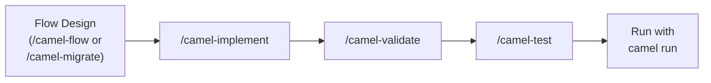

This guide covers each step in detail — from designing a flow to running tests. Whether you followed the [greenfield](/docs/getting-started/greenfield) or [migration](/docs/getting-started/migration) workflow, the steps below apply to both.

## The Shared Pipeline

After the design phase (greenfield or migration), every flow goes through the same pipeline:

### Greenfield: Design the Flow

In the greenfield path, `/camel-flow` is where the integration takes shape. The AI guides you through source, sink, processing steps, error handling, and optionally data transformation with schema-driven field mappings.



### Data Transformation

If your flow transforms data between formats, Camel-Kit generates XSLT automatically from your field mappings — no manual XSLT needed. This applies to both greenfield flows and migrated flows.



### Implement: Generate Camel YAML

`/camel-implement` reads the Technical Design Document and generates catalog-verified Camel YAML DSL. Every component name, option, and URI is checked against the live Camel catalog via MCP.



### Validate: Check Correctness and Security

`/camel-validate` runs completeness checks, URI validation, 47 automated security checks, and constitution compliance on the generated route.



### Test: Generate Integration Tests

`/camel-test` generates Citrus integration tests — happy path, error handling, DLQ, and scenario-specific tests based on the EIPs in your route.


