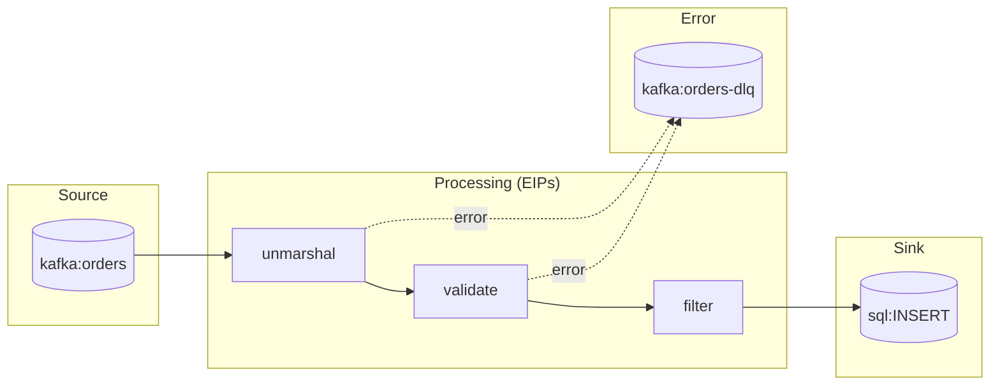

The flow definition captures **WHAT** the integration does and **HOW** it's implemented.

## Creating a Flow

Run `/camel-flow <flow-name>` in your AI assistant. You'll be guided through:

1. **Flow Intent** - What data is processed and what is the goal
2. **Source System** - Where data comes from and which Camel component handles it
3. **Processing Steps** - EIPs required (filter, split, aggregate, transform, etc.)
4. **Sink System** - Where data goes and which Camel component handles it
5. **Error Handling** - Dead Letter Channel and retry strategy

Then, only if relevant, the agent asks follow-up questions for:
- **Data transformation** - Schemas for DataMapper/XSLT generation; `unmarshal` only as a fallback
- **Circuit Breaker** - Only if an external HTTP/REST service is involved
- **Idempotent Consumer** - Only if consuming from a message broker or deduplication is needed
- **Transactions** - Only if writing to more than one external system
- **Performance, Security, Monitoring** - Only if mentioned during the interview

## Flow File

The flow is saved to `.camel-kit/flows/<flow-name>/flow.md`.

**Example flow diagram:**

## Best Practices

### Constitution v2.0 — Six Enforced Rules

The constitution (`.camel-kit/constitution.md`) enforces exactly six rules on every generated route:

| Rule | Description | Violation |
|------|-------------|-----------|
| Route Structure | Every route has a `from:` source and a final `to:` sink | ERROR |
| Single Responsibility | One route = one clear purpose; ≤ 7 processing steps | WARNING if > 7 |
| Separation of Concerns | Ingestion, Processing, Delivery; `direct:` for sync, `seda:` for async | WARNING |
| Naming Conventions | Route IDs follow `<domain>-<action>[-<qualifier>]` | WARNING |
| Observability | Every route declares `routeId` and `description` | ERROR |
| External Configuration | No hardcoded credentials or connection strings; use `{{PLACEHOLDER}}` | ERROR |

All other design guidance (error handling strategy, retry policy, circuit breaker, transactions, idempotency, throttling, Kubernetes, data format choices) is applied context-specifically during `/camel-flow` and `/camel-migrate` flow design — not enforced globally.
